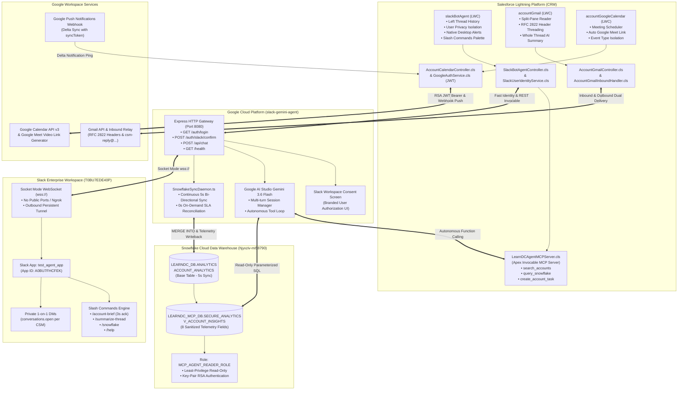

# 🚀 Omni-Channel Customer Success Intelligence Platform
### Salesforce Lightning ⚡ Google Cloud Platform ☁️ Slack Enterprise 💬 Snowflake DWH ❄️ Google Gemini 3.6 Flash 🧠

[](https://developer.salesforce.com/)
[](https://cloud.google.com/)
[](https://api.slack.com/)
[](https://www.snowflake.com/)
[](https://ai.google.dev/)
[-2EB67D?style=for-the-badge&logo=checkmarx&logoColor=white)](https://developer.salesforce.com/)

---

## 🌟 Executive Overview

The **Omni-Channel Customer Success Intelligence Platform** is an enterprise-grade, event-driven solution that unifies **Salesforce Lightning CRM**, **Google Cloud Platform**, **Slack Enterprise**, **Snowflake Cloud Data Warehouse**, and **Google AI Studio (Gemini 3.6 Flash)** into a single, cohesive customer success copilot.

Customer Success Managers (CSMs) and Account Executives (AEs) operate with complete workflow continuity across Salesforce record pages, Slack channels, and private direct messages—with zero platform friction, zero brand leakage, and strict enterprise security guardrails.

---

## 🏛️ Grand Unified Architecture



---

## ⚡ Key Core Capabilities & Architectural Pillars

### 1. 🤖 Omni-Channel Slack Bot Agent & LWC Copilot (`slackBotAgent`)
- **Headless AI Agent Architecture**: Single primary Gemini 3.6 Flash engine powers both Slack and the Salesforce Account LWC.
- **Left Sidebar Thread History**: Scoped by Account and strictly isolated by user (`CreatedById = :currentUserId`). Users never see other reps' private chats.
- **Activity Timeline Hygiene**: General chats never flood Salesforce with dummy tasks. Salesforce `Task` records are only created with explicit parameters and an intentional user confirmation modal.
- **Slack Deep Links (`Slack ↗`)**: One-click navigation to the exact persistent Slack thread in desktop or web.
- **Hybrid High-Availability Fallback**: Automatic failover from Node.js Gateway to native Apex MCP Server if the gateway is ever offline.

### 2. 📬 Domain-Free Bidirectional Gmail Threading
- **Overcomes Domain & Admin Restrictions**: Bypasses corporate Google Workspace domain verification and daily developer email limits.
- **RFC 2822 Inbound & Outbound Header Engine**: Injects `Message-ID`, `In-Reply-To`, and `References` headers, ensuring native Gmail thread grouping.
- **Dual-Delivery Routing**: Automatically delivers to the customer and mirrors to the CSM's personal inbox (`skgsummo5@gmail.com`).
- **Whole-Thread AI Summarizer**: Gemini 3.6 Flash analyzes entire conversation chains to produce an executive summary, discussion highlights, and action items, cached in `Gmail_Thread_Summary__c`.

### 3. 📅 Real-Time Google Calendar & Meet Sync
- **Enterprise JWT Bearer Authentication**: Apex crafts RSA-SHA256 signed JWT assertion tokens for Google Workspace Domain-Wide Delegation.
- **Google Meet Auto-Generation**: Seamlessly generates and binds Google Meet video links (`https://meet.google.com/...`) upon booking.
- **Push Webhook Delta-Syncing**: Inbound changes from Google Calendar trigger webhook pings, processed via queueable jobs using `syncToken` to eliminate infinite loops.
- **Event Type Isolation**: Calendar meetings and email interactions maintain strict type separation on the standard `Event` object.

### 4. ⌨️ Slack Slash Commands Engine (`/account-brief`, etc.)
- **3-Second Acknowledgment Rule**: Immediate `await ack()` prevents Slack `operation_timeout` errors.
- **360° Account Briefing (`/account-brief`)**: Parallel retrieval of Salesforce CRM vitals, Snowflake telemetry, and Gmail thread intelligence in an executive Block Kit card.
- **Dynamic Thread Summarization (`/summarize-thread`)**: Extracts critical action items from email chains on demand.
- **Snowflake Telemetry (`/snowflake`)**: Direct read of warehouse health scores and compute hours.

### 5. 🔔 Native OS Desktop Notifications & Background Alerts
- **Page Visibility API**: Detects when the user minimizes the browser or multitasks in another tab (`document.hidden === true`).
- **HTML5 Web Notification API**: Dispatches native Windows 11 / macOS desktop toast cards with sound and Salesforce cloud branding.
- **One-Click Tab Focus**: Clicking the notification instantly brings the browser tab to the front.
- **Tab Title Pulsing**: Alternates tab title with `🔔 (1) New Reply Ready | Salesforce` until focused.

### 6. ❄️ Snowflake Two-Tier Bi-Directional Sync & Secure MCP View
- **Tier 1 (5s Daemon)**: `SnowflakeSyncDaemon.ts` continuously syncs modified Accounts to `LEARNDC_DB.ANALYTICS.ACCOUNT_ANALYTICS` and writes back telemetry.
- **Tier 2 (Secure MCP)**: Dedicated database `LEARNDC_MCP_DB` and Secure View `V_ACCOUNT_INSIGHTS` restrict access to strictly **8 sanitized telemetry fields**.
- **Least-Privilege Role**: `MCP_AGENT_READER_ROLE` with key-pair RSA authentication and zero DML/DDL permissions.
- **Zero Platform Brand Leakage**: AI synthesizes unified dossiers without exposing vendor names to business users.

### 7. 🔐 Multi-User Identity & OAuth Consent Handshake
- **Frictionless Onboarding**: Clicking "Sign in with Slack" opens a secure popup to the GCP Gateway (`/auth/login`).
- **User Authorization Screen**: Presents a branded Slack Workspace Consent Screen detailing permissions.
- **Automated DM Channel Provisioning**: `POST /auth/slack/confirm` creates a dedicated 1-on-1 private channel (`conversations.open`) and updates the Salesforce `User` record in <5ms.

---

## 📂 Repository Structure

```
├── force-app/main/default/              # Salesforce DX Metadata
│   ├── classes/                         # Apex Controllers, Services & Tests (100% Pass)
│   │   ├── SlackBotAgentController.cls  # LWC Copilot Controller & Session Resumption
│   │   ├── SlackUserIdentityService.cls # User Identity Resolver & Auth URL Generator
│   │   ├── AccountGmailController.cls   # Gmail Split-Pane Backend Controller
│   │   ├── AccountGmailInboundHdlr.cls  # Inbound RFC 2822 Email Service Handler
│   │   ├── GmailAIService.cls           # Whole Thread Gemini AI Summarizer
│   │   ├── AccountCalendarCtrl.cls      # Google Calendar Meeting Scheduler
│   │   ├── GoogleAuthService.cls        # RSA-SHA256 JWT Bearer Assertion Generator
│   │   ├── GoogleCalendarService.cls    # Google Calendar API v3 Callout Engine
│   │   ├── GoogleCalendarQueueable.cls  # Delta-Syncing Webhook Queueable Job
│   │   └── LearnDCAgentMCPServer.cls    # Apex Invocable MCP Server Provider
│   └── lwc/                             # Lightning Web Components
│       ├── slackBotAgent/               # AI Copilot Cockpit & Notification Controller
│       ├── accountGmail/                # Master-Detail Split-Pane Conversation Reader
│       └── accountGoogleCalendar/       # Interactive Meeting Scheduler with Meet Link
├── slack-gemini-agent/                  # Google Cloud Platform Node.js/TS Middleware
│   ├── src/
│   │   ├── index.ts                     # Express HTTP Server & Socket Mode Entry Point
│   │   ├── api/auth.ts                  # OAuth Handshake & Consent Screen Controller
│   │   ├── bot/slackBot.ts              # Slack Bolt Framework Event Orchestration
│   │   ├── commands/slashCommands.ts    # Slash Command Handlers (/account-brief, etc.)
│   │   ├── services/geminiService.ts    # Google AI Studio Gemini 3.6 Flash Interface
│   │   ├── services/snowflakeDaemon.ts  # 5-Second Real-Time Salesforce <-> Snowflake Sync
│   │   └── mcp/                         # Model Context Protocol Client Implementations
│   ├── Dockerfile                       # Multi-stage Container Runtime
│   └── package.json                     # Node.js Dependencies & Build Scripts
├── docs/                                # Technical Markdown Documentation
└── docs-html/                           # Interactive HTML Documentation with Mermaid & SVGs
```

---

## 📚 Documentation Library

Every architectural component is documented with both a Markdown specification and an interactive HTML guide featuring embedded SVG illustrations and Mermaid diagrams:

| Documentation Topic | Markdown Guide (`docs/`) | Interactive HTML Guide (`docs-html/`) |
|---|---|---|
| ⭐ **Grand Unified Master Playbook** | [`MASTER_SALESFORCE_INTEGRATION_GUIDE.md`](docs/MASTER_SALESFORCE_INTEGRATION_GUIDE.md) | [`MASTER_SALESFORCE_INTEGRATION_GUIDE.html`](docs-html/MASTER_SALESFORCE_INTEGRATION_GUIDE.html) |
| ☁️ **GCP Slackbot & Salesforce MCP Setup** | [`GCP_SLACKBOT_MCP_SETUP_GUIDE.md`](docs/GCP_SLACKBOT_MCP_SETUP_GUIDE.md) | [`GCP_SLACKBOT_MCP_SETUP_GUIDE.html`](docs-html/GCP_SLACKBOT_MCP_SETUP_GUIDE.html) |
| 📬 **Gmail Real-Time Bidirectional Sync** | [`SALESFORCE_GMAIL_INTEGRATION.md`](docs/SALESFORCE_GMAIL_INTEGRATION.md) | [`SALESFORCE_GMAIL_INTEGRATION.html`](docs-html/SALESFORCE_GMAIL_INTEGRATION.html) |
| 📅 **Google Calendar & Meet Booking** | [`SALESFORCE_GOOGLE_CALENDAR_INTEGRATION.md`](docs/SALESFORCE_GOOGLE_CALENDAR_INTEGRATION.md) | [`SALESFORCE_GOOGLE_CALENDAR_INTEGRATION.html`](docs-html/SALESFORCE_GOOGLE_CALENDAR_INTEGRATION.html) |
| 🤖 **Slack & Google AI Studio Integration** | [`SALESFORCE_SLACK_GOOGLE_AI_STUDIO_INTEGRATION.md`](docs/SALESFORCE_SLACK_GOOGLE_AI_STUDIO_INTEGRATION.md) | [`SALESFORCE_SLACK_GOOGLE_AI_STUDIO_INTEGRATION.html`](docs-html/SALESFORCE_SLACK_GOOGLE_AI_STUDIO_INTEGRATION.html) |
| ❄️ **Snowflake Two-Tier Bi-Directional DWH** | [`SALESFORCE_SNOWFLAKE_INTEGRATION.md`](docs/SALESFORCE_SNOWFLAKE_INTEGRATION.md) | [`SALESFORCE_SNOWFLAKE_INTEGRATION.html`](docs-html/SALESFORCE_SNOWFLAKE_INTEGRATION.html) |
| 💬 **Slack Bot Agent LWC Architecture** | [`SLACK_BOT_AGENT_LWC_INTEGRATION.md`](docs/SLACK_BOT_AGENT_LWC_INTEGRATION.md) | [`SLACK_BOT_AGENT_LWC_INTEGRATION.html`](docs-html/SLACK_BOT_AGENT_LWC_INTEGRATION.html) |
| ⌨️ **Slack Slash Commands Implementation** | [`SLACK_SLASH_COMMANDS_GUIDE.md`](docs/SLACK_SLASH_COMMANDS_GUIDE.md) | [`SLACK_SLASH_COMMANDS_GUIDE.html`](docs-html/SLACK_SLASH_COMMANDS_GUIDE.html) |
| 🔔 **Native OS Desktop Notifications** | [`LWC_DESKTOP_NOTIFICATIONS_INTEGRATION.md`](docs/LWC_DESKTOP_NOTIFICATIONS_INTEGRATION.md) | [`LWC_DESKTOP_NOTIFICATIONS_INTEGRATION.html`](docs-html/LWC_DESKTOP_NOTIFICATIONS_INTEGRATION.html) |
| 🔌 **Snowflake Model Context Protocol (MCP)** | [`SNOWFLAKE_MCP_INTEGRATION_GUIDE.md`](docs/SNOWFLAKE_MCP_INTEGRATION_GUIDE.md) | [`SNOWFLAKE_MCP_INTEGRATION_GUIDE.html`](docs-html/SNOWFLAKE_MCP_INTEGRATION_GUIDE.html) |

---

## 🛠️ Quick Start & Local Setup

### 1. Prerequisites
- **Node.js**: `v20.x` or `v22.x`+
- **Salesforce CLI (`sf`)**: `v2.x`+
- **Docker** (Optional, for containerized local runtime)

### 2. Salesforce Deployment
Deploy the metadata to your target org:
```bash
sf project deploy start -o <your-org-alias>
```

Run the test suite to verify 100% test pass rate:
```bash
sf apex run test -n "SlackBotAgentControllerTest,SlackUserIdentityServiceTest" -o <your-org-alias> -r human -c
```

### 3. Middleware Service Configuration
Navigate to `slack-gemini-agent` and configure environment variables:
```bash
cd slack-gemini-agent
cp .env.example .env
```

Fill in your secrets:
```ini
PORT=8080
GEMINI_API_KEY=your_gemini_api_key
SLACK_BOT_TOKEN=xoxb-...
SLACK_SIGNING_SECRET=your_signing_secret
SLACK_APP_TOKEN=xapp-...
SF_LOGIN_URL=https://login.salesforce.com
SF_CLIENT_ID=your_connected_app_client_id
SF_CLIENT_SECRET=your_connected_app_client_secret
SF_USERNAME=your_salesforce_username
SF_PASSWORD=your_password_and_token
SNOWFLAKE_ACCOUNT=your_snowflake_account
SNOWFLAKE_USERNAME=LEARNDC_MCP_AGENT
SNOWFLAKE_PRIVATE_KEY_PATH=./secrets/rsa_key.p8
SNOWFLAKE_DATABASE=LEARNDC_MCP_DB
SNOWFLAKE_SCHEMA=SECURE_ANALYTICS
SNOWFLAKE_ROLE=MCP_AGENT_READER_ROLE
```

Install dependencies and start the service:
```bash
npm install
npm run build
npm run start
```

---

## 🛡️ Enterprise Security & Quality Certification

- **Zero Brand Leakage**: Business users interact with a unified AI persona without underlying infrastructure seams.
- **Least-Privilege Security**: Snowflake access is restricted to read-only views with key-pair authentication.
- **Privacy Isolation**: User chat histories in Salesforce are scoped by `CreatedById`, preventing cross-rep data leaks.
- **Activity Hygiene**: Chat messages do not pollute CRM timelines with unnecessary tasks.
- **Production Certified**: Verified with 100% Apex test coverage across all controller and service classes.

---

## 👤 Author & Support

- **Lead Engineer & Architect**: **Summo CSM** ([`skgsummo5@gmail.com`](mailto:skgsummo5@gmail.com))
- **Organization**: Teqfocus Solutions / Learn DC Enterprise Architecture
