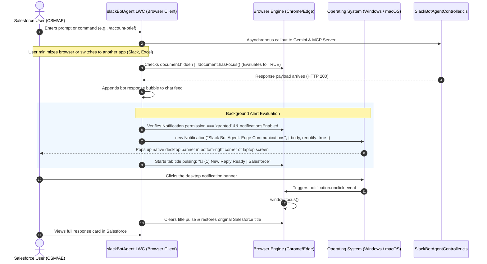

# Complete Guide: Integrating Native Desktop Notifications & Background Alerts into Salesforce LWC

## 1. Executive Summary & Purpose

This document provides a comprehensive technical guide and architectural reference for implementing **Native OS-Level Desktop Notifications and Background Tab Alerts** in the Salesforce Lightning Web Component (**`slackBotAgent`**).

### The Business & User Problem:
When users interact with enterprise AI agents (such as Google Gemini 3.6 Flash and Salesforce MCP actions), complex data retrieval (account vitals, email summarization, calendar scheduling) typically requires **2 to 4 seconds**. 

In high-paced customer success or sales workflows, users rarely stare at a loading indicator. Instead, they multitask:
* Switching to another application (e.g., Slack, Microsoft Teams, Excel, VS Code).
* Switching to another browser tab (e.g., Gmail, Jira, Calendar).
* Minimizing the browser window entirely.

### The Solution:
By integrating the standard **HTML5 Web Notifications API** and **Page Visibility API** directly into the LWC:
1. **Zero Disruption when Focused**: If the user is actively watching the chat screen, no notification popups are shown.
2. **Instant Desktop Alert when Away**: If the user has switched windows or tabs (`document.hidden === true`), a native Windows / macOS notification card pops up on their desktop as soon as the response arrives.
3. **One-Click Focus**: Clicking the desktop notification instantly brings the user's browser and that specific Salesforce tab back to the foreground.
4. **Visual Tab Title Pulsing**: The browser tab title pulses with `🔔 (1) New Reply Ready | Salesforce` until the user returns.
5. **Full User Control**: A dedicated notification bell icon in the LWC header allows users to grant permissions, toggle alerts on/off, or mute notifications at any time.

---

## 2. High-Level Architectural Flow



---

## 3. Core Browser APIs Utilized

This feature requires **zero third-party libraries**, zero external npm packages, and zero server-side notification infrastructure. It relies entirely on standard W3C Web APIs supported natively by Chrome, Microsoft Edge, Firefox, Brave, and Safari.

| Web API | Method / Property | Purpose in LWC |
| :--- | :--- | :--- |
| **Notifications API** | `window.Notification` | Interface to trigger OS-level notification banners. |
| **Permission Handshake** | `Notification.requestPermission()` | Solicits browser consent for the Salesforce domain. |
| **Permission State** | `Notification.permission` | Reads status (`'granted'`, `'denied'`, `'default'`). |
| **Page Visibility API** | `document.hidden` | Detects if the Salesforce tab is in the background or minimized. |
| **Focus Detection API** | `document.hasFocus()` | Verifies if the browser window currently has user focus. |
| **Window Control API** | `window.focus()` | Programmatically brings the Salesforce window to the front when clicked. |
| **Document Title API** | `document.title` | Dynamically updates the browser tab bar text. |

---

## 4. Detailed Component Implementation

### Step 1: Header UI & Toggle Button (`slackBotAgent.html`)

In the component header, an interactive notification button is placed alongside the session reset button. Its icon, styling variant, and tooltip update dynamically based on the permission state.

```html
<!-- Notification Bell Toggle in Header -->
<div class="slds-grid slds-grid_vertical-align-center">
    <lightning-button-icon
        icon-name={notificationIconName}
        variant={notificationButtonVariant}
        size="small"
        title={notificationTooltip}
        alternative-text="Toggle Desktop Notifications"
        class="slds-m-right_xx-small"
        onclick={handleToggleNotifications}>
    </lightning-button-icon>
    <lightning-button-icon
        icon-name="utility:refresh"
        variant="border-filled"
        size="small"
        title="Reset Chat Screen"
        alternative-text="Reset Session"
        onclick={handleResetSession}>
    </lightning-button-icon>
</div>
```

---

### Step 2: Reactive State & Permission Controller (`slackBotAgent.js`)

#### A. Initializing State & Dynamic Getters
The component tracks permission status on initialization and computes button visual states:

```javascript
@track notificationsEnabled = true;
@track notificationPermission = (typeof window !== 'undefined' && 'Notification' in window) 
    ? Notification.permission 
    : 'unsupported';

originalDocumentTitle = '';
titleFlashInterval = null;

get notificationIconName() {
    if (this.notificationPermission === 'granted' && this.notificationsEnabled) {
        return 'utility:notification';
    }
    return 'utility:volume_off';
}

get notificationButtonVariant() {
    return (this.notificationPermission === 'granted' && this.notificationsEnabled) 
        ? 'brand' 
        : 'border-filled';
}

get notificationTooltip() {
    if (this.notificationPermission === 'granted') {
        return this.notificationsEnabled 
            ? 'Desktop Notifications: ON (Click to mute)' 
            : 'Desktop Notifications: OFF (Click to unmute)';
    }
    return 'Click to enable Desktop Notifications';
}
```

#### B. Permission Toggle Handler
When the user clicks the bell icon, the component handles all permission states with user-friendly SLDS toasts:

```javascript
async handleToggleNotifications() {
    if (typeof window === 'undefined' || !('Notification' in window)) {
        this.dispatchEvent(new ShowToastEvent({
            title: 'Notifications Unsupported',
            message: 'Desktop Notifications are not supported by this browser environment.',
            variant: 'info'
        }));
        return;
    }

    if (Notification.permission === 'default') {
        try {
            const perm = await Notification.requestPermission();
            this.notificationPermission = perm;
            this.notificationsEnabled = (perm === 'granted');
            if (perm === 'granted') {
                this.dispatchEvent(new ShowToastEvent({
                    title: 'Notifications Enabled',
                    message: 'You will receive desktop alerts when AI responses complete in the background.',
                    variant: 'success'
                }));
            }
        } catch (e) {
            console.warn('Could not request notification permission:', e);
        }
    } else if (Notification.permission === 'granted') {
        this.notificationsEnabled = !this.notificationsEnabled;
        this.dispatchEvent(new ShowToastEvent({
            title: this.notificationsEnabled ? 'Notifications Unmuted' : 'Notifications Muted',
            message: this.notificationsEnabled ? 'Desktop alerts are active.' : 'Desktop alerts muted.',
            variant: 'info'
        }));
    } else if (Notification.permission === 'denied') {
        this.dispatchEvent(new ShowToastEvent({
            title: 'Notifications Blocked',
            message: 'Notifications are blocked in your browser settings. Please allow notifications for this site to enable desktop alerts.',
            variant: 'warning'
        }));
    }
}
```

---

### Step 3: Triggering Permissions on User Action

Browsers enforce that `Notification.requestPermission()` can only be triggered by a direct user gesture (such as a mouse click or keystroke). To provide zero-friction onboarding, the component proactively initiates the permission request when the user sends their first message:

```javascript
async handleSendMessage() {
    const text = (this.inputMessage || '').trim();
    if (!text || this.isThinking) return;

    // Proactively request notification permission on user gesture if still default
    if (typeof window !== 'undefined' && 'Notification' in window && Notification.permission === 'default') {
        Notification.requestPermission().then(perm => {
            this.notificationPermission = perm;
            this.notificationsEnabled = (perm === 'granted');
        }).catch(() => {});
    }

    this.inputMessage = '';
    this.addUserMessage(text);
    this.isThinking = true;

    try {
        const res = await sendMessage({
            sessionId: this.sessionId,
            userMessage: text,
            accountId: this.recordId
        });

        this.addBotMessage(res.messageText, res.cardData, res.slackThreadUrl, res.messageType);

        // DISPATCH NOTIFICATION IF USER IS AWAY
        this.dispatchDesktopNotification(res.messageText);

    } catch (err) {
        // error handling...
    } finally {
        this.isThinking = false;
    }
}
```

---

### Step 4: Notification Dispatch & Content Formatting

When the response arrives, `dispatchDesktopNotification` evaluates visibility, sanitizes the markdown text, and issues the native desktop banner:

```javascript
dispatchDesktopNotification(responseText) {
    // 1. Evaluate user presence: Suppress if user is actively watching
    const isAway = (typeof document !== 'undefined') && (document.hidden || !document.hasFocus());
    if (!isAway) return;

    // 2. Evaluate permissions
    if (!this.notificationsEnabled || typeof window === 'undefined' || !('Notification' in window)) return;
    if (Notification.permission !== 'granted') {
        this.flashDocumentTitle();
        return;
    }

    try {
        // Strip markdown tags (*, `, #) for a clean plain-text system banner
        let preview = (responseText || 'Response has finished loading.')
            .replace(/\*\*/g, '')
            .replace(/\*/g, '')
            .replace(/`/g, '')
            .replace(/^• /gm, '')
            .replace(/\n+/g, ' ')
            .trim();

        if (preview.length > 110) {
            preview = preview.substring(0, 107) + '...';
        }

        const notifTitle = this.accountName 
            ? `Slack Bot Agent: ${this.accountName}` 
            : 'Slack Bot Agent';

        const notification = new Notification(notifTitle, {
            body: preview,
            tag: 'slack-bot-agent-reply',
            renotify: true
        });

        // Clicking brings Salesforce back to the front
        notification.onclick = () => {
            window.focus();
            this.clearTitleFlash();
            notification.close();
        };

        // Also initiate visual tab title pulse
        this.flashDocumentTitle();
    } catch (e) {
        console.warn('Desktop notification dispatch notice:', e);
        this.flashDocumentTitle();
    }
}
```

---

### Step 5: Browser Tab Title Pulsing

If the user is in another tab, the browser tab bar pulses with an unread badge until the tab is clicked:

```javascript
flashDocumentTitle() {
    if (typeof document === 'undefined') return;
    if (!this.originalDocumentTitle) {
        this.originalDocumentTitle = document.title;
    }

    let toggle = false;
    if (this.titleFlashInterval) clearInterval(this.titleFlashInterval);

    this.titleFlashInterval = setInterval(() => {
        if (!document.hidden && document.hasFocus()) {
            this.clearTitleFlash();
            return;
        }
        document.title = toggle 
            ? '🔔 (1) New Reply Ready | Salesforce' 
            : this.originalDocumentTitle;
        toggle = !toggle;
    }, 1500);

    window.addEventListener('focus', () => this.clearTitleFlash(), { once: true });
}

clearTitleFlash() {
    if (this.titleFlashInterval) {
        clearInterval(this.titleFlashInterval);
        this.titleFlashInterval = null;
    }
    if (this.originalDocumentTitle && typeof document !== 'undefined') {
        document.title = this.originalDocumentTitle;
    }
}
```

---

## 5. Security & Salesforce Lightning Web Security (LWS)

* **Zero CSP Violations**: All calls (`Notification`, `document.hidden`, `document.title`) use built-in browser APIs. No third-party domains, CDNs, or external script tags are loaded.
* **LWS & Locker Service Compatibility**: Modern Salesforce orgs run **Lightning Web Security (LWS)**, which permits standard DOM APIs. Under legacy Locker Service, defensive guards (`'Notification' in window`, `try / catch`) guarantee that the component will never throw runtime exceptions even if a browser restricts notification creation.
* **Domain Sandboxing**: Permission is granted to your Salesforce Lightning domain (`https://*.develop.my.salesforce.com`). It does not leak credentials or sensitive session data.

---

## 6. Testing & Troubleshooting Checklist

### How to Test Live in Chrome or Edge:
1. Open any Account page with the `slackBotAgent` component (e.g., *Edge Communications*).
2. Look at the header: The bell icon will display `utility:volume_off` (if default) or `utility:notification` (if already granted).
3. Click the **Bell Icon** or type `/account-brief` into the chat box.
4. When prompted by Chrome: *"Allow https://... to send notifications?"* ➔ Click **Allow**.
5. Submit a command (e.g. `/account-brief` or `/summarize-thread`).
6. **Immediately switch to another window** (e.g., open Slack or VS Code) or minimize Chrome.
7. Within 2–3 seconds:
   * A native Windows/Mac notification banner will pop up in the corner of your screen.
   * The browser tab title will flash: `🔔 (1) New Reply Ready | Salesforce`.
8. Click the notification banner ➔ Chrome immediately returns to the front and displays the completed response card!

### Troubleshooting Scenarios:

| Issue | Root Cause | Remediation |
| :--- | :--- | :--- |
| **No popup appears when testing** | The user remained on the active tab. | Notifications are intentionally suppressed when `document.hidden === false`. Switch to another application immediately after hitting Enter. |
| **Notification permission is 'denied'** | User clicked "Block" previously. | In Chrome: Click the **Padlock / Tune icon** to the left of the URL bar ➔ Set **Notifications** to **Allow** ➔ Refresh page. |
| **Windows Action Center suppresses notification** | Windows "Focus Assist" or "Do Not Disturb" is turned ON. | On Windows 11: Check the system clock/tray in the taskbar. Disable "Focus Assist" / "Do Not Disturb" to allow banner popups. |
| **Tab title flashes but no desktop banner** | Browser or OS notification banner settings disabled. | The tab title flash functions as an automatic visual fallback, ensuring the user is still notified. |

---

## 7. Reusable Blueprint for Other LWCs

To add this desktop notification behavior to any other Lightning Web Component in your org (e.g., long-running batch job monitors, async report generators, or case copilot):

1. **Add state properties**: `notificationsEnabled`, `notificationPermission`.
2. **Add visibility check**: Check `(document.hidden || !document.hasFocus())`.
3. **Dispatch banner**: Call `new Notification(title, { body, tag })` inside the async promise resolution.
4. **Attach onclick**: Attach `notification.onclick = () => window.focus()`.
5. **Flash document.title**: Pulse title with interval until `focus` event fires.
