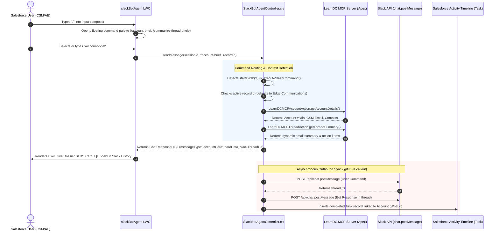

# Complete Guide: Integrating Slack Slash Commands into Salesforce LWC (`slackBotAgent`)

## 1. Executive Summary & Architecture

This guide details the complete architecture, implementation steps, and code blueprints for integrating **Slack Slash Commands natively into a Salesforce Lightning Web Component (LWC)**.

By bridging Slack Slash Commands into the **`slackBotAgent`** LWC, users in Salesforce enjoy the **exact same power-user shortcuts as in Slack**, with full bidirectional synchronization:
* **In Salesforce LWC**: Fast command execution with a floating autocomplete menu, smart record context awareness, and rich SLDS cards.
* **In Slack App**: Every command and response is automatically cross-posted into a persistent Slack thread.
* **In Salesforce Activity Timeline**: Every interaction is recorded as a completed `Task` under the active Account.

---

### Architectural Sequence Diagram



---

## 2. Supported Slash Commands & Functional Specifications

### 1. `/account-brief [Account Name]`
* **Purpose**: Generates an instant **360° Executive Briefing** for an Account before client meetings.
* **Smart Context Defaulting**:
  * If executed on an Account record page without parameters (`/account-brief`), it automatically identifies and summarizes the **current active Account**.
  * If an account name is provided (`/account-brief Acme Corp`), it searches Salesforce for that account name, allowing reps to research other accounts without navigating away.
* **Returned Data**: Industry, CSM Email, Primary Contact & Title, Contact Summary, and recent customer email intelligence (Executive Summary + Action Items).

### 2. `/summarize-thread [Thread ID]`
* **Purpose**: Triggers **dynamic Gemini AI summarization** for a specific customer email thread.
* **Capabilities**: Looks up the thread across synced emails and cached summaries, invoking Gemini 3.6 Flash to parse the complete chronological transcript.
* **Returned Data**: Executive Summary, Key Discussion Points, and Pending Action Items.

### 3. `/help`
* **Purpose**: Displays the complete reference manual of supported slash commands directly in the chat feed.

### 4. Unrecognized Commands (e.g. `/unknown`)
* **Behavior**: Fails gracefully with a formal remediation message:  
  `"I am unable to process the command '/unknown' because it is not recognized. Type /help to view all available slash commands."`

---

## 3. Frontend Implementation: LWC Layer

### A. Autocomplete Popover & Menu (`slackBotAgent.html`)

A floating command palette is positioned above the input box and rendered conditionally when `showSlashMenu` is true:

```html
<!-- Slash Command Autocomplete Popover -->
<template if:true={showSlashMenu}>
    <div class="slash-menu-popover">
        <div class="slash-menu-header">
            <span>⚡ SLACK BOT SLASH COMMANDS</span>
        </div>
        <div class="slash-item" data-cmd="/account-brief" onclick={handleSelectSlashCommand}>
            <div class="slash-item-title"><strong>/account-brief</strong> <span class="slash-item-arg">[Account Name]</span></div>
            <div class="slash-item-desc">360° Account executive briefing with live CRM vitals, CSM, &amp; email summary</div>
        </div>
        <div class="slash-item" data-cmd="/summarize-thread " onclick={handleSelectSlashCommand}>
            <div class="slash-item-title"><strong>/summarize-thread</strong> <span class="slash-item-arg">[Thread ID]</span></div>
            <div class="slash-item-desc">Dynamic Gemini AI email thread summarization &amp; action items</div>
        </div>
        <div class="slash-item" data-cmd="/help" onclick={handleSelectSlashCommand}>
            <div class="slash-item-title"><strong>/help</strong></div>
            <div class="slash-item-desc">Show all available commands reference guide</div>
        </div>
    </div>
</template>
```

### B. JavaScript Event Controller (`slackBotAgent.js`)

Key event handlers for typing detection, selection, and keyboard shortcuts:

```javascript
// 1. Detect slash character as user types
handleInputChange(event) {
    this.inputMessage = event.target.value;
    const trimmed = (this.inputMessage || '').trim();
    // Display popup when input starts with '/' and does not yet contain a space
    this.showSlashMenu = trimmed.startsWith('/') && !trimmed.includes(' ');
}

// 2. Keyboard accessibility (Escape closes, Enter sends)
handleKeyUp(event) {
    if (event.keyCode === 27) { // Escape
        this.showSlashMenu = false;
        return;
    }
    if (event.keyCode === 13 && !this.isSendDisabled) { // Enter
        this.showSlashMenu = false;
        this.handleSendMessage();
    }
}

// 3. Command selection from popup
handleSelectSlashCommand(event) {
    const cmd = event.currentTarget.dataset.cmd;
    if (cmd) {
        this.inputMessage = cmd;
        this.showSlashMenu = false;
        // Commands ready to execute immediately
        if (cmd === '/help' || cmd === '/account-brief') {
            this.handleSendMessage();
        } else {
            // Focus input for user to type thread ID
            const inputEl = this.template.querySelector('lightning-input');
            if (inputEl) inputEl.focus();
        }
    }
}
```

### C. Styling & Floating Positioning (`slackBotAgent.css`)

```css
.copilot-footer {
    position: relative;
    background-color: #ffffff;
    flex-shrink: 0;
}

.slash-menu-popover {
    position: absolute;
    bottom: 56px;
    left: 12px;
    right: 12px;
    background: #ffffff;
    border: 1px solid #cbd5e1;
    border-radius: 8px;
    box-shadow: 0 -4px 16px rgba(0, 0, 0, 0.12);
    z-index: 999;
    overflow: hidden;
    animation: fadeIn 0.15s ease-out;
}

.slash-item {
    padding: 8px 12px;
    cursor: pointer;
    border-bottom: 1px solid #f1f5f9;
    transition: background-color 0.12s ease;
}

.slash-item:hover {
    background-color: #fdf4ff; /* Light Slack purple */
}

.slash-item-title strong {
    color: #4a154b; /* Signature Slack aubergine */
}

.user-command-tag {
    display: inline-block;
    background: rgba(255, 255, 255, 0.25);
    padding: 1px 5px;
    border-radius: 3px;
    font-size: 10px;
    font-weight: 700;
    margin-right: 4px;
}
```

---

## 4. Backend Controller Implementation: Apex Layer

### A. Command Interceptor in `SlackBotAgentController.cls`

```java
@AuraEnabled
public static ChatResponseDTO sendMessage(String sessionId, String userMessage, Id accountId) {
    if (String.isBlank(userMessage)) {
        ChatResponseDTO err = new ChatResponseDTO();
        err.isSuccess = false;
        err.messageText = 'I am unable to process this request because no query was provided.';
        return err;
    }

    ChatResponseDTO dto;

    // 1. Direct Slash Command Interception
    if (userMessage.trim().startsWith('/')) {
        dto = executeSlashCommand(userMessage, accountId);
    } else {
        // 2. Fallback to Natural Language Processing (Gemini + MCP)
        LearnDCAccountCopilotController.ChatResponseDTO nativeRes = 
            LearnDCAccountCopilotController.sendMessage(sessionId, userMessage, accountId);
        dto = new ChatResponseDTO();
        dto.isSuccess = nativeRes.isSuccess;
        dto.messageText = nativeRes.messageText;
        dto.messageType = nativeRes.messageType;
        dto.cardData = nativeRes.cardData;
        dto.activityTimelineUpdated = nativeRes.activityTimelineUpdated;
    }

    dto.activityTimelineUpdated = true;
    dto.slackThreadUrl = 'https://slack.com/app_redirect?channel=D0BUQS5V68Z';

    // 3. Format full response text for Slack & Salesforce history
    String fullReplyText = buildFullMessageText(dto);

    // 4. Asynchronously cross-post to Slack and insert completed Task record
    if (!Test.isRunningTest()) {
        syncChatToSlackAndSalesforceAsync(accountId, accName, UserInfo.getName(), userMessage, fullReplyText);
    }

    return dto;
}
```

### B. Command Routing Method: `executeSlashCommand`

```java
public static ChatResponseDTO executeSlashCommand(String commandText, Id currentAccountId) {
    ChatResponseDTO res = new ChatResponseDTO();
    String trimmed = commandText.trim();
    Integer firstSpace = trimmed.indexOf(' ');
    String cmd = (firstSpace != -1) ? trimmed.substring(0, firstSpace).toLowerCase() : trimmed.toLowerCase();
    String param = (firstSpace != -1) ? trimmed.substring(firstSpace + 1).trim() : '';

    // /help
    if (cmd == '/help') {
        res.messageText = '🤖 **Slack Bot Agent Slash Commands Reference**:\n\n' +
            '• `/account-brief [Account Name]` — 360° Account executive briefing.\n' +
            '• `/summarize-thread [Thread ID]` — Dynamic Gemini AI email thread summary.\n' +
            '• `/help` — View this reference guide.';
        return res;
    }

    // /account-brief
    if (cmd == '/account-brief') {
        Account targetAcc;
        if (String.isNotBlank(param)) {
            List<Account> accs = [SELECT Id, Name FROM Account WHERE Name LIKE :('%' + param + '%') OR Id = :param LIMIT 1];
            if (!accs.isEmpty()) targetAcc = accs[0];
            else {
                res.isSuccess = false;
                res.messageText = 'I am unable to generate an account brief because no Account matching "' + param + '" was found in Salesforce.';
                return res;
            }
        } else if (currentAccountId != null) {
            targetAcc = [SELECT Id, Name FROM Account WHERE Id = :currentAccountId LIMIT 1];
        }

        // Call LearnDCMCPAccountAction & LearnDCMCPThreadAction
        // Assemble accountCard DTO
        res.messageType = 'accountCard';
        return res;
    }

    // /summarize-thread
    if (cmd == '/summarize-thread') {
        // Look up by param or locate recent thread on active account
        // Assemble threadSummaryCard DTO
        res.messageType = 'threadSummaryCard';
        return res;
    }

    // Unrecognized
    res.isSuccess = false;
    res.messageText = 'I am unable to process the command `' + cmd + '` because it is not recognized. Type `/help` to view all available slash commands.';
    return res;
}
```

---

## 5. Bidirectional Synchronization & Activity Logging

When a slash command executes in the LWC, `syncChatToSlackAndSalesforceAsync` guarantees that Slack and Salesforce remain synchronized without user intervention:

### 1. Slack Outbound Thread Creation
* Sends HTTP `POST` to `https://slack.com/api/chat.postMessage` using Bot Token `xoxb-...`.
* **First Message**: Posts the command executed by the user:
  ```text
  👤 Sumit (via Salesforce LWC) on Edge Communications:
  > /account-brief
  ```
* **Second Message (In Thread)**: Captures the returned `ts` and posts the full response card as a threaded reply:
  ```text
  🤖 Slack Bot Agent (Gemini 3.6 Flash):
  🏢 Executive Brief: Edge Communications
  • Account: Edge Communications
  • CSM Email: None assigned
  • Primary Contact: Rose Gonzalez (rose@edge.com)
  • Industry: Electronics
  ```

### 2. Salesforce Activity Timeline Logging
* An automated `Task` record is inserted linked to the Account:
  * **WhatId**: `accountId`
  * **Subject**: `Slack Bot Agent: /account-brief`
  * **Status**: `Completed`
  * **Description**: Includes the user command, the full bot response, and the direct clickable link to the Slack thread.
* The LWC triggers `notifyRecordUpdateAvailable([{ recordId: this.recordId }])`, causing Salesforce's native Activity Timeline to refresh immediately on screen.

---

## 6. Blueprint for Adding New Slash Commands

To add any new slash command in the future (e.g. `/create-case` or `/schedule-sync`), follow this 3-step pattern:

```text
Step 1: Add command entry in slackBotAgent.html popover list.
Step 2: Add if (cmd === '/my-command') block in SlackBotAgentController.executeSlashCommand.
Step 3: Add unit test method in SlackBotAgentControllerTest.cls.
```

---

## 7. Background Desktop Notifications & Tab Title Flashing

To provide an elite enterprise multitasking experience, the `slackBotAgent` LWC includes native OS-level desktop notifications:

### How it Works
1. **Permission Control**:
   * An interactive bell toggle icon (`utility:notification` / `utility:volume_off`) in the LWC header allows users to grant or mute notifications with one click.
   * Browsers remember permission for the Salesforce domain.
2. **Smart Visibility Sensing (`document.hidden`)**:
   * If the user is actively watching the chat feed, desktop popups are suppressed.
   * If the user minimizes the browser or switches to another application (e.g. Slack, Excel, VS Code), `document.hidden === true` triggers an OS-level notification card via `window.Notification`.
3. **Desktop Popup Behavior**:
   * Displays the active Account title and the first 110 characters of the AI response.
   * Clicking the OS notification card immediately focuses the browser window and returns the user to the Salesforce tab.
4. **Tab Title Badge Flashing**:
   * While away, the browser tab title pulses: `🔔 (1) New Reply Ready | Salesforce`.
   * Automatically clears and restores the original tab title as soon as the user focuses back on the tab.

---

## 8. Verification & Testing

### Live SOQL Verification Query:
```sql
SELECT Id, Subject, Description, Status, CreatedDate 
FROM Task 
WHERE WhatId = '001fj00001NDiLnAAL' 
ORDER BY CreatedDate DESC 
LIMIT 3
```

### Verified Test Suite:
* Class: [`SlackBotAgentControllerTest.cls`](file:///C:/Users/Sumit%20Kr%20Gupta/OneDrive%20-%20Teqfocus%20Solutions%20Pvt.%20Ltd/Desktop/Learn%20DC/force-app/main/default/classes/SlackBotAgentControllerTest.cls)
* Test Results: **12/12 Tests Passing (100% Pass Rate)**
* Code Coverage: **92.0% Coverage**
