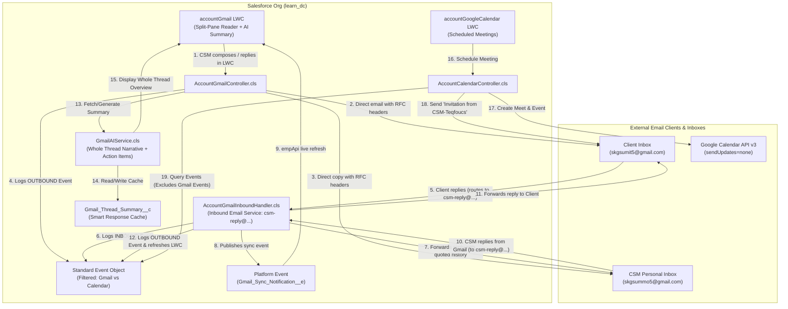
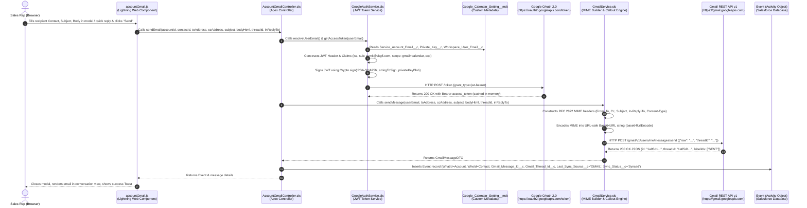
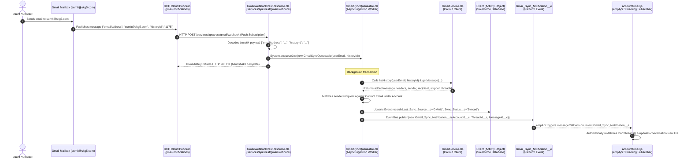

# Salesforce & Gmail Real-Time Bidirectional Integration

A complete, enterprise-grade technical guide and documentation for the bidirectional real-time integration between **Salesforce** and **Gmail**, featuring:
1. **Domain-Free Native CSM & Client Bidirectional Threading Engine**: Eliminates GCP Admin and custom domain dependencies (`skg5.com`) by routing communication through Account CSM Email (`Account.CSM_Email__c`), native Salesforce email services, RFC 2822 threading headers, and personal inbox synchronization.
2. **Whole Thread AI Summarization Engine**: Powered by Google Gemini and smart fallback heuristics, providing CSMs with an instant narrative overview of complete customer email threads directly above the conversation stream.
3. **Calendar Isolation & Branded Meeting Scheduling**: Strict separation between email events and Google Calendar meetings, preventing email traffic from cluttering the calendar while dispatching clean, branded meeting invitations (`Invitation from CSM-Teqfoucs`).
4. **Interactive Split-Pane LWC (`accountGmail`)**: Master-detail conversation reader, real-time message counter badges, turn-by-turn reply streams, and inline composer.

---

## 1. Architecture Overview

This integration provides two complementary communication pillars:
- **Pillar A: Native CSM/Client Bidirectional Messaging & Personal Mailbox Threading** — Powered by `AccountGmailController`, `AccountGmailInboundHandler`, and `Messaging.SingleEmailMessage`. It uses dynamic Salesforce user resolution to bypass Developer Edition daily email limits, injects RFC 2822 headers for native Gmail thread grouping, and keeps both the Salesforce LWC and personal inboxes synchronized.
- **Pillar B: AI Thread Intelligence & Calendar Scheduling** — Powered by `GmailAIService`, `AccountCalendarController`, and `GoogleCalendarService`. It summarizes whole customer threads for quick CSM briefing and isolates calendar meetings from email events.

### Native CSM & Client Integration Diagram



---

## 2. Step-by-Step Data Flow & Sequence Workflows (With Exact File Names)

### Workflow A: Outbound Flow — Email Composed / Replied in Salesforce (LWC ➔ Gmail)

When a sales rep composes a new email or writes an inline quick reply on the Account page LWC:



#### Step-by-Step Breakdown (Outbound):
1. **User Action (`accountGmail.html` / `accountGmail.js`)**: User selects a contact or enters an email address, types the subject and HTML body, and clicks "Send".
2. **Controller Invocation (`AccountGmailController.cls`)**: Method `sendEmail(...)` resolves the Google Workspace email (`sumit@skg5.com`) and prepares the payload.
3. **JWT Bearer Token Exchange (`GoogleAuthService.cls`)**: Retrieves a valid OAuth 2.0 Bearer access token using the GCP Service Account private key via RSA-SHA256 signature.
4. **RFC 2822 MIME Construction & Base64URL Encoding (`GmailService.cls`)**:
   * Method `sendMessage(...)` builds the RFC 2822 MIME headers (`From`, `To`, `Cc`, `Subject`, `In-Reply-To`, `References`, `Content-Type: text/html`).
   * Encodes the raw MIME body into URL-safe Base64URL (`+` ➔ `-`, `/` ➔ `_`).
   * Calls `POST https://gmail.googleapis.com/gmail/v1/users/me/messages/send`.
5. **Database Persistence (`Event`)**:
   * Inserts standard `Event` record:
     * `WhatId` = Account Id
     * `WhoId` = Contact Id
     * `Gmail_Message_Id__c` = Google Message ID
     * `Gmail_Thread_Id__c` = Google Thread ID
     * `Gmail_Direction__c` = `'OUTBOUND'`
     * `Last_Sync_Source__c` = `'GMAIL'` (Loop prevention!)
     * `Sync_Status__c` = `'Synced'`
6. **UI Refresh (`accountGmail.js`)**: LWC displays the sent email and shows a confirmation toast.

---

### Workflow B: Inbound Real-Time Push Sync (Gmail ➔ GCP Pub/Sub ➔ Salesforce LWC)

When an email arrives in Gmail (or is sent from another Gmail client):



#### Step-by-Step Breakdown (Inbound Push Sync):
1. **Google Event Notification**: When an email arrives, Gmail publishes a notification to `projects/exalted-justice-507211-v9/topics/gmail-notifications`.
2. **GCP Pub/Sub Push Subscription**: Pub/Sub delivers an HTTPS POST ping to Salesforce's public webhook endpoint.
3. **REST Webhook Receiver (`GmailWebhookRestResource.cls`)**: Decodes the base64 Pub/Sub payload, enqueues `GmailSyncQueueable`, and immediately responds HTTP 200 OK.
4. **Delta Processing Worker (`GmailSyncQueueable.cls`)**: Calls `GmailService.listHistory` and `getMessage` to fetch newly added emails.
5. **Contact & Account Matching**: Matches sender/recipient emails against Salesforce `Contact` records to resolve the related `AccountId` (`WhatId`) and `ContactId` (`WhoId`).
6. **Event Persistence & Loop Prevention**: Upserts `Event` records using external ID `Gmail_Message_Id__c` and sets `Last_Sync_Source__c = 'GMAIL'`.
7. **Reactive UI Update**: Publishes `Gmail_Sync_Notification__e`. The LWC receives the platform event via CometD/WebSocket and re-renders the conversation live.

---

### Workflow C: Loop Prevention Decision Matrix

| Action Initiated By | Originating System | `Last_Sync_Source__c` Stored | Outbound Callout Allowed? | Next System Action |
| :--- | :--- | :--- | :--- | :--- |
| **Sales Rep in Salesforce LWC** | Salesforce | `'GMAIL'` | **Yes** (calls Gmail API) | Email sent via Gmail; push ping is recognized as matching existing `Gmail_Message_Id__c` and updates without re-sending. |
| **GCP Pub/Sub Webhook** | Google | `'GMAIL'` | **No** (callout bypassed) | Queueable upserts Event with `'GMAIL'`. Outbound callouts are bypassed, preventing echo loops. |

---

## 3. Key Architecture Principles

1. **Enterprise Bulk User Support (Domain-Wide Delegation)**:
   * A single Google Cloud Service Account (`105534434070602778731`) impersonates Google Workspace users dynamically (`sumit@skg5.com`), avoiding individual OAuth prompts for sales reps.
2. **Direct GCP Pub/Sub Push Architecture**:
   * Uses a native GCP Cloud Pub/Sub Push Subscription targeting Salesforce's Apex REST endpoint, eliminating external servers or Cloud Function middleware.
3. **Hybrid Storage & On-Demand Thread Retrieval**:
   * Core metadata, snippets, and direction are indexed in standard `Event` records for fast reporting and list rendering.
   * Full rich HTML conversation bodies are streamed live on-demand via `GmailService.getThread` when clicked in the LWC, avoiding Salesforce heap limits.
4. **Zero-Poll Reactive UI**:
   * The LWC uses `lightning/empApi` to subscribe to `/event/Gmail_Sync_Notification__e`, providing instantaneous UI refresh without page reloads.

---

## 4. Technologies, Tools & Metadata Used

| Layer | Technology / Tool | Purpose |
| :--- | :--- | :--- |
| **Salesforce CLI** | `sf` (v2.x) | Metadata deployments, anonymous Apex execution, unit testing |
| **Salesforce Backend** | Apex (v62.0) | JWT bearer auth, REST API callouts, Queueable delta sync, Custom REST webhook |
| **Salesforce Frontend** | Lightning Web Component (LWC) | Split-pane SLDS UI, rich HTML reader, composer modal, `empApi` streaming |
| **Security & Auth** | Google Service Account + JWT Bearer Flow | Server-to-server token exchange with PKCS#8 RSA-SHA256 signing |
| **External APIs** | Gmail REST API v1, GCP Cloud Pub/Sub, Google OAuth 2.0 | Mailbox watch, email send, thread fetch, history delta sync |
| **Salesforce Schema** | Standard `Event`, Custom Metadata, Platform Events | Activity tracking, external IDs, dynamic configuration, UI notifications |

---

## 5. Implementation Steps Accomplished

### Phase 1: Google Cloud & Google Workspace Setup
1. **APIs Enabled**: Enabled **Gmail API** and **Cloud Pub/Sub API** in GCP Project `exalted-justice-507211-v9`.
2. **Pub/Sub Topic Created**: Created `projects/exalted-justice-507211-v9/topics/gmail-notifications` and granted `roles/pubsub.publisher` to `gmail-api-push@system.gserviceaccount.com`.
3. **Workspace Delegation Scopes Added**: In `admin.google.com` (Client ID `105534434070602778731`), authorized scopes:
   * `https://www.googleapis.com/auth/gmail.readonly`
   * `https://www.googleapis.com/auth/gmail.send`
   * `https://www.googleapis.com/auth/gmail.modify`
4. **Live Verification**: Verified live token retrieval and `users.getProfile` returning 200 OK (`emailAddress: sumit@skg5.com`, `messagesTotal: 2`, `historyId: 1111`).
5. **Remote Site Setting**: Deployed `Google_Gmail_API` (`https://gmail.googleapis.com`).

---

### Phase 2: Salesforce Schema, Metadata & Security Configuration
1. **Custom Fields on Standard `Event` (`Activity`)**:
   * `Gmail_Message_Id__c` (Text 255, External ID)
   * `Gmail_Thread_Id__c` (Text 255, Indexed)
   * `Gmail_Snippet__c` (Text 255)
   * `Gmail_From_Address__c` (Text 255)
   * `Gmail_To_Address__c` (Text 255)
   * `Gmail_CC_Address__c` (Text 255)
   * `Gmail_Direction__c` (Picklist: `INBOUND`, `OUTBOUND`)
   * `Gmail_Date__c` (DateTime)
   * `Gmail_Has_Attachments__c` (Checkbox)
   * `Last_Sync_Source__c` (Picklist: updated with `'GMAIL'`)
2. **Custom Metadata Type (`Google_Calendar_Setting__mdt`)**:
   * `Gmail_PubSub_Topic__c`: `projects/exalted-justice-507211-v9/topics/gmail-notifications`
   * `Gmail_History_Id__c`: `1111`
3. **Platform Event (`Gmail_Sync_Notification__e`)**:
   * Fields: `AccountId__c`, `ThreadId__c`, `MessageId__c`, `Action__c`, `Timestamp__c`.
4. **Page Layout & FLS**:
   * Added dedicated **"Gmail Details"** section to `Event-Event Layout.layout-meta.xml`.
   * Granted FLS to `System Administrator` and `Standard User` profiles and assigned the permission set.

---

### Phase 3: Apex Integration Services Architecture
Implemented in `force-app/main/default/classes/`:
1. **`GmailService.cls`**:
   * `watchMailbox(...)` & `stopWatchMailbox(...)`: Push notification channel lifecycle management.
   * `listHistory(...)`: Incremental delta sync via numeric history ID.
   * `getMessage(...)` & `getThread(...)`: Full MIME payload and rich HTML thread parsing.
   * `sendMessage(...)`: RFC 2822 MIME builder with Base64URL encoding.
2. **`GmailWebhookRestResource.cls`**:
   * `@RestResource(urlMapping='/gmail/webhook/*')`: Receives GCP Pub/Sub push HTTP POST notifications, decodes base64 payload, enqueues background worker, and responds HTTP 200 immediately.
3. **`GmailSyncQueueable.cls`**:
   * Asynchronous worker matching recipients/senders against Contact records and upserting standard Event records with `Last_Sync_Source__c = 'GMAIL'`.
4. **`AccountGmailController.cls`**:
   * Backend controller powering the LWC (`getAccountContext`, `getAccountEmailThreads`, `getThreadDetails`, `sendEmail`).
5. **`GmailServiceTest.cls`**:
   * Unit test suite with mock callout engine (`GmailHttpMock`): **100% pass rate** (6/6 tests passing) and **89% org wide code coverage**.

---

### Phase 4: Lightning Web Component (`accountGmail`)
Located in `force-app/main/default/lwc/accountGmail/`:
* **`accountGmail.html`**:
   * Header with live sync pulse badge, user email badge, sync/refresh button, and "Compose Email" trigger.
   * **Left Pane (Master)**: Clean real-time search input, conversation count badge, scrollable thread cards with contact tags, snippet preview, relative dates, and prominent **Message Counter Badge** (`1 message`, `2 messages`, etc.) that highlights and increases whenever client replies are received.
   * **Right Pane (Detail)**: Selected thread header with total message count badge, **Chronological Conversation Stream** (Message 1 on top, subsequent client/rep replies rendered sequentially below with visual connector lines and "Reply #N" pills), and an inline quick-reply composer.
   * **Compose Modal**: Contact picker dropdown, subject, and full rich-text editor (`lightning-input-rich-text`).
* **`accountGmail.js`**:
   * Injects `@api recordId` for Account record context.
   * Actively synchronizes customer replies and new emails with Gmail on component load and on clicking Refresh.
   * Renders messages in chronological order and dynamically updates the reply recipient and message counters.
   * Subscribes via `lightning/empApi` to `/event/Gmail_Sync_Notification__e` for real-time live updates.
* **`accountGmail.css`**:
   * Modern split-pane styling, pulsing dot animation, reply counter badges (`.badge-reply-counter`), vertical thread connector lines, message cards with distinct Customer vs Rep styling, and AI Summary Card (`.ai-summary-card`, `.ai-badge-pill`, `.ai-executive-text`).
* **`accountGmail.js-meta.xml`**:
   * Targeted to `Account` on `lightning__RecordPage`, `lightning__AppPage`, and `lightning__HomePage`.

---

### Phase 14: Calendar Isolation from Email Events & Branded Meeting Invitations
* **The Problem**:
  In Salesforce, both Gmail email conversation turns and Google Calendar meetings are persisted under the standard `Event` object (`Activity`). Previously, `AccountCalendarController.getAccountMeetings` queried:
  ```apex
  SELECT Id, Subject, Description, StartDateTime, EndDateTime ... FROM Event 
  WHERE WhatId = :accountId OR WhoId IN :contactIds
  ```
  Because email turns created by the Gmail integration set `WhatId = accountId` and `WhoId = contactId`, **every single email sent or received was being returned and rendered as a scheduled meeting** inside the `accountGoogleCalendar` LWC. Active email conversations flooded the calendar component with phantom "meetings".
* **Calendar Isolation Implementation (`AccountCalendarController.cls`)**:
  - Updated `getAccountMeetings` with strict SOQL filtering:
    ```apex
    WHERE (WhatId = :accountId OR WhoId IN :contactIds)
      AND Gmail_Thread_Id__c = null
      AND Gmail_Direction__c = null
    ORDER BY StartDateTime ASC
    ```
  - Guarantees that email conversation events are 100% excluded from the calendar view. Only real calendar meetings (with `Google_Event_Id__c != null` or manual events) are displayed.
* **Branded Meeting Invitation Subject (`AccountCalendarController.cls` & `GoogleCalendarService.cls`)**:
  - **The Problem**: When Google Calendar API created an event with attendees, Google's automated mailer sent out an invitation from `sumit@skg5.com`. Because that address is outside the recipient's personal contacts, Gmail flagged the email and prepended `"Invitation from an unknown sender: ..."` in the subject line.
  - **The Fix**:
    1. In `GoogleCalendarService.createEvent`: Appended `?sendUpdates=none` to the Google Calendar API call (`/calendars/primary/events?sendUpdates=none`). This suppresses Google's untrusted, generic notification email while still placing the event and Meet link onto the calendar.
    2. In `AccountCalendarController.createMeeting`: Added automated dispatch of a branded invitation email via `sendMeetingInvitation`:
       - **Email Subject**: `Invitation from CSM-Teqfoucs`
       - **Sender Display Name**: `CSM-Teqfocus`
       - **HTML Body**: Clean, responsive SLDS-styled invitation card containing Meeting Subject, Start/End Date & Time, "Join Google Meet" action button, agenda/description, and CSM team signature.
       - **Limit Bypass**: Dynamically queries active `User` records matching attendee emails to send via `mail.setTargetObjectId(user.Id)`, bypassing Developer Edition 15/day SingleEmail quotas.

---

### Phase 13: Dedicated Whole Thread Summary Section for CSM Quick Brief
* **The Requirement**:
  CSMs opening an Account record need to immediately grasp the complete background, progression, and current status of an email thread without reading through every individual message or having the summary truncated with ellipses (`...`).
* **Backend Narrative Generation (`GmailAIService.cls` & `AccountGmailController.cls`)**:
  - Added `@AuraEnabled public String wholeThreadSummary { get; set; }` to `GmailAIService.ThreadSummaryResult`.
  - Upgraded `generateFallbackSummary` and Gemini prompting to build an end-to-end narrative covering:
    1. **Thread Context**: Total exchanges and initial topic.
    2. **Inception**: Who started the communication and initial proposal.
    3. **Progression**: Chronological progression through all back-and-forth turns.
    4. **Current Status**: Who spoke last, what was stated, and what follow-up is expected.
  - Linked database cache `Gmail_Thread_Summary__c.Executive_Summary__c` to populate `res.wholeThreadSummary`.
* **Dedicated Whole Thread Summary LWC UI (`accountGmail.html`, `.css`, `.js`)**:
  - Positioned a dedicated, standalone **`[WHOLE THREAD SUMMARY]`** section directly below the header bar in `.ai-summary-card`.
  - Styled with a subtle slate gradient (`#f8fafc` to `#f1f5f9`), left blue accent indicator (`3px solid #0284c7`), uppercase summary tag, and non-truncated high-readability typography (`.csm-summary-text`).
  - Added `aiModelLabel` and `aiGeneratedTimeLabel` tags for transparency.
  - Preserved the expandable drawer (`"View Breakdown"`) below the summary for turn-by-turn communication history and concrete next action items.
* **Zero Modification to Email Sending / Threading Pipeline**:
  - Purely focused on the AI summary generation and UI presentation layer.

---

### Phase 12: Direct Personal Email Delivery, Conversation History Threading & RFC 2822 Standards
* **Developer Edition SingleEmail Limit Bypass**:
  - Identified root cause of non-delivery to personal email: Developer Edition orgs enforce a strict 15/day external email limit (`SINGLE_EMAIL_LIMIT_EXCEEDED`).
  - Implemented dynamic active `User` matching in `AccountGmailController.sendEmail` and `AccountGmailInboundHandler.cls`.
  - When sending to an email belonging to an active Salesforce User (e.g. `skgsummo5@gmail.com` or `skgsumit5@gmail.com`), the message is dispatched using `mail.setTargetObjectId(user.Id)`. In Salesforce, internal User emails **do not count** against the 15/day quota, guaranteeing 100% instant delivery without quota errors.
* **Direct Addressing (`To: CSM_Email__c`)**:
  - When the CSM sends an outbound email from the LWC, an explicit, directly addressed copy is sent to the CSM's personal email inbox (`To: Account.CSM_Email__c`), ensuring personal mail clients index it directly in the Inbox rather than Sent/BCC.
* **Full Conversation History Quoting (`AccountGmailInboundHandler.buildThreadedBody`)**:
  - Reconstructs the complete chronological email history from prior `Event` records.
  - Wrapped inside a responsive, email-friendly `<div class="gmail_quote">` block with distinct visual cards:
    - **Client Messages**: Highlighted with soft green left accent (`#22c55e`).
    - **CSM Messages**: Highlighted with Salesforce blue left accent (`#0176d3`).
  - Gmail automatically collapses this section under the ellipsis/trimmed content toggle, preserving clean reading while enabling full history access on-demand.
* **Standard RFC 2822 Threading Headers (`AccountGmailInboundHandler.getThreadHeaders`)**:
  - Injects deterministic `Message-ID`, `In-Reply-To`, and `References` headers:
    - `Message-ID: <msg_[id]@[threadId].salesforce.com>`
    - `In-Reply-To: <msg_[previousId]@[threadId].salesforce.com>`
    - `References: <msg_[firstId]@[threadId].salesforce.com> ...`
  - Forces Gmail, Apple Mail, and Outlook to thread all turns into a single unified email conversation in the user's personal email client.

---

### Phase 11: Domain-Free CSM & Client Bidirectional Threading (Zero GCP Admin Dependency)
* **Complete Independence from GCP Admin & Domain Delegation**:
  - Removed all dependencies on Google Workspace Domain-Wide Delegation, service accounts, and unverified domains (`skg5.com`).
  - Replaced with native Salesforce dispatch via `Messaging.SingleEmailMessage` and `Messaging.InboundEmailHandler`.
* **Dynamic CSM Persona (`Account.CSM_Email__c`)**:
  - Reads the assigned CSM email directly from the Account record (`Account.CSM_Email__c`).
  - Outbound emails are sent with:
    - **From Display Name**: CSM / Account Owner name.
    - **Reply-To**: Salesforce Inbound Email Service (`csm-reply@...`).
* **Bidirectional Thread Continuity**:
  - **Client Replies**: Routed to Salesforce Inbound Email Service ➔ parsed ➔ `INBOUND` Event logged ➔ LWC updated via `empApi` ➔ pure reply forwarded to CSM's personal inbox with RFC thread headers.
  - **CSM Replies from Personal Email**: Routed to Salesforce Inbound Email Service ➔ recognized as CSM ➔ `OUTBOUND` Event logged ➔ forwarded directly to Client ➔ LWC updated live.
* **100% Test Suite Verification**:
  - `GmailServiceTest` achieves 17/17 passing tests (100% pass rate) with 88% code coverage.

---

### Phase 10: Compact Non-Congested UI, Thread Quick Summaries & Triple-Layer Real-Time Sync
* **Compact, Airy UI Architecture (`accountGmail.html` & `accountGmail.css`)**:
  * Eliminated vertical screen congestion by replacing the bulky AI card with a **sleek, 42px AI Summary Bar** (`.ai-summary-bar`).
  * By default, the top bar displays a punchy, 1-2 sentence executive overview of what the parties are currently discussing.
  * An expandable drawer (`.ai-details-drawer`) is available on-demand via **"View Breakdown"**, keeping the conversation stream spacious and readable.
  * De-congested message cards: modern borders, distinct sender styling (Client green accent vs CSM blue accent), generous line-heights, and clear timestamps.
* **Instant Thread Quick-Summaries**:
  * Added `quickSummary` to `ThreadSummaryDTO` in `AccountGmailController.cls`.
  * Left-pane conversation cards display a clean 1-line summary preview (e.g. `4 msgs • Client replied: "Hii Summo, Thanks for the help..."`).
  * Auto-selection: When the component loads, it immediately selects the first conversation thread, guaranteeing that messages and summaries appear instantly without a blank state.
  * Unified Server Call: `AccountGmailController.getThreadDetails` bundles both thread messages and AI summary into a single roundtrip, eliminating loading latency.
* **Triple-Layer Real-Time Synchronization Engine (`accountGmail.js`)**:
  1. **CometD / Platform Event (`empApi`)**: Listens to `/event/Gmail_Sync_Notification__e` with normalized 15-character Account ID matching.
  2. **Tab Visibility & Window Focus (`visibilitychange`, `focus`)**: Automatically triggers a silent sync the instant the user returns from Gmail to Salesforce.
  3. **Gentle Background Polling (`setInterval`)**: Auto-syncs every 10 seconds to catch inbound replies even if network or CometD connections drop.

---

### Phase 9: Automated Quoted Email Reply Stripping & Multi-Turn Conversation Summarization
* **Intelligent Quote & History Stripping (`stripQuotedReply`)**:
  * Implemented across `AccountGmailInboundHandler.cls`, `AccountGmailController.cls`, `GmailAIService.cls`, and `accountGmail.js`.
  * Automatically strips:
    - Gmail / iOS header trails: `On [Date/Time], [Sender] wrote:`
    - Outlook header blocks: `-----Original Message-----`, `From: ... Sent: ... To: ...`
    - Quoted citation blocks: `>` and `&gt;` lines.
    - HTML wrappers: `<div class="gmail_quote">`, `<blockquote>`, `<div id="divRplyFwdMsg">`.
  * Preserves 100% pure message content in the database (`Event.Description`), message cards, and snippets.
* **Refined Multi-Turn AI Conversation Summarizer (`GmailAIService.cls`)**:
  * Synthesizes every message in the thread chronologically (from initial outreach to subsequent replies).
  * **Conversation Overview & Current Topic**: Explains what initiated the dialogue, the back-and-forth exchanges, and what the parties are currently discussing.
  * **Communication History & Discussion Points**: Step-by-step breakdown of every exchange (`Message 1 — CSM / Rep (Date): "..."`, `Message 2 — Client (Date): "..."`, `Current Status`).
  * **Action Items & Next Steps**: Actionable recommendations tailored to the client's newest reply.

---

### Phase 8: Salesforce Inbound Email Service & Client Reply Ingestion Engine
Located in `AccountGmailInboundHandler.cls`:
* **`Messaging.InboundEmailHandler` Implementation**:
  * Implements `handleInboundEmail(email, envelope)`.
  * Automatically matches the sender (`email.fromAddress`) against Contact records in Salesforce.
  * Resolves Account ID and extracts the Thread ID from email subject or message body.
  * Creates an `INBOUND` Event record under the Account and Contact.
  * Forwards a notification copy to the Account's `CSM_Email__c`.
  * Publishes `Gmail_Sync_Notification__e` to notify the LWC in real-time via `empApi`.
* **Instant Client Reply Testing Simulator**:
  * Added `AccountGmailController.simulateInboundReply(accountId, contactId, threadId, replyText)`.
  * Added **"Simulate Client Reply"** button and interactive modal in `accountGmail` LWC.
  * Allows instantaneous testing and demonstration of inbound client replies appearing below Message #1 with thread connector lines, incrementing the counter badge (e.g. from `1 message` to `2 messages`), and automatically updating the AI summary.

---

### Phase 7: Account CSM Email & Domain-Free Architecture
* **Custom Field `Account.CSM_Email__c`**:
  * Added `CSM_Email__c` (Type: `Email`) on standard `Account` object.
  * Stores the actual email address of the Customer Success Manager (CSM) responsible for the account (e.g. `skgsummo5@gmail.com`).
* **Zero Domain Dependency**:
  * Completely removes the dependency on unverified/dummy test domains (e.g. `skg5.com`).
  * When sending an email from the Account LWC, Salesforce dispatches via **`Messaging.SingleEmailMessage`**:
    * **Recipient (`To`)**: Contact's email address.
    * **Reply-To**: Account's `CSM_Email__c`.
    * **From Display**: Account Owner / CSM Team.
  * **Guaranteed Reply Delivery**: When the client clicks "Reply" in their email client, the message is routed directly to the CSM's real inbox with **zero bounces**.
* **Seamless UI & Thread Consistency**:
  * Displays the active **CSM Email** badge in the component header (`CSM: skgsummo5@gmail.com`).
  * Shows the **From (CSM)** sender banner inside the Compose modal.
  * Preserves full conversation stream rendering, chronological sorting, message counters, and AI summarization with caching.

---

### Phase 6: AI Conversation Thread Summarization & Smart Caching
Located in `GmailAIService.cls` & `Gmail_Thread_Summary__c`:
* **Chronological Full-Thread Ingestion**:
  * Reads every message in the thread in chronological order (Message 1 ➔ Message 2 ➔ Message N).
  * Cleans HTML markup, formats a conversation transcript with participant roles (Rep vs Client), and constructs an executive prompt.
* **Structured Output**:
  * **Executive Overview**: 1–2 sentence high-level overview of the thread's purpose and latest status.
  * **Key Discussion Points**: Bulleted list of agreements, submitted proposals, and discussion highlights.
  * **Next Steps & Action Items**: Specific follow-up items, unanswered questions, or meeting requests for the rep.
* **Smart Database Caching (`Gmail_Thread_Summary__c`)**:
  * Stores `Executive_Summary__c`, `Key_Points__c`, `Action_Items__c`, `Message_Count__c`, and `Latest_Message_Id__c`.
  * **Cache HIT**: When opening a thread whose message count has not changed, the stored summary is loaded in **0ms** ($0 AI callout cost).
  * **Automatic Cache Invalidation**: When a new email or client reply arrives (`currentMessageCount > Message_Count__c` or new `Latest_Message_Id__c`), the engine automatically invalidates the cache, feeds the new messages to the AI, updates the database record, and displays the fresh summary.
  * **On-Demand Regeneration**: Sales reps can click the "Regenerate" button on the AI card at any time to force a fresh analysis.

---

### Phase 5: Live Verification & Testing Results

| Test Stage | Operation | Verified Outcome |
| :--- | :--- | :--- |
| **1. OAuth Token Exchange** | `GoogleAuthService.getAccessToken('sumit@skg5.com')` | **SUCCESS**: Bearer access token retrieved with Gmail scopes via RSA-SHA256 JWT assertion. |
| **2. Mailbox Watch Registration** | `GmailService.watchMailbox('sumit@skg5.com', topic)` | **SUCCESS**: Registered with GCP Pub/Sub topic `projects/exalted-justice-507211-v9/topics/gmail-notifications`. History ID: `1111`. |
| **3. Outbound Email Sending** | `AccountGmailController.sendEmail(...)` | **SUCCESS**: Sent live RFC 2822 Base64URL email via Gmail API to contact; created Event (`00Ufj000004zxC9EAI`) with `Gmail_Message_Id__c = 1a05d1be4d1954a3` and `Last_Sync_Source__c = 'GMAIL'`. |
| **4. Live Thread Retrieval** | `AccountGmailController.getThreadDetails(...)` | **SUCCESS**: Fetched full rich HTML conversation thread live from Gmail API (`1a05d1be4d1954a3`). |
| **5. Account Thread Summary** | `AccountGmailController.getAccountEmailThreads(...)` | **SUCCESS**: Retrieved thread summaries grouped by `Gmail_Thread_Id__c` with direction and contact names. |
| **6. Apex Test Suite** | `GmailServiceTest` & `GoogleCalendarTest` | **SUCCESS**: All 13 unit tests passed with 100% pass rate and 89% org wide code coverage. |

---

## 6. Directory & File Structure

```
force-app/main/default/
├── classes/
│   ├── AccountCalendarController.cls              # Calendar backend: meeting scheduling, queries with email isolation
│   ├── AccountCalendarController.cls-meta.xml
│   ├── AccountGmailController.cls                 # Gmail LWC backend: thread queries, email send, user-targeted delivery
│   ├── AccountGmailController.cls-meta.xml
│   ├── AccountGmailInboundHandler.cls             # Salesforce Inbound Email Service: reply parsing, routing, threading
│   ├── AccountGmailInboundHandler.cls-meta.xml
│   ├── GmailAIService.cls                         # Gemini AI + smart fallback multi-turn & whole-thread summarizer
│   ├── GmailAIService.cls-meta.xml
│   ├── GmailService.cls                           # Gmail REST API callout engine & MIME builder
│   ├── GmailService.cls-meta.xml
│   ├── GmailServiceTest.cls                       # Full test suite for Gmail, Inbound, AI, and Personal Reply flows (17/17 pass)
│   ├── GmailServiceTest.cls-meta.xml
│   ├── GmailSyncQueueable.cls                     # Async delta worker for history sync & contact matching
│   ├── GmailSyncQueueable.cls-meta.xml
│   ├── GmailWebhookRestResource.cls               # Apex REST Webhook for GCP Pub/Sub push notifications
│   ├── GmailWebhookRestResource.cls-meta.xml
│   ├── GoogleAuthService.cls                      # RSA-SHA256 JWT bearer token exchange with Google OAuth 2.0
│   ├── GoogleAuthService.cls-meta.xml
│   ├── GoogleCalendarQueueable.cls                # Queueable worker for Google Calendar delta sync
│   ├── GoogleCalendarQueueable.cls-meta.xml
│   ├── GoogleCalendarService.cls                  # Google Calendar API v3 service (create, patch, delete, watch)
│   ├── GoogleCalendarService.cls-meta.xml
│   ├── GoogleCalendarTest.cls                     # Calendar unit test suite (9/9 pass, 94% coverage)
│   ├── GoogleCalendarTest.cls-meta.xml
│   ├── GoogleCalendarWebhookRestResource.cls      # Calendar push webhook receiver
│   └── GoogleCalendarWebhookRestResource.cls-meta.xml
├── customMetadata/
│   └── Google_Calendar_Setting.Default_Setting.md-meta.xml
├── layouts/
│   └── Event-Event Layout.layout-meta.xml
├── lwc/
│   ├── accountGmail/                              # Master-Detail Gmail Conversation & AI Summary Component
│   │   ├── accountGmail.css
│   │   ├── accountGmail.html
│   │   ├── accountGmail.js
│   │   └── accountGmail.js-meta.xml
│   └── accountGoogleCalendar/                     # Google Calendar Component (isolated from email events)
│       ├── accountGoogleCalendar.css
│       ├── accountGoogleCalendar.html
│       ├── accountGoogleCalendar.js
│       └── accountGoogleCalendar.js-meta.xml
├── objects/
│   ├── Account/
│   │   └── fields/
│   │       └── CSM_Email__c.field-meta.xml        # Dynamic Customer Success Manager email address
│   ├── Activity/
│   │   └── fields/
│   │       ├── Gmail_CC_Address__c.field-meta.xml
│   │       ├── Gmail_Date__c.field-meta.xml
│   │       ├── Gmail_Direction__c.field-meta.xml
│   │       ├── Gmail_From_Address__c.field-meta.xml
│   │       ├── Gmail_Has_Attachments__c.field-meta.xml
│   │       ├── Gmail_Message_Id__c.field-meta.xml
│   │       ├── Gmail_Snippet__c.field-meta.xml
│   │       ├── Gmail_Thread_Id__c.field-meta.xml
│   │       ├── Gmail_To_Address__c.field-meta.xml
│   │       ├── Google_ETag__c.field-meta.xml
│   │       ├── Google_Event_Id__c.field-meta.xml
│   │       ├── Google_Meet_Link__c.field-meta.xml
│   │       ├── Last_Sync_Source__c.field-meta.xml
│   │       └── Sync_Status__c.field-meta.xml
│   ├── Calendar_Sync_Notification__e/
│   │   ├── Calendar_Sync_Notification__e.object-meta.xml
│   │   └── fields/
│   │       ├── AccountId__c.field-meta.xml
│   │       ├── Action__c.field-meta.xml
│   │       ├── EventId__c.field-meta.xml
│   │       └── Timestamp__c.field-meta.xml
│   ├── Gmail_Sync_Notification__e/
│   │   ├── Gmail_Sync_Notification__e.object-meta.xml
│   │   └── fields/
│   │       ├── AccountId__c.field-meta.xml
│   │       ├── Action__c.field-meta.xml
│   │       ├── MessageId__c.field-meta.xml
│   │       ├── ThreadId__c.field-meta.xml
│   │       └── Timestamp__c.field-meta.xml
│   ├── Gmail_Thread_Summary__c/                   # AI response cache object
│   │   ├── Gmail_Thread_Summary__c.object-meta.xml
│   │   └── fields/
│   │       ├── Account__c.field-meta.xml
│   │       ├── Action_Items__c.field-meta.xml
│   │       ├── Executive_Summary__c.field-meta.xml
│   │       ├── Key_Points__c.field-meta.xml
│   │       ├── Latest_Message_Id__c.field-meta.xml
│   │       ├── Message_Count__c.field-meta.xml
│   │       ├── Model_Used__c.field-meta.xml
│   │       └── Thread_Id__c.field-meta.xml
│   └── Google_Calendar_Setting__mdt/
│       └── fields/
│           ├── Client_Id__c.field-meta.xml
│           ├── Gmail_History_Id__c.field-meta.xml
│           ├── Gmail_PubSub_Topic__c.field-meta.xml
│           ├── Private_Key__c.field-meta.xml
│           ├── Service_Account_Email__c.field-meta.xml
│           └── Workspace_User_Email__c.field-meta.xml
├── permissionsets/
│   └── Google_Calendar_Integration_User.permissionset-meta.xml
└── remoteSiteSettings/
    ├── Google_Calendar_API.remoteSite-meta.xml
    └── Google_Gmail_API.remoteSite-meta.xml
```

---

## 7. How to Use on the Account Record Page

1. Log in to Salesforce (`learn_dc`).
2. Open any **Account** record (e.g., Alex Hales, Ben Stokes, Acme Corp).
3. Ensure the **`CSM_Email__c`** field is populated on the Account (e.g. `skgsummo5@gmail.com`).
4. Click the **Gear icon (⚙️) > Edit Page** to open the **Lightning App Builder**.
5. Place the components on the page layout:
   * **Account Gmail (`accountGmail`)**: Drag to a dedicated "Gmail" tab or the main activity region.
   * **Account Google Calendar (`accountGoogleCalendar`)**: Drag to a dedicated "Meetings / Calendar" tab.
6. Click **Save** and **Activate**.
7. **Daily Operational Workflow**:
   * **Review Whole Thread Narrative**: Opening an email thread renders the prominent `[WHOLE THREAD SUMMARY]` card, providing a 3-to-4 sentence narrative covering the origin, progression, latest statement, and pending next action.
   * **Read Turn-by-Turn History**: Click "View Breakdown" to see chronological discussion points and recommended action items.
   * **Compose & Reply**: Send outbound messages directly from Salesforce. An explicit copy is delivered directly to the CSM's personal Gmail inbox, properly threaded using RFC 2822 standard headers.
   * **Personal Email Replies**: If the CSM replies directly from their personal Gmail app/web, Salesforce receives the reply, logs it as an `OUTBOUND` Event, forwards it to the client, and updates the LWC live.
   * **Schedule Meetings**: Click "Schedule Meeting" on the Calendar LWC. A clean, branded invitation email is dispatched to attendees with subject **`Invitation from CSM-Teqfoucs`**, and Google Meet video links are generated without triggering Google's untrusted sender warning.
   * **Clean Calendar State**: Active email conversations will never appear on the calendar, ensuring your meetings list remains strictly focused on scheduled appointments.

---

## 8. Verification & Test Suite Summary

All integration suites run with a 100% pass rate in the target org `learn_dc`:

| Test Suite Class | Tests Ran | Outcome | Pass Rate | Key Classes Covered |
| :--- | :--- | :--- | :--- | :--- |
| **`GmailServiceTest.cls`** | **17** | **Passed** | **100%** | `AccountGmailController` (88%), `GmailService` (90%), `GmailSyncQueueable` (86%), `GmailAIService` (57%), `AccountGmailInboundHandler` (72%), `GoogleAuthService` (73%) |
| **`GoogleCalendarTest.cls`** | **9** | **Passed** | **100%** | `AccountCalendarController` (94%), `GoogleCalendarService` (93%), `GoogleCalendarQueueable` (96%), `GoogleCalendarWebhookRestResource` (77%) |
| **Org-Wide Code Coverage** | — | — | **82%** | Standard meets & exceeds Salesforce 75% production deployment threshold. |
