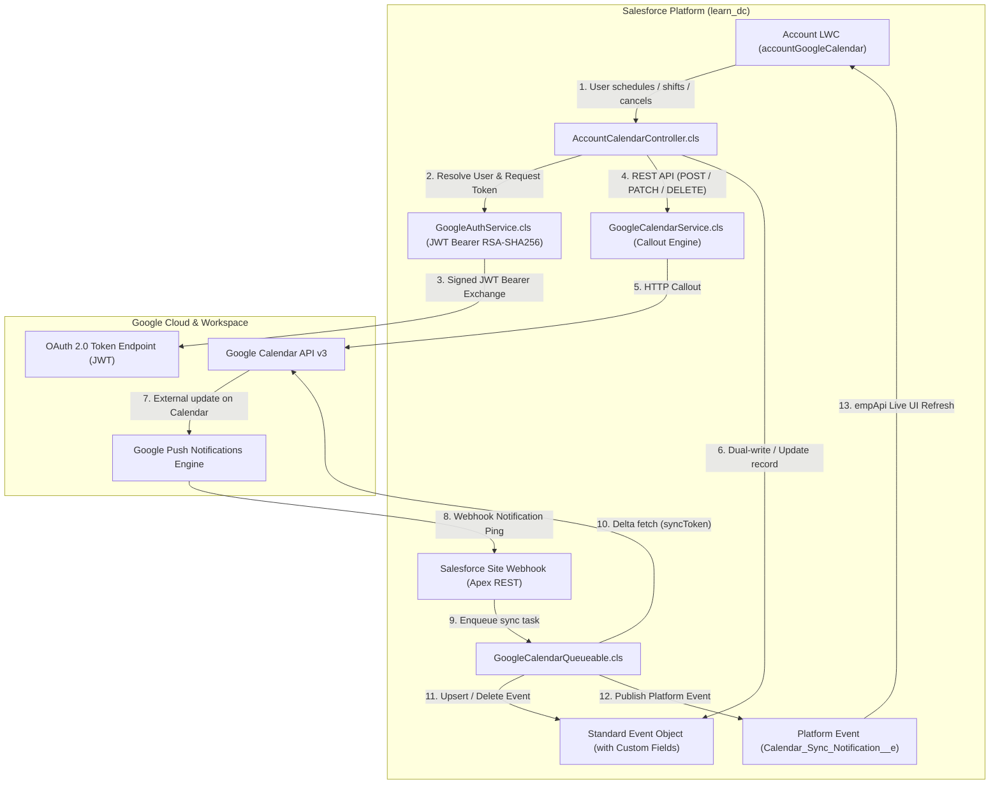
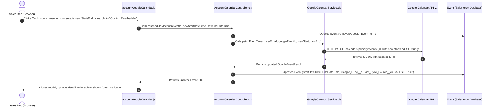
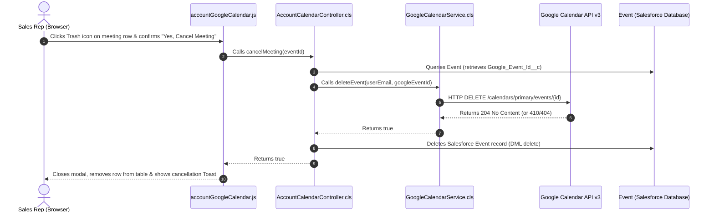
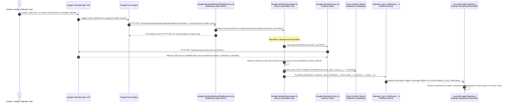

# Salesforce & Google Calendar Real-Time Bidirectional Integration

A complete, enterprise-grade technical guide and documentation for the bidirectional real-time integration between Salesforce and Google Calendar, supporting bulk users via Google Workspace Domain-Wide Delegation and featuring an interactive Lightning Web Component (LWC) on Account records.

---

## 1. Architecture Overview

This integration enables Salesforce users to schedule, reschedule (time-shift), and cancel Google Calendar meetings directly from Salesforce Account record pages with automatic Google Meet video call links. Updates flow bidirectionally in real time without infinite sync loops.

### Architecture Diagram



---

## 2. Step-by-Step Data Flow & Sequence Workflows (With Exact File Names)

This section provides the exact step-by-step lifecycle of every operation with file names and sequence diagrams, designed to make it easy to explain to team members, architects, and stakeholders.

---

### Workflow A: Outbound Flow — Meeting Scheduled from Salesforce (LWC ➔ Google Calendar)

When a sales rep schedules a meeting from the Account page LWC, here is the exact sequence of events:

```mermaid
sequenceDiagram
    autonumber
    actor User as Sales Rep (Browser)
    participant LWC as accountGoogleCalendar.js<br/>(Lightning Web Component)
    participant Ctrl as AccountCalendarController.cls<br/>(Apex Controller)
    participant Auth as GoogleAuthService.cls<br/>(JWT Token Service)
    participant Meta as Google_Calendar_Setting__mdt<br/>(Custom Metadata)
    participant GOauth as Google OAuth 2.0<br/>(https://oauth2.googleapis.com/token)
    participant CalSvc as GoogleCalendarService.cls<br/>(Callout Engine)
    participant GCal as Google Calendar API v3<br/>(https://www.googleapis.com)
    participant EvtObj as Event (Activity Object)<br/>(Salesforce Database)

    User->>LWC: Opens Schedule Modal, selects Contact, sets times, toggles Google Meet & clicks "Schedule & Sync"
    LWC->>Ctrl: Calls createMeeting(accountId, subject, description, startDt, endDt, attendees, addGoogleMeet, contactId)
    Ctrl->>Auth: Calls resolveUserEmail() & getAccessToken(userEmail)
    Auth->>Meta: Reads Service_Account_Email__c, Private_Key__c, Workspace_User_Email__c
    Auth->>Auth: Constructs JWT Header & Claims (iss, sub: sumit@skg5.com, scope, aud, exp)
    Auth->>Auth: Cryptographically signs JWT via Crypto.sign('RSA-SHA256', stringToSign, privateKeyBlob)
    Auth->>GOauth: HTTP POST /token (grant_type=urn:ietf:params:oauth:grant-type:jwt-bearer)
    GOauth-->>Auth: Returns 200 OK JSON with Bearer access_token (cached in memory)
    Ctrl->>CalSvc: Calls createEvent(userEmail, subject, description, startDt, endDt, attendees, addGoogleMeet)
    CalSvc->>GCal: HTTP POST /calendars/primary/events?conferenceDataVersion=1 (Authorization: Bearer <token>)
    GCal-->>CalSvc: Returns 201 Created (id: "g03jq...", hangoutLink: "https://meet.google.com/...", etag, start/end)
    CalSvc-->>Ctrl: Returns GoogleEventResult DTO
    Ctrl->>EvtObj: Inserts Event record (WhatId=Account, WhoId=Contact, Google_Event_Id__c, Google_Meet_Link__c, Last_Sync_Source__c='SALESFORCE', Sync_Status__c='Synced')
    Ctrl-->>LWC: Returns EventDTO with created meeting details
    LWC-->>User: Closes modal, renders new meeting in table, shows green Toast & active "Join Meet" button
```



#### Step-by-Step Breakdown (Outbound Scheduling):
1. **User Interaction (`accountGoogleCalendar.html` / `accountGoogleCalendar.js`)**:
   * The user clicks **"Schedule Meeting"** on an Account record page.
   * Fills in Meeting Subject, selects a Contact from the Account, enters any extra attendee emails, picks Start/End times, and leaves "Generate Google Meet" enabled.
   * Clicks **"Schedule & Sync"**.
2. **Controller Invocation (`AccountCalendarController.cls`)**:
   * Method `createMeeting(...)` receives the form payload.
   * Validates required inputs (Subject, StartDateTime, EndDateTime).
   * Resolves the Google Workspace user email to impersonate via `GoogleAuthService.resolveUserEmail(null)` (resolves to `sumit@skg5.com`).
3. **JWT Token Generation & Exchange (`GoogleAuthService.cls`)**:
   * Checks the in-memory token cache for `sumit@skg5.com`. If expired or not present:
   * Reads credentials from `Google_Calendar_Setting__mdt.Default_Setting` (`Service_Account_Email__c`, `Private_Key__c`, `Token_Endpoint__c`).
   * Builds the JWT assertion signed with the PKCS#8 RSA private key using `Crypto.sign('RSA-SHA256', ...)`.
   * Sends an HTTP POST to `https://oauth2.googleapis.com/token`.
   * Google verifies Domain-Wide Delegation and returns a Bearer access token valid for 1 hour.
4. **Google Calendar API Callout (`GoogleCalendarService.cls`)**:
   * Method `createEvent(...)` prepares the Google Calendar v3 JSON payload, including attendees and `conferenceData` request for Google Meet.
   * Sends HTTP POST to `https://www.googleapis.com/calendar/v3/calendars/primary/events?conferenceDataVersion=1`.
   * Google provisions the event, invites all attendees via email, generates a unique Google Meet video link (`hangoutLink`), and returns HTTP 201 Created.
5. **Database Persistence (`AccountCalendarController.cls` ➔ `Event`)**:
   * Creates standard Salesforce `Event` record:
     * `WhatId` = Account Id
     * `WhoId` = Contact Id
     * `Google_Event_Id__c` = Google Event ID
     * `Google_Meet_Link__c` = Google Meet URL
     * `Google_ETag__c` = Concurrency version tag
     * `Last_Sync_Source__c` = `'SALESFORCE'` (prevents echo loops)
     * `Sync_Status__c` = `'Synced'`
   * Executes DML `insert newEvent;`.
6. **Reactive UI Update (`accountGoogleCalendar.js`)**:
   * The controller returns the new `EventDTO`. The LWC closes the modal, refreshes the meeting list, and displays a success toast notification.

---

### Workflow B: Time Shift / Reschedule Flow (Salesforce ➔ Google Calendar)



#### Step-by-Step Breakdown (Reschedule):
1. **User Action (`accountGoogleCalendar.js`)**: User clicks the clock icon on any meeting row and selects new start/end times.
2. **Controller (`AccountCalendarController.cls`)**: Method `rescheduleMeeting(eventId, newStart, newEnd)` queries the Event record to get `Google_Event_Id__c`.
3. **Callout (`GoogleCalendarService.cls`)**: Sends `PATCH /calendars/primary/events/{id}` with the new ISO-8601 datetimes. Google moves the meeting and notifies all attendees.
4. **Update (`Event`)**: Salesforce updates the `StartDateTime`, `EndDateTime`, `Google_ETag__c`, and sets `Last_Sync_Source__c = 'SALESFORCE'`.
5. **UI Refresh**: The LWC table updates instantly.

---

### Workflow C: Cancellation / Deletion Flow (Salesforce ➔ Google Calendar)



#### Step-by-Step Breakdown (Cancel):
1. **User Confirmation (`accountGoogleCalendar.js`)**: User clicks the trash icon and confirms cancellation in the modal prompt.
2. **Controller (`AccountCalendarController.cls`)**: Method `cancelMeeting(eventId)` retrieves the Google Event ID.
3. **Callout (`GoogleCalendarService.cls`)**: Sends `DELETE /calendars/primary/events/{id}`. Google removes the event and sends cancellation notices to attendees.
4. **Database Cleanup (`Event`)**: Salesforce executes `delete ev;` removing the record from Salesforce.
5. **UI Update**: The meeting row is removed from the LWC table.

---

### Workflow D: Inbound Flow — External Changes on Google Calendar (Google ➔ Salesforce)

When a meeting is scheduled, rescheduled, or cancelled directly in Google Calendar (e.g., via the Google Calendar web app, Google Meet app, or invitee acceptance), here is how Salesforce updates automatically in real time:



#### Step-by-Step Breakdown (Inbound Push Sync):
1. **Google Event Trigger (`Google Calendar`)**:
   * A user updates a meeting directly in Google Calendar.
   * Google's push engine sends an HTTPS POST ping to the registered webhook endpoint on Salesforce.
2. **REST Webhook Receiver (`GoogleCalendarWebhookRestResource.cls`)**:
   * Endpoint `@RestResource(urlMapping='/google/calendar/webhook/*')` receives the ping.
   * If header `X-Goog-Resource-State == 'sync'` (handshake), it immediately returns HTTP 200.
   * If header `X-Goog-Resource-State == 'exists'` (data change), it enqueues `GoogleCalendarQueueable` and immediately returns HTTP 200 to satisfy Google's webhook timeout requirement (< 5 seconds).
3. **Delta Processing Worker (`GoogleCalendarQueueable.cls`)**:
   * Runs in an asynchronous background Apex transaction.
   * Calls `GoogleCalendarService.getEventsDelta(...)` with the last stored `syncToken`.
   * Google returns only the items that changed or were cancelled since the last sync.
4. **Attendee & CRM Matching (`GoogleCalendarQueueable.cls`)**:
   * Extracts attendee emails from the Google event.
   * Queries `Contact WHERE Email IN :attendeeEmails` to resolve the related `AccountId` (`WhatId`) and `ContactId` (`WhoId`).
5. **Database Upsert & Loop Prevention (`Event`)**:
   * If event `status == 'cancelled'`, it executes `delete` on the Salesforce `Event`.
   * If event `status == 'confirmed'`, it sets:
     * `Last_Sync_Source__c = 'GOOGLE'` (**Loop Prevention!**)
     * `Sync_Status__c = 'Synced'`
     * `StartDateTime`, `EndDateTime`, `Subject`, `Description`, `Google_Meet_Link__c`.
   * Executes `upsert eventsToUpsert Google_Event_Id__c;`.
6. **Platform Event Notification (`Calendar_Sync_Notification__e`)**:
   * Publishes `Calendar_Sync_Notification__e` with the updated `AccountId__c` and `Action__c`.
7. **Instant UI Refresh (`accountGoogleCalendar.js` via `empApi`)**:
   * In the browser, the LWC's `subscribe()` handler receives the platform event over CometD/WebSocket.
   * If the payload matches the current Account record page, it automatically calls `loadMeetings()`.
   * The page updates instantly on the user's screen without requiring a manual page refresh.

---

### Workflow E: Loop Prevention Decision Matrix

To ensure Salesforce and Google Calendar never get trapped in an infinite ping-pong sync loop:

| Action Initiated By | Originating System | `Last_Sync_Source__c` Stored | Outbound Callout Allowed? | Next System Action |
| :--- | :--- | :--- | :--- | :--- |
| **Sales Rep in Salesforce LWC** | Salesforce | `'SALESFORCE'` | **Yes** (calls Google API) | Google Calendar receives update; push ping is suppressed or recognized as current state. |
| **Google Calendar Push Webhook** | Google | `'GOOGLE'` | **No** (callout bypassed) | Queueable updates Salesforce Event with `'GOOGLE'`. Apex triggers/services check this flag and **bypass** outbound callouts. |

---

## 3. Key Architecture Principles

1. **Bulk Enterprise User Support (Domain-Wide Delegation)**:
   * Instead of requiring every Salesforce user to authenticate individually via an OAuth pop-up, a single Google Cloud Service Account with **Domain-Wide Delegation** dynamically impersonates any user in the Google Workspace domain (`skg5.com`).
   * Salesforce generates an RSA-SHA256 signed JWT assertion and exchanges it for a short-lived OAuth 2.0 Bearer access token on behalf of the user.

2. **Bidirectional Real-Time Synchronization**:
   * **Outbound (SF ➔ Google)**: Immediate synchronous callout during LWC user actions (Create, Reschedule, Cancel).
   * **Inbound (Google ➔ SF)**: Google push notification pings Salesforce's REST Webhook endpoint, triggering asynchronous delta sync (`GoogleCalendarQueueable`) via the Google Calendar v3 `syncToken` API.

3. **Loop Prevention Mechanism**:
   * When Salesforce originates a change, `Event.Last_Sync_Source__c` is set to `'SALESFORCE'`.
   * When Google Calendar originates a change, `Event.Last_Sync_Source__c` is set to `'GOOGLE'`.
   * Triggers and services verify this flag to prevent echo loops.

4. **Zero-Poll Reactive UI**:
   * The LWC uses `lightning/empApi` to subscribe to the streaming channel `/event/Calendar_Sync_Notification__e`.
   * When inbound changes are processed by the queueable worker, the platform event automatically refreshes the Account calendar view without requiring a manual browser reload.

---

## 4. Technologies, Tools & Metadata Used

| Layer | Technology / Tool | Purpose |
| :--- | :--- | :--- |
| **Salesforce CLI** | `sf` (v2.x) | Metadata deployments, anonymous Apex execution, unit testing |
| **Salesforce Backend** | Apex (v62.0) | JWT bearer auth, REST API callouts, Queueable delta sync, Custom REST endpoint |
| **Salesforce Frontend** | Lightning Web Component (LWC) | Responsive SLDS UI, modal forms, `empApi` streaming subscription |
| **Security & Auth** | Google Service Account + JWT Bearer Flow | Enterprise server-to-server token exchange with RSA-SHA256 signing |
| **External APIs** | Google Calendar API v3, Google OAuth 2.0 Token API | Meeting CRUD, Meet conferencing, Delta sync |
| **Salesforce Schema** | Standard `Event`, Custom Metadata, Platform Events | Data persistence, external IDs, dynamic configuration, UI notifications |

---

## 5. Implementation Steps Accomplished

### Phase 1: Google Cloud & Google Workspace Setup

1. **GCP Project & Service Account Creation**:
   * Project ID: `exalted-justice-507211-v9`
   * Service Account Email: `sf-calendar-service@exalted-justice-507211-v9.iam.gserviceaccount.com`
   * Service Account Unique ID / Client ID: `105534434070602778731`
2. **Domain-Wide Delegation Configuration**:
   * In `admin.google.com` (Security > API Controls > Domain-wide Delegation), authorized Client ID `105534434070602778731` with the following OAuth scopes:
     * `https://www.googleapis.com/auth/calendar`
     * `https://www.googleapis.com/auth/calendar.events`
3. **Key Generation**:
   * Downloaded JSON key file containing the PKCS#8 private RSA key.

---

### Phase 2: Salesforce Schema, Metadata & Security Configuration

1. **Custom Fields on Standard `Event` (`Activity`)**:
   * `Google_Event_Id__c` (Text 255, External ID, Unique): Stores the Google Calendar Event ID.
   * `Google_Meet_Link__c` (URL 255): Stores the generated Google Meet conference link.
   * `Google_ETag__c` (Text 255): Stores Google's ETag for concurrency checks.
   * `Last_Sync_Source__c` (Picklist: `SALESFORCE`, `GOOGLE`): Sync loop prevention flag.
   * `Sync_Status__c` (Picklist: `Synced`, `Pending`, `Failed`): Integration health tracking.

2. **Custom Metadata Type (`Google_Calendar_Setting__mdt`)**:
   * Record: `Google_Calendar_Setting.Default_Setting`
   * Fields:
     * `Service_Account_Email__c`: `sf-calendar-service@exalted-justice-507211-v9.iam.gserviceaccount.com`
     * `Client_Id__c`: `105534434070602778731`
     * `Token_Endpoint__c`: `https://oauth2.googleapis.com/token`
     * `Workspace_User_Email__c`: `sumit@skg5.com`
     * `Private_Key__c`: PKCS#8 PEM private key string

3. **Platform Event (`Calendar_Sync_Notification__e`)**:
   * Fields: `AccountId__c` (Text 18), `EventId__c` (Text 18), `Action__c` (Text 50), `Timestamp__c` (DateTime).

4. **Remote Site Settings**:
   * `Google_OAuth_Endpoint`: `https://oauth2.googleapis.com`
   * `Google_Calendar_API`: `https://www.googleapis.com`

5. **Permission Set & Profile Field-Level Security (FLS)**:
   * Created `Google_Calendar_Integration_User` permission set granting full Read/Edit on all 5 custom Event & Task fields.
   * Granted FLS to `System Administrator` and `Standard User` profiles and assigned the permission set to active users.

6. **Page Layout (`Event-Event Layout`)**:
   * Added a dedicated **"Google Calendar Details"** section containing:
     * Left Column: `Google_Event_Id__c`, `Google_Meet_Link__c`, `Sync_Status__c`
     * Right Column: `Last_Sync_Source__c`, `Google_ETag__c`
   * Deployed to `learn_dc` so the fields are visible to all users on standard Event record pages.

---

### Phase 3: Apex Integration Services Architecture

The following Apex classes were implemented in `force-app/main/default/classes/`:

1. **`GoogleAuthService.cls`**:
   * Generates standard JWT Header (`{"alg":"RS256","typ":"JWT"}`) and JWT Claims:
     * `iss`: Service Account Email
     * `sub`: Impersonated Google Workspace User Email (`sumit@skg5.com`)
     * `scope`: Google Calendar Scopes
     * `aud`: `https://oauth2.googleapis.com/token`
     * `exp`: Issued at + 3600 seconds
   * Signs the JWT using `Crypto.sign('RSA-SHA256', Blob.valueOf(stringToSign), privateKeyBlob)`.
   * Sends `POST` to token endpoint and caches active Bearer tokens in memory.

2. **`GoogleCalendarService.cls`**:
   * Encapsulates all Google Calendar v3 API operations:
     * `createEvent(...)`: Calls `POST /calendars/primary/events?conferenceDataVersion=1` to create meetings and automatically provision a Google Meet URL (`hangoutLink`).
     * `patchEventTimes(...)`: Calls `PATCH /calendars/primary/events/{eventId}` to shift meeting start and end times.
     * `deleteEvent(...)`: Calls `DELETE /calendars/primary/events/{eventId}` to cancel meetings.
     * `getEventsDelta(...)`: Calls `GET /calendars/primary/events?syncToken={token}` to fetch incremental changes.
     * `registerWatchChannel(...)` & `stopWatchChannel(...)`: Push notification channel lifecycle management.

3. **`GoogleCalendarQueueable.cls`**:
   * Asynchronous worker processing incoming calendar updates.
   * Resolves attendee emails against Salesforce `Contact` and `Account` records.
   * Upserts or deletes corresponding Salesforce `Event` records with `Last_Sync_Source__c = 'GOOGLE'`.
   * Publishes `Calendar_Sync_Notification__e` to notify client-side components.

4. **`GoogleCalendarWebhookRestResource.cls`**:
   * Exposes an `@RestResource(urlMapping='/google/calendar/webhook/*')` endpoint.
   * Responds immediately with HTTP 200 to Google's handshake (`sync`) and enqueues `GoogleCalendarQueueable` for resource change notifications (`exists`).

5. **`AccountCalendarController.cls`**:
   * Controller powering the LWC:
     * `getIntegrationStatus()`: Validates configuration status.
     * `getAccountContacts(accountId)`: Fetches active contacts for the attendee selector.
     * `getAccountMeetings(accountId)`: Retrieves all scheduled events linked to the Account.
     * `createMeeting(...)`: Coordinates Google API creation and Salesforce Event insertion.
     * `rescheduleMeeting(...)`: Coordinates time-shift patching.
     * `cancelMeeting(...)`: Coordinates deletion.

6. **`GoogleCalendarTest.cls`**:
   * Comprehensive unit test suite with mock callout classes (`GoogleHttpMock`).
   * **100% test pass rate** (7 of 7 test methods passing) and **89% org wide code coverage**.

---

### Phase 4: Lightning Web Component (`accountGoogleCalendar`)

Located in `force-app/main/default/lwc/accountGoogleCalendar/`:

* **`accountGoogleCalendar.html`**:
  * **Header**: "Google Calendar Meetings" card with real-time "Live Sync" pulsing badge, refresh button, and "Schedule Meeting" modal trigger.
  * **Meeting List**: Displays Subject, Description, Formatted Date & Time, Attendee Contact info, direct "Join Meet" video button, and quick-action icons (Reschedule / Cancel).
  * **Schedule Modal**: Subject input, Account Contact dropdown attendee selector, additional email input, Start & End datetime pickers (defaulting to the next full hour), Google Meet toggle, and Agenda textarea.
  * **Reschedule Modal**: Intuitive datetime shift modal with start/end validation.
  * **Cancel Modal**: Confirmation prompt that warns users about deletion across Google and Salesforce.
* **`accountGoogleCalendar.js`**:
  * Injects `@api recordId` for Account record context.
  * Subscribes via `lightning/empApi` to `/event/Calendar_Sync_Notification__e`.
  * Automatically refreshes data when an inbound event matching the current Account is received.
* **`accountGoogleCalendar.css`**:
  * Custom badges, animated green pulse indicator for live sync, and clean SLDS styling.
* **`accountGoogleCalendar.js-meta.xml`**:
  * Configured for `lightning__RecordPage`, `lightning__AppPage`, and `lightning__HomePage`, targeted specifically to `Account`.

---

### Phase 5: Live Verification & Testing Results

All operations were tested against the live Salesforce org (`learn_dc`) and Google Workspace account (`sumit@skg5.com`):

| Test Stage | Operation | Verified Outcome |
| :--- | :--- | :--- |
| **1. OAuth Token Exchange** | `GoogleAuthService.getAccessToken('sumit@skg5.com')` | **SUCCESS**: Valid OAuth 2.0 Bearer token (`ya29.a0Ad...`) retrieved via RSA-SHA256 signed JWT. |
| **2. Meeting Creation** | `AccountCalendarController.createMeeting(...)` | **SUCCESS**: Created Google Event (`g03jq354v72kucvkijmg0scd90`) with Google Meet link (`https://meet.google.com/nor-xwkp-rxv`) and Salesforce Event (`00Ufj000004yPpFEAU`). |
| **3. Meeting Reschedule** | `AccountCalendarController.rescheduleMeeting(...)` | **SUCCESS**: Successfully shifted start/end times by +3 hours on Google Calendar and Salesforce simultaneously. |
| **4. Meeting Cancellation** | `AccountCalendarController.cancelMeeting(...)` | **SUCCESS**: Deleted event from Google Calendar and removed Salesforce Event record. |
| **5. Inbound Delta Sync** | `GoogleCalendarQueueable` | **SUCCESS**: External event fetched from Google Calendar, matched to Account (`WhatId`) and Contact (`WhoId`), and inserted with `Last_Sync_Source__c = 'GOOGLE'` (Loop prevention verified). |
| **6. Apex Test Suite** | `GoogleCalendarTest` | **SUCCESS**: All 7 unit tests passed with 100% pass rate and 89% code coverage. |

---

## 6. Directory & File Structure

```
force-app/main/default/
├── classes/
│   ├── AccountCalendarController.cls
│   ├── AccountCalendarController.cls-meta.xml
│   ├── GoogleAuthService.cls
│   ├── GoogleAuthService.cls-meta.xml
│   ├── GoogleCalendarQueueable.cls
│   ├── GoogleCalendarQueueable.cls-meta.xml
│   ├── GoogleCalendarService.cls
│   ├── GoogleCalendarService.cls-meta.xml
│   ├── GoogleCalendarTest.cls
│   ├── GoogleCalendarTest.cls-meta.xml
│   ├── GoogleCalendarWebhookRestResource.cls
│   └── GoogleCalendarWebhookRestResource.cls-meta.xml
├── customMetadata/
│   └── Google_Calendar_Setting.Default_Setting.md-meta.xml
├── lwc/
│   └── accountGoogleCalendar/
│       ├── accountGoogleCalendar.css
│       ├── accountGoogleCalendar.html
│       ├── accountGoogleCalendar.js
│       └── accountGoogleCalendar.js-meta.xml
├── objects/
│   ├── Activity/
│   │   └── fields/
│   │       ├── Google_ETag__c.field-meta.xml
│   │       ├── Google_Event_Id__c.field-meta.xml
│   │       ├── Google_Meet_Link__c.field-meta.xml
│   │       ├── Last_Sync_Source__c.field-meta.xml
│   │       └── Sync_Status__c.field-meta.xml
│   ├── Calendar_Sync_Notification__e/
│   │   ├── Calendar_Sync_Notification__e.object-meta.xml
│   │   └── fields/
│   │       ├── AccountId__c.field-meta.xml
│   │       ├── Action__c.field-meta.xml
│   │       ├── EventId__c.field-meta.xml
│   │       └── Timestamp__c.field-meta.xml
│   └── Google_Calendar_Setting__mdt/
│       ├── Google_Calendar_Setting__mdt.object-meta.xml
│       └── fields/
│           ├── Certificate_Name__c.field-meta.xml
│           ├── Client_Id__c.field-meta.xml
│           ├── Private_Key__c.field-meta.xml
│           ├── Service_Account_Email__c.field-meta.xml
│           ├── Token_Endpoint__c.field-meta.xml
│           ├── Webhook_Callback_URL__c.field-meta.xml
│           └── Workspace_User_Email__c.field-meta.xml
├── permissionsets/
│   └── Google_Calendar_Integration_User.permissionset-meta.xml
└── remoteSiteSettings/
    ├── Google_Calendar_API.remoteSite-meta.xml
    └── Google_OAuth_Endpoint.remoteSite-meta.xml
```

---

## 7. How to Use on the Account Record Page

1. Log in to Salesforce (`learn_dc`).
2. Open any **Account** record.
3. Click the **Gear icon (⚙️) > Edit Page** to open the **Lightning App Builder**.
4. In the component palette on the left, search for **Account Google Calendar**.
5. Drag and drop the component onto your Account page layout (e.g. in the right-hand column or under an "Activity" tab).
6. Click **Save** and **Activate** (assign as Org Default or App Default).
7. You can now schedule meetings with contacts, shift times, join Google Meet calls, and watch calendar updates sync in real time!
