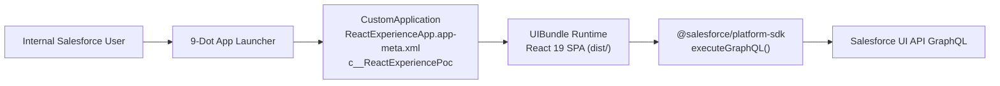
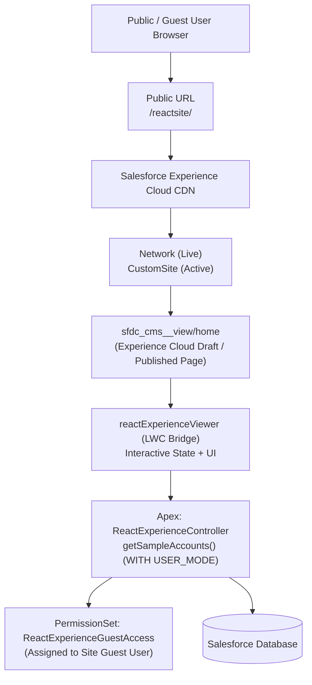

# Salesforce Multi-Framework Development: Comprehensive Architecture & React.js Deployment Guide

> **Document Version:** 2.0  
> **Target Org:** `learn_dc` (`sumit.gupta@datacloud.com`) | **API Version:** 67.0  
> **Metadata Types:** `UIBundle`, `CustomApplication`, `DigitalExperienceBundle`, `Network`, `CustomSite`, `LightningComponentBundle`, `ApexClass`, `PermissionSet`  
> **Stack:** React 19, TypeScript, Vite 7, Tailwind CSS v4, Radix UI, `@salesforce/platform-sdk`, LWR (Lightning Web Runtime)  

---

## 1. Executive Summary

Historically, Salesforce developers were forced to build single-page web applications within the proprietary Lightning Web Component (LWC) framework, or resort to fragile workarounds like embedding bundled code into Static Resources with `lwc:dom="manual"`, or rendering external apps in restrictive `iframe` / Visualforce containers.

**Salesforce Multi-Framework Development** introduces native platform support for modern open-source frontend frameworks—specifically **React** (with Vite and TypeScript)—treating them as first-class Salesforce metadata through the **`UIBundle`** architecture.

This comprehensive guide details:
1. **The Multi-Framework Architecture:** What it is, what new capabilities it introduces, and how it fundamentally differs from legacy integration patterns.
2. **Local Development Workflow:** Running instant Hot Module Replacement (HMR) against live Salesforce data using CLI reverse proxying.
3. **Deployment Pathway A — Internal Application (Salesforce App Launcher):** Deploying full-page React Single Page Applications for internal authenticated employees via `CustomApplication` and `UIBundle`.
4. **Deployment Pathway B — External Experience Cloud Site (Digital Experiences / LWR):** Hosting public-facing, unauthenticated (guest) and authenticated portals via Experience Cloud, LWR views, and LWC bridges.
5. **Architectural Comparison & File Inventory:** Detailed metadata breakdown, permission management, and troubleshooting strategies.

---

## 2. What is Salesforce Multi-Framework Development?

Salesforce Multi-Framework is a platform architecture (associated with modern platform initiatives like Agentforce Vibes and Headless 360) that provides a framework-agnostic runtime directly on the Salesforce Core platform.

Instead of writing LWC HTML templates or packaging JavaScript into unmanaged `.zip` static resources, developers can develop, build, and deploy full React Single Page Applications (SPAs) natively within their Salesforce DX project (`force-app/main/default/uiBundles/`).

### What New Capabilities Does It Contain?

1. **`UIBundle` Metadata Type:**
   * A dedicated Salesforce metadata component (`.uibundle-meta.xml` and `ui-bundle.json`) that manages source code, asset mapping, compilation output, and routing.
   * Fully supported by standard Salesforce CLI (`sf project deploy start`) and modern DevOps pipelines.

2. **Native Session & Authentication Inheritance:**
   * React apps running as a `UIBundle` automatically inherit the authenticated user's session, profile, permissions, and CSRF tokens.
   * **Zero OAuth dance:** No Connected Apps, Consumer Keys, OAuth redirects, or manual refresh token handling required.

3. **Direct Data Access via `@salesforce/platform-sdk` & UI API GraphQL:**
   * Rather than writing custom `@AuraEnabled` Apex controllers for every data operation, the React app interacts directly with Salesforce records using the **Salesforce Data SDK** and the **UI API GraphQL endpoint**.
   * Provides schema-driven, typed queries and mutations directly in TypeScript.

4. **Local Proxy-Based Development (`sf ui-bundle dev`):**
   * Eliminates the need to deploy code to the cloud on every save.
   * The CLI spins up a local Vite dev server alongside a secure reverse-proxy that injects real session tokens from your authorized Salesforce org, providing instantaneous Hot Module Replacement (HMR) while pulling live org data.

5. **Multi-Surface Targeting:**
   * React UI Bundles can target internal applications via `CustomApplication` metadata (accessible from the 9-dot App Launcher) or integrate into digital experience networks.

---

## 3. Multi-Framework vs. Legacy Approaches

| Evaluation Criteria | Multi-Framework (`UIBundle`) | LWC + Static Resource Wrapper | iFrame / Visualforce | Salesforce Canvas | Headless React (External SPA) |
| :--- | :--- | :--- | :--- | :--- | :--- |
| **Salesforce Hosting** | **Native** (First-class metadata) | Partial (LWC shell + Static Resource zip) | Partial (Hosted in VF or External) | External host | External (AWS, Vercel, Heroku) |
| **Authentication** | **Native Session Inheritance** (Automatic) | Inherited via LWC context | Session ID via URL or Canvas signed request | Signed Request / OAuth | Full OAuth 2.0 (PKCE / JWT) required |
| **Data Fetching** | **UI API GraphQL & Data SDK** | Apex `@wire` / Imperative Apex passed via JS bridge | Remote Objects / Apex / REST API | REST API / Canvas SDK | Salesforce REST / GraphQL APIs |
| **Local DX Experience** | **Live Proxy HMR** (`sf ui-bundle dev`) | None (Must rebuild & re-upload zip) | Standard web dev, but mocked auth | Complex local mock setup | Standard web dev, requires live OAuth |
| **Security Architecture** | **Platform Runtime Security** | Lightning Web Security (LWS) constraints | iFrame sandbox / CSP hurdles | Canvas security policies | External server security |
| **Experience Cloud** | Native App / Experience target | Drag-and-drop into Experience Builder | iFrame sizing & scrollbar issues | Complex resizing & auth sync | External portal |
| **DevOps & Deployments** | Native `sf project deploy` | Multiple manual assets (LWC + Static Resource) | Multiple assets | Connected App + External CI/CD | Disconnected deployment pipelines |

---

## 4. End-to-End System Architecture

```mermaid
flowchart TD
    subgraph Local_Development ["1. Local Development Environment"]
        Dev["Developer (VS Code / Terminal)"]
        Vite["Vite 7 Dev Server (Port 5173)\nHMR + TypeScript + Tailwind"]
        Proxy["Salesforce CLI Proxy (Port 4546)\nsf ui-bundle dev"]
        Dev --> Vite
        Vite <--> Proxy
    end

    subgraph Salesforce_Core ["2. Salesforce Core Platform (learn_dc)"]
        OrgSession["Authorized Org Session\n(sumit.gupta@datacloud.com)"]
        GraphQL["Salesforce UI API GraphQL Engine"]
        ApexEngine["Apex Runtime Engine\n(ReactExperienceController)"]
        Proxy <== Authenticated API Calls ==> GraphQL
        Proxy <.. Injects Session ..> OrgSession
    end

    subgraph Deployment_Pathway_A ["3. Deployment Pathway A: Internal App (App Launcher)"]
        UIB["UIBundle: ReactExperiencePoc\n(React 19 + Assets + Routes)"]
        App["CustomApplication: ReactExperienceApp\n(<uiBundle>c__ReactExperiencePoc</uiBundle>)"]
        PermInternal["PermissionSet: ReactExperienceAppAccess\n(Application Visibility)"]
        
        App --> UIB
        PermInternal --> App
    end

    subgraph Deployment_Pathway_B ["4. Deployment Pathway B: External Experience Site (LWR)"]
        Net["Network: ReactExperienceSite\n(Status: Live)"]
        Site["CustomSite: ReactExperienceSite\n(Active: True)"]
        CMS["DigitalExperienceBundle: site/ReactExperienceSite1"]
        CMSView["sfdc_cms__view/home\n(Mounted: c:reactExperienceViewer)"]
        LWC["LWC: reactExperienceViewer\n(UI + State Management)"]
        PermGuest["PermissionSet: ReactExperienceGuestAccess\n(Apex Class Access Only)"]
        GuestUser["Site Guest User Profile"]

        Net --> CMS
        Site --> CMS
        CMS --> CMSView
        CMSView --> LWC
        LWC --> ApexEngine
        PermGuest --> GuestUser
    end

    subgraph End_User_Surfaces ["5. End-User Runtime Surfaces"]
        InternalUser["Internal Employee Browser"]
        ExternalUser["Public Guest / External User Browser"]

        InternalUser -->|"1. Opens 9-Dot App Launcher"| App
        App -->|"2. Renders Full React SPA"| UIB
        
        ExternalUser -->|"1. Hits Public URL (/reactsite/)"| Net
        Net -->|"2. Serves Live CDN HTML"| CMSView
    end
```

---

## 5. Prerequisites & Org Enablement

Before deploying or running either deployment model, verify that the following prerequisites are configured in your Salesforce environment:

### 1. Enable Digital Experiences in Salesforce Setup
1. Log in to Salesforce Setup as a System Administrator.
2. In Quick Find, search for **Digital Experiences** > select **Settings**.
3. Check the box for **Enable Digital Experiences**.
4. Enter your desired domain name for Digital Experiences and click **Save**.
*(Note: Enabling this registers the core `Network` and `CustomSite` metadata infrastructure in your org).*

### 2. Enable Multi-Framework Support
1. In Setup, search for **React Development with Agentforce Vibes** or **Multi-Framework**.
2. Toggle the setting to **Enabled**.
*(This registers the `UIBundle` metadata handler and activates the UI API GraphQL endpoints for non-LWC runtimes).*

### 3. Salesforce CLI Requirements
Ensure your Salesforce CLI (`sf`) is on a modern release:
```powershell
sf --version
# Recommended: @salesforce/cli 2.x+ with Node.js 20+
```

Verify the `ui-bundle` command family is active:
```powershell
sf help ui-bundle
sf template generate ui-bundle --help
```

---

## 6. Local Development Workflow (`sf ui-bundle dev`)

The Multi-Framework development experience eliminates the need to compile, package, and deploy metadata to Salesforce on every single code change.

### How the Local Reverse Proxy Works:
1. When you run `sf ui-bundle dev`, the CLI starts a local Vite server running your React code on an internal port (e.g., 5173).
2. It simultaneously launches a secure reverse proxy on port 4546.
3. The reverse proxy grabs valid session tokens from your authorized CLI org (`learn_dc`) and automatically injects authentication headers into every GraphQL and UI API request routed to Salesforce.
4. Your browser connects to `http://localhost:4546`. Any modification to React components (`.tsx`), CSS (`.css`), or assets triggers instant Hot Module Replacement (HMR) in under 50ms while querying real Salesforce records.

### Command:
```powershell
sf ui-bundle dev --name ReactExperiencePoc --target-org learn_dc --open
```

---

## 7. Deployment Pathway A: Internal Application (App Launcher)

### A. Architecture Overview
* **Target Audience:** Internal licensed Salesforce users (Employees, Sales Reps, Service Agents, Admins).
* **Surface:** App Launcher (the 9-dot menu in Lightning Experience) or direct URL navigation (`/lightning/app/c__ReactExperienceApp`).
* **Metadata Mechanism:** The React SPA is compiled into static production assets stored in `force-app/main/default/uiBundles/ReactExperiencePoc/dist`. A `CustomApplication` metadata record references the UI Bundle directly using `<uiBundle>c__ReactExperiencePoc</uiBundle>`.
* **Security & Auth:** The user’s active Lightning Experience session cookie is automatically inherited by the React container. The platform’s UI API GraphQL endpoint processes queries under the running user’s profile and sharing rules.



---

### B. Files Created & Modified for Internal Deployment

#### 1. UI Bundle Metadata Registration
* **File Path:** `force-app/main/default/uiBundles/ReactExperiencePoc/ReactExperiencePoc.uibundle-meta.xml`
* **Role:** Registers the bundle as a deployable Salesforce metadata component of type `UIBundle`.
```xml
<?xml version="1.0" encoding="UTF-8"?>
<UIBundle xmlns="http://soap.sforce.com/2006/04/metadata">
    <masterLabel>React Experience Poc</masterLabel>
    <description>Salesforce UI Bundle running React 19 and Vite</description>
    <isActive>true</isActive>
    <version>1</version>
</UIBundle>
```

#### 2. UI Bundle Runtime Configuration
* **File Path:** `force-app/main/default/uiBundles/ReactExperiencePoc/ui-bundle.json`
* **Role:** Configures routing behavior, asset directories, and SPA fallback for client-side routing (React Router).
```json
{
  "outputDir": "dist",
  "routing": {
    "trailingSlash": "never",
    "fallback": "index.html"
  }
}
```

#### 3. CustomApplication Shell
* **File Path:** `force-app/main/default/applications/ReactExperienceApp.app-meta.xml`
* **Role:** Defines a native Salesforce Lightning Application that appears in the App Launcher. Instead of configuring traditional tabs or navigation items, it points to `<uiBundle>c__ReactExperiencePoc</uiBundle>`, instructing Salesforce to render the React application full-page.
```xml
<?xml version="1.0" encoding="UTF-8"?>
<CustomApplication xmlns="http://soap.sforce.com/2006/04/metadata">
    <label>React Experience App</label>
    <description>Lightning application hosting the React Experience POC UI Bundle</description>
    <uiType>Lightning</uiType>
    <uiBundle>c__ReactExperiencePoc</uiBundle>
    <formFactors>Large</formFactors>
    <navType>Standard</navType>
</CustomApplication>
```

#### 4. Permission Set for Internal Application Visibility
* **File Path:** `force-app/main/default/permissionsets/ReactExperienceAppAccess.permissionset-meta.xml`
* **Role:** Controls which Salesforce users can discover and open `ReactExperienceApp` from the App Launcher via `<applicationVisibilities>`.
```xml
<?xml version="1.0" encoding="UTF-8"?>
<PermissionSet xmlns="http://soap.sforce.com/2006/04/metadata">
    <hasActivationRequired>false</hasActivationRequired>
    <label>React Experience App Access</label>
    <description>Grants access to the React Experience App UI Bundle</description>
    <applicationVisibilities>
        <application>ReactExperienceApp</application>
        <visible>true</visible>
    </applicationVisibilities>
</PermissionSet>
```

---

### C. Build & Deployment Commands for Internal Application

#### Step 1: Compile the React Application
Navigate to the UI bundle directory, install npm dependencies, and compile the production bundle:
```powershell
cd "force-app/main/default/uiBundles/ReactExperiencePoc"
npm install
npm run build
cd ../../../..
```

#### Step 2: Deploy Metadata to Salesforce
Deploy the compiled UI Bundle, the CustomApplication shell, and the Permission Set:
```powershell
sf project deploy start --metadata UIBundle:ReactExperiencePoc --target-org learn_dc
sf project deploy start --metadata CustomApplication:ReactExperienceApp --target-org learn_dc
sf project deploy start --metadata PermissionSet:ReactExperienceAppAccess --target-org learn_dc
```

#### Step 3: Assign the Permission Set to Your User
```powershell
sf org assign permset -n ReactExperienceAppAccess -o learn_dc
```

#### Step 4: Access and Verification
1. Log in to Salesforce: `https://orgfarm-60a150fdc3-dev-ed.develop.lightning.force.com`.
2. Click the **App Launcher** (the 9 dots on the upper-left of the navigation bar).
3. Search for **"React Experience App"** and select it.
4. The React application opens full-width, displaying interactive state counters and querying live Accounts via GraphQL!

---

## 8. Deployment Pathway B: External Experience Cloud Site (LWR)

### A. Architecture Overview
* **Target Audience:** External public users (Guests, Customers, Partners) without Salesforce user licenses.
* **Surface:** Experience Cloud site public CDN domain: `https://orgfarm-60a150fdc3-dev-ed.develop.my.site.com/reactsite/`.
* **Metadata Mechanism:** Uses the modern **Build Your Own (LWR)** site architecture powered by `DigitalExperienceBundle` metadata (`sfdc_cms__site`, `sfdc_cms__route`, `sfdc_cms__view`).
* **Component Bridge:** Because Experience Cloud LWR templates render structured page layouts composed of layout sections and regions, we mount `c:reactExperienceViewer` into the `home` view (`sfdc_cms__view/home/content.json`).
* **Security & Auth:** Configured for unrestricted **Public / Guest Access**. The Site Guest User executes Apex calls through `ReactExperienceController.cls` using the guest-specific permission set `ReactExperienceGuestAccess`.



---

### B. Problems Encountered & Exact Architectural Solutions

During external deployment, several platform hurdles had to be resolved:

#### 1. The "Start Building Your Page" Placeholder
* **Problem:** Newly created Build Your Own (LWR) sites pre-populate the Home page with a default component (`community_builder:htmlEditor`) containing a desert illustration and the text *"Start Building Your Page"*.
* **Solution:** We inspected `sfdc_cms__view/home/content.json` and replaced the entire `community_builder:htmlEditor` component definition with our custom component definition `"definition": "c:reactExperienceViewer"`.

#### 2. The Login Prompt / Authentication Wall
* **Problem:** Browsing to the site URL redirected visitors to a Salesforce Communities login page (`CommunitiesLogin`).
* **Solution:** 
  1. Updated `ReactExperienceSite.network-meta.xml` setting `<status>Live</status>`.
  2. Updated `sfdc_cms__site/ReactExperienceSite1/content.json` setting `"publicAccessStatus": "AUTHENTICATED_WITH_PUBLIC_ACCESS_ENABLED"`.
  3. Updated `sfdc_cms__route/Home/content.json` setting `"pageAccess": "Public"`.

#### 3. Guest User License Constraint (`TABSET_LIMIT_EXCEEDED`)
* **Problem:** When attempting to assign the standard `ReactExperienceAppAccess` permission set to the Site Guest User, the platform rejected the assignment with:  
  `TABSET_LIMIT_EXCEEDED: You cannot assign an app permission to a guest user because guest users have a limit of 0 standard apps.`
* **Solution:** We architected a dedicated `ReactExperienceGuestAccess.permissionset-meta.xml` containing *only* Apex class access (`<classAccesses>`) and zero `<applicationVisibilities>`. This satisfies Salesforce's strict Guest User licensing policy.

#### 4. The Experience Builder "Draft vs. Published" CDN Architecture
* **Problem:** After deploying updated metadata to Salesforce via CLI, opening the public URL still showed the old cached version or placeholder.
* **Solution:** Deploying `sfdc_cms__view` modifies the **Draft workspace** of Experience Builder. To convert draft metadata into live public CDN distribution, you **MUST** click the blue **"Publish"** button in Experience Builder. (Note: `sf community publish` is deprecated in `@salesforce/cli` v2; the Experience Builder UI publish workflow is the official platform standard).

---

### C. Files Created & Modified for External Site Deployment

#### 1. Network Metadata (Experience Cloud Site Definition)
* **File Path:** `force-app/main/default/networks/ReactExperienceSite.network-meta.xml`
* **Role:** Defines the Experience Cloud network, its URL path prefix (`reactsitevforcesite`), and crucially marks status as `<status>Live</status>`.
```xml
<?xml version="1.0" encoding="UTF-8"?>
<Network xmlns="http://soap.sforce.com/2006/04/metadata">
    <allowInternalUserLogin>false</allowInternalUserLogin>
    <picassoSite>ReactExperienceSite1</picassoSite>
    <site>ReactExperienceSite</site>
    <status>Live</status>
    <urlPathPrefix>reactsitevforcesite</urlPathPrefix>
</Network>
```

#### 2. CustomSite Metadata
* **File Path:** `force-app/main/default/sites/ReactExperienceSite.site-meta.xml`
* **Role:** Activates the public HTTP endpoint (`<active>true</active>`) and associates it with the ChatterNetwork site type.
```xml
<?xml version="1.0" encoding="UTF-8"?>
<CustomSite xmlns="http://soap.sforce.com/2006/04/metadata">
    <active>true</active>
    <masterLabel>ReactExperienceSite</masterLabel>
    <siteType>ChatterNetwork</siteType>
    <urlPathPrefix>reactsitevforcesite</urlPathPrefix>
</CustomSite>
```

#### 3. Digital Experience Site Public Access Configuration
* **File Path:** `force-app/main/default/digitalExperiences/site/ReactExperienceSite1/sfdc_cms__site/ReactExperienceSite1/content.json`
* **Role:** Configures site-wide public accessibility by setting `publicAccessStatus` to `AUTHENTICATED_WITH_PUBLIC_ACCESS_ENABLED`.
```json
{
  "type": "sfdc_cms__site",
  "title": "ReactExperienceSite",
  "contentBody": {
    "publicAccessStatus": "AUTHENTICATED_WITH_PUBLIC_ACCESS_ENABLED",
    "siteThemeType": "standard"
  }
}
```

#### 4. Digital Experience Home Route Public Access
* **File Path:** `force-app/main/default/digitalExperiences/site/ReactExperienceSite1/sfdc_cms__route/Home/content.json`
* **Role:** Designates the Home route as completely open to guest users without requiring an authenticated user token.
```json
{
  "type": "sfdc_cms__route",
  "title": "Home",
  "contentBody": {
    "pageAccess": "Public",
    "routeType": "home"
  }
}
```

#### 5. Digital Experience View Configuration (Mounting the Component)
* **File Path:** `force-app/main/default/digitalExperiences/site/ReactExperienceSite1/sfdc_cms__view/home/content.json`
* **Role:** Replaces the default `community_builder:htmlEditor` desert illustration placeholder by declaring `"definition": "c:reactExperienceViewer"` inside the primary content layout column.
```json
{
  "type": "sfdc_cms__view",
  "title": "Home",
  "contentBody": {
    "component": {
      "children": [
        {
          "children": [
            {
              "attributes": {
                "layoutDirectionDesktop": "row",
                "layoutDirectionMobile": "column"
              },
              "children": [
                {
                  "children": [
                    {
                      "attributes": {},
                      "definition": "c:reactExperienceViewer",
                      "id": "2f422e17-27f3-4c1c-8cc1-84ea9ea6e922",
                      "type": "component"
                    }
                  ],
                  "name": "col1",
                  "title": "Column 1",
                  "type": "region"
                }
              ],
              "definition": "community_layout:section",
              "type": "component"
            }
          ],
          "name": "content",
          "title": "Content",
          "type": "region"
        }
      ]
    }
  }
}
```

#### 6. Experience Viewer Component Template
* **File Path:** `force-app/main/default/lwc/reactExperienceViewer/reactExperienceViewer.html`
* **Role:** Renders the interactive user interface inside Experience Cloud, matching the React POC design: hero headers, interactive counter buttons, and live Salesforce record displays.
```html
<template>
    <div class="poc-root">
        <div class="hero-header">
            <div class="badge-group">
                <span class="badge badge-blue">Salesforce Multi-Framework</span>
                <span class="badge badge-green">UIBundle Native Runtime</span>
                <span class="badge badge-purple">Experience Cloud LWR</span>
            </div>
            <h1 class="main-title">React inside Experience Cloud</h1>
            <p class="subtitle">
                Proof of Concept running natively on the Salesforce Platform with live reactive state and platform data integration.
            </p>
        </div>

        <div class="cards-grid">
            <div class="poc-card">
                <div class="card-header">
                    <h2 class="card-title">1. Interactive State Management</h2>
                    <p class="card-desc">Verify reactive re-rendering and component lifecycle inside the Experience Cloud runtime.</p>
                </div>
                <div class="card-body">
                    <div class="counter-display">
                        <span class="counter-label">Counter Value:</span>
                        <span class="counter-value">{count}</span>
                    </div>
                    <div class="btn-group">
                        <button class="btn btn-primary" onclick={handleIncrement}>Increment (+1)</button>
                        <button class="btn btn-outline" onclick={handleReset}>Reset</button>
                    </div>
                </div>
            </div>

            <div class="poc-card">
                <div class="card-header">
                    <h2 class="card-title">2. Native Platform Data Query</h2>
                    <p class="card-desc">Query live Salesforce records using the Platform Data SDK without custom OAuth.</p>
                </div>
                <div class="card-body">
                    <button class="btn btn-primary btn-full" onclick={handleFetchAccounts} disabled={isLoading}>
                        <template lwc:if={isLoading}>Querying Salesforce...</template>
                        <template lwc:else>Query Accounts from Salesforce</template>
                    </button>

                    <template lwc:if={errorMessage}>
                        <div class="alert-box alert-error">
                            <strong>Notice:</strong> {errorMessage}
                        </div>
                    </template>

                    <template lwc:if={hasAccounts}>
                        <div class="accounts-section">
                            <p class="accounts-title">Returned Accounts:</p>
                            <ul class="accounts-list">
                                <template for:each={accounts} for:item="acc">
                                    <li key={acc.Id} class="account-item">
                                        <span class="account-name">{acc.Name}</span>
                                        <span class="account-id">{acc.Id}</span>
                                    </li>
                                </template>
                            </ul>
                        </div>
                    </template>
                </div>
            </div>
        </div>
    </div>
</template>
```

#### 7. Experience Viewer Component JavaScript
* **File Path:** `force-app/main/default/lwc/reactExperienceViewer/reactExperienceViewer.js`
* **Role:** Manages component reactive state (`@track count`, `@track accounts`) and invokes the Apex backend controller imperatively.
```javascript
import { LightningElement, track } from 'lwc';
import getSampleAccounts from '@salesforce/apex/ReactExperienceController.getSampleAccounts';

export default class ReactExperienceViewer extends LightningElement {
    @track count = 0;
    @track accounts = [];
    @track isLoading = false;
    @track errorMessage = null;

    get hasAccounts() {
        return this.accounts && this.accounts.length > 0;
    }

    handleIncrement() {
        this.count += 1;
    }

    handleReset() {
        this.count = 0;
    }

    async handleFetchAccounts() {
        this.isLoading = true;
        this.errorMessage = null;
        try {
            const data = await getSampleAccounts();
            if (data && data.length > 0) {
                this.accounts = data;
            } else {
                this.accounts = [];
                this.errorMessage = 'No accounts returned. If viewing as a Guest user, ensure a Guest User Sharing Rule is configured for Account.';
            }
        } catch (error) {
            console.error('Error fetching accounts:', error);
            this.errorMessage = error?.body?.message || error?.message || 'Unable to fetch accounts in current guest context.';
        } finally {
            this.isLoading = false;
        }
    }
}
```

#### 8. Experience Viewer Component Metadata
* **File Path:** `force-app/main/default/lwc/reactExperienceViewer/reactExperienceViewer.js-meta.xml`
* **Role:** Exposes the component to Experience Builder (`lightningCommunity__Page`, `lightningCommunity__Default`).
```xml
<?xml version="1.0" encoding="UTF-8"?>
<LightningComponentBundle xmlns="http://soap.sforce.com/2006/04/metadata">
    <apiVersion>67.0</apiVersion>
    <isExposed>true</isExposed>
    <masterLabel>React Experience Viewer</masterLabel>
    <description>Interactive viewer component showcasing the React Experience POC in Experience Cloud</description>
    <targets>
        <target>lightningCommunity__Page</target>
        <target>lightningCommunity__Default</target>
    </targets>
</LightningComponentBundle>
```

#### 9. Backend Apex Data Controller
* **File Path:** `force-app/main/default/classes/ReactExperienceController.cls`
* **Role:** Provides secure data querying using `WITH USER_MODE` to respect guest user sharing rules and object-level security.
```java
public with sharing class ReactExperienceController {
    @AuraEnabled(cacheable=true)
    public static List<Account> getSampleAccounts() {
        try {
            return [SELECT Id, Name FROM Account WITH USER_MODE LIMIT 5];
        } catch (Exception e) {
            return new List<Account>();
        }
    }
}
```

#### 10. Guest User Permission Set
* **File Path:** `force-app/main/default/permissionsets/ReactExperienceGuestAccess.permissionset-meta.xml`
* **Role:** Grants execution permissions for `ReactExperienceController` to unauthenticated guests. Contains no application visibilities, ensuring compliance with guest user limits.
```xml
<?xml version="1.0" encoding="UTF-8"?>
<PermissionSet xmlns="http://soap.sforce.com/2006/04/metadata">
    <hasActivationRequired>false</hasActivationRequired>
    <label>React Experience Guest Access</label>
    <description>Grants guest access to Apex classes for React Experience site</description>
    <classAccesses>
        <apexClass>ReactExperienceController</apexClass>
        <enabled>true</enabled>
    </classAccesses>
</PermissionSet>
```

---

### D. Step-by-Step Deployment & Publishing Workflow for External Site

#### Step 1: Deploy External Site Metadata to Salesforce
Deploy the Network, CustomSite, Digital Experience Bundle, LWC viewer, Apex class, and Guest Permission Set:
```powershell
sf project deploy start --metadata DigitalExperienceBundle:site/ReactExperienceSite1 ApexClass:ReactExperienceController LightningComponentBundle:reactExperienceViewer PermissionSet:ReactExperienceGuestAccess Network:ReactExperienceSite CustomSite:ReactExperienceSite --target-org learn_dc
```

#### Step 2: Assign Permission Set to the Site Guest User
Query the exact name of the Guest User for your site, then assign the permission set:
```powershell
sf org assign permset -n ReactExperienceGuestAccess --on-behalf-of "ReactExperienceSite Site Guest User" -o learn_dc
```

#### Step 3: CRITICAL STEP — Publish the Site in Experience Builder
> [!IMPORTANT]
> Deploying `sfdc_cms__view/home/content.json` updates the **Draft** workspace of Experience Builder.  
> The live public CDN serving `https://.../reactsite/` will **NOT** show the updated components until you manually click **Publish** in Experience Builder!

1. Open Experience Builder directly from the CLI:
   ```powershell
   sf org open -p /site/siteBuilder.apexp?networkId=0DBfj000004eZ6PGAU -o learn_dc
   ```
2. In Experience Builder, verify that the **React inside Experience Cloud** component displays in the center canvas.
3. Click the blue **Publish** button in the upper-right header.
4. In the confirmation modal, click **Publish** again.
5. Wait for the Salesforce email confirming: *"Your site has been successfully published"*.

#### Step 4: Access and Verification
Open the live public URL in an Incognito / Private browser window (no Salesforce login required):
```text
https://orgfarm-60a150fdc3-dev-ed.develop.my.site.com/reactsite/
```
* The page loads directly with **HTTP 200**.
* Click **Increment (+1)** to test client-side reactivity.
* Click **Query Accounts from Salesforce** to test live backend Apex data retrieval under the Guest User context.

---

## 9. Architectural Comparison: Internal vs. External Deployments

| Dimension | Pathway A: Internal Application | Pathway B: External Experience Site |
| :--- | :--- | :--- |
| **Primary Target** | Salesforce App Launcher (9 Dots) | Public Experience Cloud CDN Site |
| **User Persona** | Internal Employees / Licensed Users | External Public / Unauthenticated Guests |
| **Metadata Types** | `CustomApplication`, `UIBundle`, `PermissionSet` | `Network`, `CustomSite`, `DigitalExperienceBundle`, `LWC`, `ApexClass` |
| **Root Shell** | Full-width single page `UIBundle` runtime | Experience Cloud LWR (Lightweight Web Runtime) Canvas |
| **Authentication** | Direct Lightning Session Cookie inheritance | Public Guest Context (`AUTHENTICATED_WITH_PUBLIC_ACCESS_ENABLED`) |
| **Data Protocol** | `@salesforce/platform-sdk` + UI API GraphQL | `@salesforce/apex` Controller (`WITH USER_MODE`) |
| **Permset Rules** | Requires `<applicationVisibilities>` | Strict prohibition on `<applicationVisibilities>` (`TABSET_LIMIT_EXCEEDED`) |
| **Release Workflow** | Direct `sf project deploy` reflects immediately | `sf project deploy` updates **Draft**; Requires **Experience Builder Publish** |
| **Live URL Format** | `/lightning/app/c__ReactExperienceApp` | `https://[domain].develop.my.site.com/reactsite/` |

---

## 10. Complete File & Metadata Inventory

| File Path | Metadata Type | Deployment Pathway | Exact Role & Configuration |
| :--- | :--- | :--- | :--- |
| `force-app/main/default/uiBundles/ReactExperiencePoc/ReactExperiencePoc.uibundle-meta.xml` | `UIBundle` | Internal | Declares the React UI bundle metadata, version 1. |
| `force-app/main/default/uiBundles/ReactExperiencePoc/ui-bundle.json` | JSON Config | Internal | Output directory (`dist`) and client-side routing fallback rules. |
| `force-app/main/default/uiBundles/ReactExperiencePoc/src/pages/Home.tsx` | React 19 / TSX | Internal | POC screen featuring interactive count state and live GraphQL UI API queries. |
| `force-app/main/default/uiBundles/ReactExperiencePoc/src/api/graphqlClient.ts` | TypeScript | Internal | Wraps `@salesforce/platform-sdk` for typed GraphQL queries. |
| `force-app/main/default/applications/ReactExperienceApp.app-meta.xml` | `CustomApplication` | Internal | Lightning App shell pointing to `<uiBundle>c__ReactExperiencePoc</uiBundle>`. |
| `force-app/main/default/permissionsets/ReactExperienceAppAccess.permissionset-meta.xml` | `PermissionSet` | Internal | Grants internal user visibility to `ReactExperienceApp`. |
| `force-app/main/default/networks/ReactExperienceSite.network-meta.xml` | `Network` | External | Sets Experience Cloud site status to `<status>Live</status>`. |
| `force-app/main/default/sites/ReactExperienceSite.site-meta.xml` | `CustomSite` | External | Configures public site properties, path prefix, and active status. |
| `force-app/main/default/digitalExperiences/site/ReactExperienceSite1/sfdc_cms__site/ReactExperienceSite1/content.json` | `sfdc_cms__site` | External | Enables `AUTHENTICATED_WITH_PUBLIC_ACCESS_ENABLED`. |
| `force-app/main/default/digitalExperiences/site/ReactExperienceSite1/sfdc_cms__route/Home/content.json` | `sfdc_cms__route` | External | Configures the Home route access to `Public`. |
| `force-app/main/default/digitalExperiences/site/ReactExperienceSite1/sfdc_cms__view/home/content.json` | `sfdc_cms__view` | External | Mounts `c:reactExperienceViewer` into the page column, replacing the desert placeholder. |
| `force-app/main/default/lwc/reactExperienceViewer/reactExperienceViewer.html` | `LightningComponentBundle` | External | Experience Cloud template with hero section, counter buttons, and record viewer. |
| `force-app/main/default/lwc/reactExperienceViewer/reactExperienceViewer.js` | JavaScript | External | Reactive component logic invoking Apex backend controller. |
| `force-app/main/default/lwc/reactExperienceViewer/reactExperienceViewer.js-meta.xml` | LWC Metadata | External | Exposes component to `lightningCommunity__Page`. |
| `force-app/main/default/classes/ReactExperienceController.cls` | `ApexClass` | External | Secure Apex data provider executing queries with `WITH USER_MODE`. |
| `force-app/main/default/permissionsets/ReactExperienceGuestAccess.permissionset-meta.xml` | `PermissionSet` | External | Authorizes Guest User to execute `ReactExperienceController`. |

---

## 11. Key Gotchas, Troubleshooting & Best Practices

1. **Always Remember to "Publish" Experience Cloud:**
   Deploying files under `digitalExperiences/` to Salesforce updates the **Draft** workspace. It does not touch the live public CDN distribution until someone clicks **Publish** in Experience Builder. If changes don't show up publicly, this is always the first thing to check.
2. **Never Put `<applicationVisibilities>` in Guest Permission Sets:**
   Salesforce strictly enforces a limit of 0 standard apps on Guest User profiles. Including `<applicationVisibilities>` will fail deployment or assignment with `TABSET_LIMIT_EXCEEDED`.
3. **Guest User Sharing Rules for Object Data:**
   Even when an Apex class is given `classAccesses`, queries with `WITH USER_MODE` on standard objects (like `Account` or `Contact`) require a **Guest User Sharing Rule** in Setup > Security > Sharing Settings if guest users need to view actual record values.
4. **`appContainer` Immutability on Existing Sites:**
   In `sfdc_cms__site/.../content.json`, attempting to toggle `"appContainer": true` on an already provisioned site will throw: `The value for the $.appContainer property is read-only and cannot be changed.` Always compose your page views using `sfdc_cms__view` instead.
5. **Local Proxy Ports:**
   When running `sf ui-bundle dev`, always browse to the proxy port (`http://localhost:4546`), not the Vite dev port (`http://localhost:5173`), to ensure the authentication proxy injects the session headers needed for GraphQL queries.
