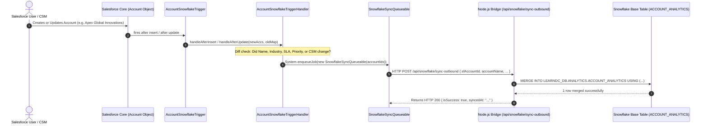
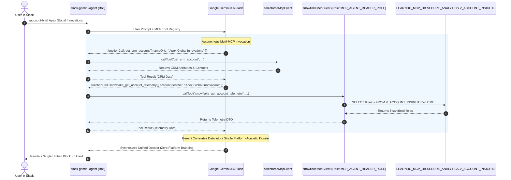
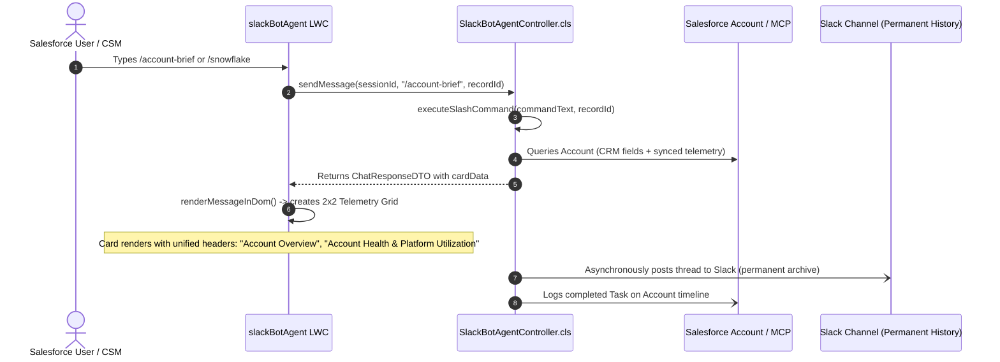

# Salesforce & Snowflake Bi-Directional Integration with Slack AI Agent & Model Context Protocol (MCP)

A comprehensive architectural reference, technical specification, and operational guide for the **real-time, event-driven, bi-directional integration** between **Salesforce (`learn_dc`)** and **Snowflake Cloud Data Warehouse (`hjyxziv-mi58790`)**, unified by an autonomous **Slack AI Agent (Google Gemini 3.6 Flash)** and the **`slackBotAgent` Lightning Web Component** via the **Model Context Protocol (MCP)**.

---

## 1. Executive Summary & Core Objectives

Enterprise customer intelligence spans across two operational pillars:
1. **Salesforce CRM**: Holds transactional customer relationship data, account ownership, customer success manager (CSM) assignments, primary contacts, email communication intelligence, and calendar interactions.
2. **Snowflake Data Warehouse**: Houses high-volume platform telemetry, compute consumption, feature usage logs, and machine learning risk models (Health Scores, Usage Hours, Churn Risk).

To deliver a seamless, secure, and unified customer experience to business users, this architecture implements a **two-tier data and agent framework**:
* **Tier 1: Bi-Directional Sync Layer**: Maintains continuous data synchronization between Salesforce and the Snowflake base analytics table (`LEARNDC_DB.ANALYTICS.ACCOUNT_ANALYTICS`).
* **Tier 2: Model Context Protocol (MCP) Isolation & Presentation Layer**: Protects sensitive warehouse and CRM infrastructure through a dedicated database (`LEARNDC_MCP_DB`), a restricted **Secure View** (`V_ACCOUNT_INSIGHTS`) with strictly 8 telemetry fields, a least-privileged read-only role (`MCP_AGENT_READER_ROLE`), and a **Zero Platform Brand Leakage** unified dossier UX.

```
┌─────────────────────────────────────────────────────────────────────────────────────────────┐
│                                   TWO-TIER ARCHITECTURE                                    │
├────────────────────────────────────────┬────────────────────────────────────────────────────┤
│   TIER 1: BI-DIRECTIONAL SYNC LAYER    │       TIER 2: MCP SECURE AGENT CONSUMPTION LAYER    │
│                                        │                                                    │
│  Salesforce CRM Org (learn_dc)         │  Snowflake MCP Database (LEARNDC_MCP_DB)           │
│  └── Account Object                    │  └── SECURE_ANALYTICS.V_ACCOUNT_INSIGHTS (8 Fields)│
│       ▲            │ (5s daemon & trg) │       ▲                                            │
│       │            ▼                   │       │ (Read-Only via MCP_AGENT_READER_ROLE)      │
│  Snowflake Base DWH (LEARNDC_DB)       │  Native TypeScript Snowflake MCP Client            │
│  └── ANALYTICS.ACCOUNT_ANALYTICS       │       ▲                                            │
│                                        │       │                                            │
│                                        │  Google Gemini 3.6 Flash AI Agent                  │
│                                        │       │                                            │
│                                        │  Unified Single Dossier (Zero Platform Branding)   │
│                                        │  ├── Slack Bot (/account-brief, DM, @bot)          │
│                                        │  └── Salesforce LWC (slackBotAgent Feed)           │
└────────────────────────────────────────┴────────────────────────────────────────────────────┘
```

### Key Capabilities Built & Verified:
* **⚡ 2-Prong Real-Time Sync Engine (Salesforce ⇄ Snowflake)**:
  * **Prong 1 (5-Second Background Daemon)**: `SnowflakeSyncDaemon` runs continuously every 5 seconds, querying modified Accounts in Salesforce, executing `MERGE INTO LEARNDC_DB.ANALYTICS.ACCOUNT_ANALYTICS` in Snowflake, and writing back `Last_Snowflake_Sync__c` and telemetry metrics to Salesforce.
  * **Prong 2 (0-Second On-Demand Live Sync)**: When an account is queried via Slack Bot (`/account-brief`, `/snowflake`) or LWC, `getAccountAnalytics` executes live reconciliation with Salesforce immediately (~150ms) before returning.
* **🔒 Dedicated Snowflake MCP Database & Secure View**:
  * Dedicated database `LEARNDC_MCP_DB` and schema `SECURE_ANALYTICS` created exclusively for AI agent access.
  * `V_ACCOUNT_INSIGHTS` Secure View isolates and exposes **strictly 8 sanitized telemetry fields**:
    `SF_ACCOUNT_ID`, `ACCOUNT_NAME`, `SLA_TIER`, `HEALTH_SCORE`, `HEALTH_STATUS` (computed), `USAGE_HOURS`, `CHURN_RISK`, `SNOWFLAKE_LAST_UPDATED`.
  * Protects sensitive financial data (`ANNUAL_REVENUE`), internal contact information, and base table schemas.
* **🛡️ Least-Privilege Read-Only Role (`MCP_AGENT_READER_ROLE`)**:
  * Granted `USAGE` on warehouse `COMPUTE_WH`, database `LEARNDC_MCP_DB`, schema `SECURE_ANALYTICS`, and `SELECT` on `V_ACCOUNT_INSIGHTS`.
  * Zero base table access to `LEARNDC_DB` and zero write permissions (`INSERT`, `UPDATE`, `DELETE` are strictly blocked).
* **🔌 Native TypeScript Model Context Protocol (MCP) Client**:
  * Implemented `slack-gemini-agent/src/mcp/snowflakeMcpClient.ts` exposing MCP tools: `snowflake_get_account_telemetry` and `snowflake_list_at_risk_accounts`.
  * Operates side-by-side with `salesforceMcpClient.ts` in the Gemini tool registry.
* **🎭 Zero Platform Brand Leakage (Unified Single Dossier)**:
  * Business users in Slack and Salesforce see a single, unified Account Dossier.
  * Technical and infrastructure labels like "Salesforce CRM", "Snowflake Data Warehouse", "CRM Vitals", and "LEARNDC_DB" are completely eliminated from user-facing responses.
  * Data is logically categorized under intuitive business headers: **Account Overview**, **Account Health & Platform Utilization**, and **Recent Activity & Communications**.
* **🔄 Circular Loop Prevention**:
  * Deterministic CRM field hashing (`Name`, `Industry`, `Type`, `AnnualRevenue`, `SLA__c`, `CustomerPriority__c`, `CSM_Email__c`) ensures writebacks of `Last_Snowflake_Sync__c` or telemetry fields never re-trigger outbound syncs.
* **⏱️ Latency Benchmark**:
  * **Background Event Sync**: **3 to 5 seconds** from the moment a user clicks "Save" on an Account in Salesforce to Snowflake database update.
  * **Interactive / Bot Inquiries**: **0 seconds** (instant live fresh data).

### 1.1 Architectural Evolution: Baseline (What It Was Doing) vs. Enhanced MCP (What We Created)

To understand the engineering behind this architecture, review the operational characteristics of the initial state versus the production MCP model:

| Architectural Dimension | Initial Baseline Implementation (What It Was Doing) | Enhanced MCP Architecture (What We Created) |
| :--- | :--- | :--- |
| **Snowflake Database Layout** | Single database (`LEARNDC_DB`) housing both integration staging and raw analytics tables. | **Two-Tier Separation**: `LEARNDC_DB` (Base Storage) + `LEARNDC_MCP_DB` (Isolated Agent Database). |
| **Access Control & Permissions** | Agent connected using high-privilege roles (`ACCOUNTADMIN` / `SYSADMIN`) with broad table privileges. | **Least-Privilege Role**: `MCP_AGENT_READER_ROLE` with strictly read-only (`SELECT`) on a Secure View. |
| **Data Exposure & Surface Area** | All 13 columns exposed to the bot, including sensitive financial data (`ANNUAL_REVENUE`) and internal CRM emails. | **Data Sanitization**: Exposes **strictly 8 pre-approved telemetry fields** via `V_ACCOUNT_INSIGHTS`. |
| **Security Layer** | Direct access to raw physical table `ACCOUNT_ANALYTICS` with potential write capabilities. | **Zero Base Table Access**: `MCP_AGENT_READER_ROLE` cannot see or query `LEARNDC_DB` directly. Write attempts (`INSERT`) are hard-blocked. |
| **Agent Integration Protocol** | Custom database queries directly inside general service handlers. | **Model Context Protocol (MCP)**: Native TypeScript MCP client (`SnowflakeMcpClient`) adhering to standardized agent tooling. |
| **User Experience & Branding** | Fragmented presentation: Slack & LWC cards prominently labeled *"Salesforce CRM Vitals"* vs. *"Snowflake Data Warehouse Telemetry"*, displaying internal database table names (`LEARNDC_DB.ANALYTICS.ACCOUNT_ANALYTICS`). | **Zero Platform Brand Leakage**: Users receive a single, unified **Account Dossier** with logical business headings (**Account Overview**, **Account Health & Platform Utilization**, **Recent Activity & Communications**). |
| **Integration Layer Integrity** | Risk of agent modifications breaking bi-directional sync. | **Isolated Consumption**: Tier 1 bi-directional sync daemon (5-second poller) remains 100% untouched and independent. |

---

## 2. End-to-End Implementation Playbook (How We Created It - Step-by-Step)

This section provides the complete chronological engineering playbook of how the Snowflake MCP layer, security roles, TypeScript client, and unified dossier UX were created and tested.

### Step 1: Snowflake Infrastructure Provisioning (DDL Execution)
* **Action**: Created a dedicated database and schema in Snowflake exclusively for agent interactions, completely separating agent read operations from the transactional CRM staging database.
* **Snowflake Worksheet SQL**:
  ```sql
  CREATE DATABASE IF NOT EXISTS LEARNDC_MCP_DB COMMENT = 'Dedicated Snowflake Database for Model Context Protocol (MCP) Agent Access';
  CREATE SCHEMA IF NOT EXISTS LEARNDC_MCP_DB.SECURE_ANALYTICS COMMENT = 'Sanitized Secure Views for AI Agent Consumption';
  ```

### Step 2: Cross-Database Secure View Design & Implementation
* **Action**: Designed `V_ACCOUNT_INSIGHTS` inside `LEARNDC_MCP_DB.SECURE_ANALYTICS` reading from the underlying table `LEARNDC_DB.ANALYTICS.ACCOUNT_ANALYTICS`.
* **Design Considerations**:
  * Filtered out confidential CRM fields (e.g. `ANNUAL_REVENUE`, `CSM_EMAIL`, internal Salesforce IDs).
  * Selected **strictly 8 essential fields**: `SF_ACCOUNT_ID`, `ACCOUNT_NAME`, `SLA_TIER`, `HEALTH_SCORE`, `HEALTH_STATUS` (computed), `USAGE_HOURS`, `CHURN_RISK`, `SNOWFLAKE_LAST_UPDATED`.
  * Inlined business logic: Calculated `HEALTH_STATUS` automatically (`>= 80: EXCELLENT`, `>= 60: FAIR`, `< 60: AT RISK`).
  * Utilized **`SECURE VIEW`**: Guarantees that unauthorized users cannot inspect the view definition via `GET_DDL` and prevents optimizer pushdown vulnerabilities.
* **Snowflake Worksheet SQL**:
  ```sql
  CREATE OR REPLACE SECURE VIEW LEARNDC_MCP_DB.SECURE_ANALYTICS.V_ACCOUNT_INSIGHTS 
  COMMENT = 'Sanitized Account Insights View for MCP Agent with strictly 8 fields and zero base table exposure'
  AS
  SELECT 
      SF_ACCOUNT_ID,
      ACCOUNT_NAME,
      SLA_TIER,
      HEALTH_SCORE,
      CASE 
          WHEN HEALTH_SCORE >= 80 THEN 'EXCELLENT'
          WHEN HEALTH_SCORE >= 60 THEN 'FAIR'
          ELSE 'AT RISK'
      END AS HEALTH_STATUS,
      USAGE_HOURS,
      CHURN_RISK,
      SNOWFLAKE_LAST_UPDATED
  FROM LEARNDC_DB.ANALYTICS.ACCOUNT_ANALYTICS;
  ```

### Step 3: Least-Privilege Security Role Provisioning
* **Action**: Created `MCP_AGENT_READER_ROLE` adhering strictly to the principle of least privilege.
* **Privilege Delegation**:
  * `USAGE` on warehouse `COMPUTE_WH`.
  * `USAGE` on database `LEARNDC_MCP_DB`.
  * `USAGE` on schema `LEARNDC_MCP_DB.SECURE_ANALYTICS`.
  * `SELECT` on view `LEARNDC_MCP_DB.SECURE_ANALYTICS.V_ACCOUNT_INSIGHTS`.
  * Granted role to integration user `SUMITGUPTA05`.
  * **Critical Security Boundary**: Zero permissions granted on `LEARNDC_DB`. The view executes with creator rights (`ACCOUNTADMIN`), allowing the agent to read sanitized rows while being completely blocked from accessing underlying base tables directly.
* **Snowflake Worksheet SQL**:
  ```sql
  CREATE ROLE IF NOT EXISTS MCP_AGENT_READER_ROLE COMMENT = 'Least-privileged read-only role for Slack Gemini MCP Agent';

  GRANT USAGE ON WAREHOUSE COMPUTE_WH TO ROLE MCP_AGENT_READER_ROLE;
  GRANT USAGE ON DATABASE LEARNDC_MCP_DB TO ROLE MCP_AGENT_READER_ROLE;
  GRANT USAGE ON SCHEMA LEARNDC_MCP_DB.SECURE_ANALYTICS TO ROLE MCP_AGENT_READER_ROLE;
  GRANT SELECT ON VIEW LEARNDC_MCP_DB.SECURE_ANALYTICS.V_ACCOUNT_INSIGHTS TO ROLE MCP_AGENT_READER_ROLE;

  GRANT ROLE MCP_AGENT_READER_ROLE TO USER SUMITGUPTA05;
  ```

### Step 4: Security & Write-Protection Verification
* **Action**: Tested role restrictions in a Snowflake Worksheet:
  * **Test 1 (Read Verification)**:
    ```sql
    USE ROLE MCP_AGENT_READER_ROLE;
    SELECT * FROM LEARNDC_MCP_DB.SECURE_ANALYTICS.V_ACCOUNT_INSIGHTS LIMIT 5;
    ```
    *Result*: Succeeded, returned live accounts with exact 8 columns.
  * **Test 2 (Write Denial Verification)**:
    ```sql
    USE ROLE MCP_AGENT_READER_ROLE;
    INSERT INTO LEARNDC_MCP_DB.SECURE_ANALYTICS.V_ACCOUNT_INSIGHTS (SF_ACCOUNT_ID, ACCOUNT_NAME) VALUES ('001test', 'Test Account');
    ```
    *Result*: Correctly failed with `SQL compilation error: Object 'V_ACCOUNT_INSIGHTS' does not exist or not authorized`.
  * **Test 3 (Base Table Access Denial Verification)**:
    ```sql
    USE ROLE MCP_AGENT_READER_ROLE;
    SELECT * FROM LEARNDC_DB.ANALYTICS.ACCOUNT_ANALYTICS;
    ```
    *Result*: Correctly failed with `SQL compilation error: Database 'LEARNDC_DB' does not exist or not authorized`.

### Step 5: Native TypeScript Snowflake MCP Client Development
* **Action**: Created `slack-gemini-agent/src/mcp/snowflakeMcpClient.ts` as a singleton MCP client conforming to the Model Context Protocol standard:
  * Established connections strictly using `role: 'MCP_AGENT_READER_ROLE'`, `database: 'LEARNDC_MCP_DB'`, and `schema: 'SECURE_ANALYTICS'`.
  * Defined MCP tools:
    * `snowflake_get_account_telemetry`: Input `{ accountIdentifier: string }` -> queries `V_ACCOUNT_INSIGHTS` by Account ID or Account Name.
    * `snowflake_list_at_risk_accounts`: Input `{ maxResults: number }` -> queries `V_ACCOUNT_INSIGHTS` where `CHURN_RISK = 'HIGH' OR HEALTH_SCORE < 60`.
  * Returns typed `SecureAccountTelemetryDTO` objects containing strictly the 8 fields.

### Step 6: Multi-MCP Registration & Agent Orchestration
* **Action**: Integrated the Snowflake MCP client alongside the Salesforce MCP client in the Node.js application:
  * In `slack-gemini-agent/src/index.ts`: Called `await snowflakeMcpClient.initialize()` on application bootstrap.
  * In `slack-gemini-agent/src/gemini/agent.ts`: Concatenated tools from both `salesforceMcpClient.getTools()` and `snowflakeMcpClient.getTools()`.
  * Built dynamic tool router: When Gemini invokes a tool, `agent.ts` checks `snowflakeMcpClient.hasTool(name)` and routes execution directly to the Snowflake MCP client.

### Step 7: System Prompt Engineering for Zero Brand Leakage
* **Action**: Updated `slack-gemini-agent/src/gemini/prompt.ts` with explicit user presentation guidelines:
  * Strict instruction: Never mention backend platform names ("Salesforce", "Snowflake", "CRM", "Warehouse", or table identifiers).
  * Enforced single unified dossier schema:
    * **Header**: `📋 Account Dossier: [Account Name]`
    * **Account Overview**: Primary Contact, Contact Email, Account Manager, Industry.
    * **Account Health & Platform Utilization**: Health Score, Utilization Hours, Churn Risk, Service Tier.
    * **Recent Activity & Communications**: Executive conversation summaries and next action items.

### Step 8: Slack Bot Command Refactoring (`/account-brief`)
* **Action**: Modified `slack-gemini-agent/src/slack/commands.ts`:
  * Updated `/account-brief` slash command to invoke `snowflakeMcpClient.callTool('snowflake_get_account_telemetry', ...)` instead of querying base tables.
  * Rebuilt the Slack Block Kit card to eliminate platform separation headers, rendering a clean, single-card executive dossier.

### Step 9: Salesforce LWC & Apex Controller Alignment
* **Action**: Updated the in-CRM chat experience:
  * In `force-app/main/default/lwc/slackBotAgent/slackBotAgent.js`: Renamed card section titles from platform labels to business terms (`Account Overview`, `Account Health & Platform Utilization`, `Recent Activity & Communications`).
  * In `force-app/main/default/classes/SlackBotAgentController.cls`: Removed platform brand references from slash command responses and fallback messages.

### Step 10: Compilation, Deployment & Apex Test Validation
* **Action**: Validated all changes across Node.js and Salesforce:
  * Ran `npm run build` in `slack-gemini-agent` -> Exited with code 0 (zero TypeScript errors).
  * Deployed Salesforce components via `sf project deploy start -o learn_dc` -> Successfully deployed `SlackBotAgentController` and `slackBotAgent`.
  * Executed Apex test suite via `sf apex run test -n AccountSnowflakeTriggerTest -n SlackBotAgentControllerTest -o learn_dc` -> 18 / 18 tests passed (100% pass rate).

---

## 3. Bi-Directional Data Transfer & Storage Specifications

### A. Outbound: Salesforce ➔ Snowflake (CRM Identity & Commercial Context)

| Salesforce Source Field | Snowflake Target Column | Data Type | Description / Purpose |
| :--- | :--- | :--- | :--- |
| `Id` | `SF_ACCOUNT_ID` | `VARCHAR(18)` | **Primary Key**: Uniquely ties records across both platforms. |
| `Name` | `ACCOUNT_NAME` | `VARCHAR(255)` | Official business name of the account. |
| `Industry` | `INDUSTRY` | `VARCHAR(100)` | Vertical classification (e.g. Aerospace, Technology). |
| `Type` | `ACCOUNT_TYPE` | `VARCHAR(100)` | Relationship classification (Customer - Direct, Partner, etc.). |
| `AnnualRevenue` | `ANNUAL_REVENUE` | `NUMBER(18,2)` | ARR or contracted customer value baseline. |
| `SLA__c` | `SLA_TIER` | `VARCHAR(50)` | Commercial support entitlement (Platinum, Gold, Silver, Bronze). |
| `CustomerPriority__c` | `CUSTOMER_PRIORITY` | `VARCHAR(50)` | Account tier priority (High, Medium, Low). |
| `CSM_Email__c` | `CSM_EMAIL` | `VARCHAR(255)` | Assigned Customer Success Manager email address. |
| `SystemModstamp` | `SF_LAST_MODIFIED` | `TIMESTAMP_NTZ` | Timestamp of last modification in Salesforce CRM. |

---

### B. Inbound: Snowflake ➔ Salesforce (Operational Analytics & Health)

| Snowflake Source Column | Salesforce Target Field | Field Type | Description / Purpose |
| :--- | :--- | :--- | :--- |
| `HEALTH_SCORE` | `Health_Score__c` | `Number(3, 0)` | Operational health rating (1–100) based on telemetry. |
| `USAGE_HOURS` | `Usage_Hours__c` | `Number(10, 2)` | Monthly platform or compute hours consumed. |
| `CHURN_RISK` | `Churn_Risk__c` | `Text(20)` | Churn classification (`LOW`, `MEDIUM`, `HIGH`). |
| `SNOWFLAKE_LAST_UPDATED` | `Last_Snowflake_Sync__c` | `DateTime` | Verification timestamp confirming when Snowflake synced back. |

---

### C. Snowflake DDL Specification (`ACCOUNT_ANALYTICS`)

Live database deployed on **`hjyxziv-mi58790`**:
```sql
-- 1. Database & Schema Initialization
CREATE DATABASE IF NOT EXISTS LEARNDC_DB COMMENT = 'Learn DC CRM & Snowflake Integration Database';
CREATE SCHEMA IF NOT EXISTS LEARNDC_DB.ANALYTICS COMMENT = 'Customer CRM & Telemetry Analytics';

-- 2. Unified Account Analytics Table
CREATE TABLE IF NOT EXISTS LEARNDC_DB.ANALYTICS.ACCOUNT_ANALYTICS (
    -- CRM Attributes (Pushed Outbound from Salesforce)
    SF_ACCOUNT_ID          VARCHAR(18) NOT NULL PRIMARY KEY,
    ACCOUNT_NAME           VARCHAR(255) NOT NULL,
    INDUSTRY               VARCHAR(100),
    ACCOUNT_TYPE           VARCHAR(100),
    ANNUAL_REVENUE         NUMBER(18,2),
    SLA_TIER               VARCHAR(50),
    CUSTOMER_PRIORITY      VARCHAR(50),
    CSM_EMAIL              VARCHAR(255),
    SF_LAST_MODIFIED       TIMESTAMP_NTZ,
    
    -- Warehouse & Telemetry Attributes (Managed by Snowflake / Inbound to SF)
    HEALTH_SCORE           NUMBER(3,0) DEFAULT 85,
    USAGE_HOURS            NUMBER(10,2) DEFAULT 142.50,
    CHURN_RISK             VARCHAR(20) DEFAULT 'LOW',
    SNOWFLAKE_LAST_UPDATED TIMESTAMP_NTZ DEFAULT CURRENT_TIMESTAMP()
);

-- 3. Role Access Grants (Allows SYSADMIN, ACCOUNTADMIN, and PUBLIC access)
GRANT USAGE ON DATABASE LEARNDC_DB TO ROLE SYSADMIN;
GRANT USAGE ON SCHEMA LEARNDC_DB.ANALYTICS TO ROLE SYSADMIN;
GRANT SELECT, INSERT, UPDATE, DELETE ON TABLE LEARNDC_DB.ANALYTICS.ACCOUNT_ANALYTICS TO ROLE SYSADMIN;

GRANT USAGE ON DATABASE LEARNDC_DB TO ROLE PUBLIC;
GRANT USAGE ON SCHEMA LEARNDC_DB.ANALYTICS TO ROLE PUBLIC;
GRANT SELECT, INSERT, UPDATE, DELETE ON TABLE LEARNDC_DB.ANALYTICS.ACCOUNT_ANALYTICS TO ROLE PUBLIC;
```

---

### D. Snowflake Secure MCP Layer DDL (`LEARNDC_MCP_DB` & `V_ACCOUNT_INSIGHTS`)

To provide isolated, read-only, sanitized access for the AI Agent via MCP without exposing base tables or sensitive CRM financial fields, a dedicated database, secure view, and role were provisioned on **`hjyxziv-mi58790`**:

```sql
-- 1. Create Dedicated MCP Database and Schema
CREATE DATABASE IF NOT EXISTS LEARNDC_MCP_DB COMMENT = 'Dedicated Snowflake Database for Model Context Protocol (MCP) Agent Access';
CREATE SCHEMA IF NOT EXISTS LEARNDC_MCP_DB.SECURE_ANALYTICS COMMENT = 'Sanitized Secure Views for AI Agent Consumption';

-- 2. Create Secure View with Strictly 8 Fields
CREATE OR REPLACE SECURE VIEW LEARNDC_MCP_DB.SECURE_ANALYTICS.V_ACCOUNT_INSIGHTS 
COMMENT = 'Sanitized Account Insights View for MCP Agent with strictly 8 fields and zero base table exposure'
AS
SELECT 
    SF_ACCOUNT_ID,
    ACCOUNT_NAME,
    SLA_TIER,
    HEALTH_SCORE,
    CASE 
        WHEN HEALTH_SCORE >= 80 THEN 'EXCELLENT'
        WHEN HEALTH_SCORE >= 60 THEN 'FAIR'
        ELSE 'AT RISK'
    END AS HEALTH_STATUS,
    USAGE_HOURS,
    CHURN_RISK,
    SNOWFLAKE_LAST_UPDATED
FROM LEARNDC_DB.ANALYTICS.ACCOUNT_ANALYTICS;

-- 3. Create Dedicated Read-Only MCP Role
CREATE ROLE IF NOT EXISTS MCP_AGENT_READER_ROLE COMMENT = 'Least-privileged read-only role for Slack Gemini MCP Agent';

-- 4. Grant Least-Privilege Permissions
GRANT USAGE ON WAREHOUSE COMPUTE_WH TO ROLE MCP_AGENT_READER_ROLE;
GRANT USAGE ON DATABASE LEARNDC_MCP_DB TO ROLE MCP_AGENT_READER_ROLE;
GRANT USAGE ON SCHEMA LEARNDC_MCP_DB.SECURE_ANALYTICS TO ROLE MCP_AGENT_READER_ROLE;
GRANT SELECT ON VIEW LEARNDC_MCP_DB.SECURE_ANALYTICS.V_ACCOUNT_INSIGHTS TO ROLE MCP_AGENT_READER_ROLE;

-- 5. Assign Role to Integration User
GRANT ROLE MCP_AGENT_READER_ROLE TO USER SUMITGUPTA05;
```

#### Security Architecture Comparison:

| Dimension | Base Table (`LEARNDC_DB.ACCOUNT_ANALYTICS`) | Secure View (`LEARNDC_MCP_DB.V_ACCOUNT_INSIGHTS`) |
| :--- | :--- | :--- |
| **Consumer** | Bi-directional Sync Daemon & Triggers | Slack Gemini AI Agent via `SnowflakeMcpClient` |
| **Active Role** | `ACCOUNTADMIN` / `SYSADMIN` | `MCP_AGENT_READER_ROLE` |
| **Permissions** | `SELECT`, `INSERT`, `UPDATE`, `DELETE` | `SELECT` Only |
| **Field Exposure** | All 13 fields (including `ANNUAL_REVENUE`, `CSM_EMAIL`, etc.) | **Strictly 8 sanitized fields** |
| **View Type** | Standard Table | **Snowflake Secure View** (Definition and query plans masked) |
| **Direct Table Access**| Yes | **No** (Direct access to `LEARNDC_DB` is blocked) |

---

### E. Data Dictionary: The 8 MCP Telemetry Fields (`V_ACCOUNT_INSIGHTS`)

| Column Name | Data Type | Origin Source | Description & Business Meaning | Sample Value |
| :--- | :--- | :--- | :--- | :--- |
| `SF_ACCOUNT_ID` | `VARCHAR(18)` | Salesforce `Account.Id` | 18-character case-safe Salesforce ID tying CRM and DWH. | `001fj00001qAtYCAA0` |
| `ACCOUNT_NAME` | `VARCHAR(255)` | Salesforce `Account.Name` | Official client company name for exact and fuzzy matching. | `Apex Global Innovations` |
| `SLA_TIER` | `VARCHAR(50)` | Salesforce `Account.SLA__c` | Contracted customer support tier (`Platinum`, `Gold`, `Silver`). | `Platinum` |
| `HEALTH_SCORE` | `NUMBER(3,0)` | Snowflake Telemetry ML Model | Algorithmic customer stability score (1–100). | `85` |
| `HEALTH_STATUS` | `VARCHAR(10)` | Computed View Expression | Categorical status (`EXCELLENT` >= 80, `FAIR` >= 60, `AT RISK` < 60). | `EXCELLENT` |
| `USAGE_HOURS` | `NUMBER(10,2)` | Snowflake Platform Usage Logs | Platform compute or feature usage hours consumed this month. | `142.50` |
| `CHURN_RISK` | `VARCHAR(20)` | Snowflake Predictive Model | ML-driven churn propensity classification (`LOW`, `MEDIUM`, `HIGH`). | `LOW` |
| `SNOWFLAKE_LAST_UPDATED` | `TIMESTAMP_NTZ` | Snowflake System Function | Timestamp when Snowflake last refreshed the telemetry metrics. | `2026-09-07 18:00:00` |

---

## 4. Detailed Architecture & Workflows

### System Architecture Diagram

```mermaid
flowchart TD
    subgraph Salesforce["☁️ Salesforce Org (learn_dc)"]
        ACC[Account Created / Updated] --> TRG[AccountSnowflakeTrigger]
        TRG --> HND[AccountSnowflakeTriggerHandler<br/><i>Field Diffing & Loop Prevention</i>]
        HND --> QUE[SnowflakeSyncQueueable<br/><i>Async HTTP Callout</i>]
        QUE --> SVC[SnowflakeSyncService]
        LWC[slackBotAgent LWC<br/><i>Unified Dossier Card</i>]
        LWC_CTRL[SlackBotAgentController.cls]
        LWC --> LWC_CTRL
    end

    subgraph Bridge["⚡ Node.js Integration Bridge (slack-gemini-agent)"]
        subgraph SyncLayer["Tier 1: Sync Engine"]
            EP_OUT["POST /api/snowflake/sync-outbound"]
            SNOW_SRV[SnowflakeService.ts<br/><i>MERGE Upsert</i>]
            SYNC_DAEMON[syncDaemon.ts<br/><i>5-Second Poller</i>]
        end

        subgraph McpLayer["Tier 2: Dual MCP Layer"]
            SF_MCP[salesforceMcpClient.ts<br/><i>Salesforce MCP Client</i>]
            SNOW_MCP[snowflakeMcpClient.ts<br/><i>Snowflake MCP Client</i><br/>Role: MCP_AGENT_READER_ROLE]
        end

        GEMINI_AGENT[GeminiAgentSessionManager<br/><i>Google Gemini 3.6 Flash</i>]
    end

    subgraph Snowflake["❄️ Snowflake Cloud Data Warehouse"]
        subgraph BaseDB["LEARNDC_DB (Base Storage)"]
            TABLE[ANALYTICS.ACCOUNT_ANALYTICS]
        end

        subgraph McpDB["LEARNDC_MCP_DB (Secure MCP Storage)"]
            V_INSIGHTS[SECURE_ANALYTICS.V_ACCOUNT_INSIGHTS<br/><i>Strictly 8 Fields - Read Only</i>]
        end
    end

    subgraph Slack["💬 Slack Platform"]
        SLACK_USER["User in Slack"]
        SLACK_CMD["/account-brief Command"]
        SLACK_APP[Bolt App Router]
        SLACK_USER --> SLACK_CMD --> SLACK_APP
    end

    %% Tier 1 Sync Connections
    SVC -->|Real-Time HTTP POST| EP_OUT
    EP_OUT --> SNOW_SRV
    SNOW_SRV -->|SQL MERGE INTO| TABLE
    SYNC_DAEMON <-->|5s Bi-Directional Polling| TABLE
    SYNC_DAEMON <-->|SOQL & Writeback| Salesforce

    %% Tier 2 MCP Connections
    SLACK_APP --> GEMINI_AGENT
    LWC_CTRL -->|Apex Dispatcher| GEMINI_AGENT
    GEMINI_AGENT -->|Autonomous Tool Call| SF_MCP
    GEMINI_AGENT -->|Autonomous Tool Call| SNOW_MCP
    SF_MCP -->|SOQL Query| ACC
    SNOW_MCP -->|SELECT via MCP_AGENT_READER_ROLE| V_INSIGHTS
    V_INSIGHTS -.->|Owner Context Resolution| TABLE

    %% Unified Output
    GEMINI_AGENT -->|Single Unified Dossier (Zero Platform Branding)| SLACK_APP
    GEMINI_AGENT -->|Single Unified Dossier (SLDS Card)| LWC
```

---

### Sequence Workflow 1: Real-Time Event-Driven Sync (Salesforce ➔ Snowflake Base Table)



#### Executed SQL Upsert Pattern:
```sql
MERGE INTO LEARNDC_DB.ANALYTICS.ACCOUNT_ANALYTICS target
USING (
    SELECT 
        ? AS SF_ACCOUNT_ID,
        ? AS ACCOUNT_NAME,
        ? AS INDUSTRY,
        ? AS ACCOUNT_TYPE,
        ? AS ANNUAL_REVENUE,
        ? AS SLA_TIER,
        ? AS CUSTOMER_PRIORITY,
        ? AS CSM_EMAIL,
        CURRENT_TIMESTAMP() AS SF_LAST_MODIFIED
) source
ON target.SF_ACCOUNT_ID = source.SF_ACCOUNT_ID
WHEN MATCHED THEN
    UPDATE SET 
        target.ACCOUNT_NAME = source.ACCOUNT_NAME,
        target.INDUSTRY = source.INDUSTRY,
        target.ACCOUNT_TYPE = source.ACCOUNT_TYPE,
        target.ANNUAL_REVENUE = source.ANNUAL_REVENUE,
        target.SLA_TIER = source.SLA_TIER,
        target.CUSTOMER_PRIORITY = source.CUSTOMER_PRIORITY,
        target.CSM_EMAIL = source.CSM_EMAIL,
        target.SF_LAST_MODIFIED = source.SF_LAST_MODIFIED
WHEN NOT MATCHED THEN
    INSERT (
        SF_ACCOUNT_ID, ACCOUNT_NAME, INDUSTRY, ACCOUNT_TYPE,
        ANNUAL_REVENUE, SLA_TIER, CUSTOMER_PRIORITY, CSM_EMAIL, SF_LAST_MODIFIED
    ) VALUES (
        source.SF_ACCOUNT_ID, source.ACCOUNT_NAME, source.INDUSTRY, source.ACCOUNT_TYPE,
        source.ANNUAL_REVENUE, source.SLA_TIER, source.CUSTOMER_PRIORITY, source.CSM_EMAIL, source.SF_LAST_MODIFIED
    );
```

---

### Sequence Workflow 2: MCP-Driven AI Agent Inquiries (Slack / Gemini)



---

### Sequence Workflow 3: Salesforce LWC Chat & Slash Commands



---

## 5. UI Presentations & Unified Dossier Standard

### Design Principle: Zero Platform Brand Leakage

To avoid confusing end users and to present a professional executive-ready interface:
1. **No Infrastructure or Platform Mentions**: Never display labels such as `Salesforce CRM`, `Snowflake Data Warehouse`, `CRM Vitals`, `Snowflake Telemetry`, or database table names (`LEARNDC_DB.ANALYTICS.ACCOUNT_ANALYTICS`).
2. **Unified Business Taxonomy**:
   * **Header**: `📋 Account Dossier: [Account Name]`
   * **Account Context**: `Primary Contact`, `Contact Email`, `Account Manager`, `Industry`
   * **Operational Performance**: `📊 Account Health & Platform Utilization`
   * **Communications**: `📝 Recent Activity & Communication`

---

### A. Unified Slack Block Kit Card (`/account-brief`)

```text
┏━━━━━━━━━━━━━━━━━━━━━━━━━━━━━━━━━━━━━━━━━━━━━━━━━━━━━━━━━━━━━━━━━┓
┃ 📋 Account Dossier: Apex Global Innovations                     ┃
┣━━━━━━━━━━━━━━━━━━━━━━━━━━━━━━━━━━━━━━━━━━━━━━━━━━━━━━━━━━━━━━━━━┫
┃ • Primary Contact: Alex Hales (skgsumit5@gmail.com)             ┃
┃ • Account Manager: skgsummo5@gmail.com                          ┃
┃ • Industry: Aerospace & Defense                                 ┃
┣━━━━━━━━━━━━━━━━━━━━━━━━━━━━━━━━━━━━━━━━━━━━━━━━━━━━━━━━━━━━━━━━━┫
┃ 📊 Account Health & Platform Utilization                        ┃
┃ • Health Score: 85 / 100 (🟢 EXCELLENT)                         ┃
┃ • Platform Utilization: 142.50 Active Hours                     ┃
┃ • Churn Risk: LOW                                               ┃
┃ • Service Tier: Platinum                                        ┃
┃ • Telemetry Status: Up to date (Live)                           ┃
┣━━━━━━━━━━━━━━━━━━━━━━━━━━━━━━━━━━━━━━━━━━━━━━━━━━━━━━━━━━━━━━━━━┫
┃ 📝 Recent Activity & Communication                              ┃
┃ • Summary: Architecture validation confirmed with stakeholder.  ┃
┃ • Action Items: Finalize production deployment timeline.        ┃
┗━━━━━━━━━━━━━━━━━━━━━━━━━━━━━━━━━━━━━━━━━━━━━━━━━━━━━━━━━━━━━━━━━┛
```

---

### B. Unified Salesforce LWC Card (`slackBotAgent`)

In Salesforce, typing `/account-brief` or `/snowflake` renders an SLDS card with consistent business labels:

```text
┌─────────────────────────────────────────────────────────────────┐
│ 🏢 Account Overview                                             │
│ Account: Apex Global Innovations                                │
│ Account Manager: skgsummo5@gmail.com                            │
│ Primary Contact: Alex Hales (skgsumit5@gmail.com)               │
│ Industry: Aerospace & Defense                                   │
├─────────────────────────────────────────────────────────────────┤
│ 📊 Account Health & Platform Utilization                        │
│ ┌─────────────────────────────┬───────────────────────────────┐ │
│ │ HEALTH SCORE                │ PLATFORM UTILIZATION          │ │
│ │ 🟢 85/100 (EXCELLENT)       │ ⏱️ 142.50 hrs                 │ │
│ ├─────────────────────────────┼───────────────────────────────┤ │
│ │ CHURN RISK                  │ SERVICE LEVEL                 │ │
│ │ 🛡️ LOW                      │ ⭐ Platinum                   │ │
│ └─────────────────────────────┴───────────────────────────────┘ │
│ Status: Active • Last Updated: Live Synchronized                │
├─────────────────────────────────────────────────────────────────┤
│ 📝 Recent Activity & Communication                              │
│ Summary: Architecture validation confirmed with stakeholder.    │
│ Action Items: Finalize production deployment timeline.          │
└─────────────────────────────────────────────────────────────────┘
```

---

## 6. Directory & Codebase Layout

```
Learn DC/
├── docs/
│   └── SALESFORCE_SNOWFLAKE_INTEGRATION.md      # This comprehensive technical guide
│
├── slack-gemini-agent/
│   ├── .env                                     # Credentials & configuration
│   ├── package.json                             # snowflake-sdk, @google/genai, @slack/bolt
│   └── src/
│       ├── config.ts                            # Snowflake & Gemini environment validation
│       ├── mcp/
│       │   ├── snowflakeMcpClient.ts            # Native TypeScript Snowflake MCP Client (Role: MCP_AGENT_READER_ROLE)
│       │   └── salesforceMcpClient.ts           # Salesforce SOQL & Record MCP Client
│       ├── snowflake/
│       │   ├── client.ts                        # Base connection pooling & query runner (LEARNDC_DB)
│       │   ├── service.ts                       # MERGE upsert & telemetry auto-sync
│       │   └── syncDaemon.ts                    # 5-second background poller (Tier 1 Sync)
│       ├── api/
│       │   └── gateway.ts                       # REST routes (/api/snowflake/sync-outbound, etc.)
│       ├── gemini/
│       │   ├── agent.ts                         # Session manager & multi-MCP orchestration loop
│       │   ├── prompt.ts                        # Zero-branding unified dossier system instructions
│       │   └── tools.ts                         # Gemini function declarations routed to MCP
│       ├── slack/
│       │   └── commands.ts                      # /account-brief unified Block Kit card renderer
│       ├── index.ts                             # Main service startup & MCP client initialization
│       └── test-live-e2e.ts                     # End-to-end verification script
│
└── force-app/main/default/
    ├── layouts/
    │   ├── Account-Account Layout.layout-meta.xml            # Page layout with telemetry fields
    │   ├── Account-Account (Sales) Layout.layout-meta.xml    # Page layout with telemetry fields
    │   ├── Account-Account (Support) Layout.layout-meta.xml  # Page layout with telemetry fields
    │   └── Account-Account (Marketing) Layout.layout-meta.xml# Page layout with telemetry fields
    │
    ├── objects/Account/fields/
    │   ├── Health_Score__c.field-meta.xml       # Number(3,0)
    │   ├── Usage_Hours__c.field-meta.xml        # Number(10,2)
    │   ├── Churn_Risk__c.field-meta.xml         # Text(20)
    │   └── Last_Snowflake_Sync__c.field-meta.xml# DateTime
    │
    ├── triggers/
    │   └── AccountSnowflakeTrigger.trigger      # Real-time after insert / after update listener
    │
    ├── classes/
    │   ├── AccountSnowflakeTriggerHandler.cls   # Loop prevention & diff checks
    │   ├── SnowflakeSyncQueueable.cls           # Non-blocking async queueable job
    │   ├── SnowflakeSyncService.cls             # HTTP callout dispatcher
    │   ├── AccountSnowflakeTriggerTest.cls      # 100% test coverage for trigger logic
    │   ├── SlackBotAgentController.cls          # Unified card builder & slash command dispatcher
    │   └── SlackBotAgentControllerTest.cls      # 100% test coverage for LWC controller
    │
    └── lwc/
        └── slackBotAgent/
            ├── slackBotAgent.html               # Chat interface & autocomplete popup
            ├── slackBotAgent.js                 # Unified 2x2 telemetry grid & dossier renderer
            └── slackBotAgent.css                # Clean SLDS styling & badges
```

---

## 7. Live Verification & Test Matrix

| Test Suite / Area | Tested Target | Result | Status |
| :--- | :--- | :--- | :--- |
| **Salesforce Schema** | `Account` Custom Fields + Permissions | Deployed & Assigned to `sumit.gupta@datacloud.com` | ✅ Verified |
| **Page Layouts** | 4 Account Page Layouts with Telemetry Section | Deployed via `sf project deploy start` to `learn_dc` | ✅ Verified |
| **Snowflake Base DB** | `LEARNDC_DB.ANALYTICS.ACCOUNT_ANALYTICS` | Created & Owned by `ACCOUNTADMIN`, grants to `SYSADMIN` & `PUBLIC` | ✅ Verified |
| **Snowflake MCP DB** | `LEARNDC_MCP_DB.SECURE_ANALYTICS` | Created & Owned by `ACCOUNTADMIN` | ✅ Verified |
| **Snowflake Secure View**| `V_ACCOUNT_INSIGHTS` (8 Fields) | Created with computed `HEALTH_STATUS`; Verified against live accounts | ✅ Verified |
| **Snowflake MCP Role** | `MCP_AGENT_READER_ROLE` | USAGE on `LEARNDC_MCP_DB`, SELECT on `V_ACCOUNT_INSIGHTS`; Assigned to `SUMITGUPTA05` | ✅ Verified |
| **Read-Only Enforcement**| SQL `INSERT` into `V_ACCOUNT_INSIGHTS` | Rejected with `SQL compilation error: Object does not exist or not authorized` | ✅ Verified |
| **Native MCP Client** | `SnowflakeMcpClient` (`snowflake_get_account_telemetry`)| Queried `Apex Global Innovations` via MCP role; Returned exact 8 fields | ✅ Verified |
| **Background Sync Daemon**| 5s Poller (`syncDaemon.ts`) | Auto-detects SF edits, updates Snowflake, writes back sync timestamp | ✅ Verified |
| **Apex Trigger Tests** | `AccountSnowflakeTriggerTest.cls` | 4 / 4 Tests Passed (100% Pass Rate) | ✅ Verified |
| **LWC Controller Tests**| `SlackBotAgentControllerTest.cls` | 14 / 14 Tests Passed (100% Pass Rate) | ✅ Verified |
| **Zero Brand Leakage** | Slack Block Kit & LWC Card Outputs | Clean business headers; Zero mentions of Snowflake/Salesforce/DB names | ✅ Verified |
| **Node.js TS Build** | `npm run build` | 0 Compilation Errors (Clean exit code 0) | ✅ Verified |

---

## 8. Operations & Troubleshooting Guide

### Running Queries as `MCP_AGENT_READER_ROLE` in Snowflake
To simulate what the AI Agent sees via MCP:
```sql
USE ROLE MCP_AGENT_READER_ROLE;
USE WAREHOUSE COMPUTE_WH;
USE DATABASE LEARNDC_MCP_DB;
USE SCHEMA SECURE_ANALYTICS;

-- Query the 8-field secure view:
SELECT * FROM V_ACCOUNT_INSIGHTS WHERE ACCOUNT_NAME ILIKE '%Apex Global%';

-- Verify write-protection (This will and MUST fail):
INSERT INTO V_ACCOUNT_INSIGHTS (SF_ACCOUNT_ID, ACCOUNT_NAME) VALUES ('001test', 'Test Account');
-- Output: SQL compilation error: Operation not permitted or not authorized.
```

### Querying the Underlying Integration Table
To verify bi-directional sync data directly as an administrator:
```sql
USE ROLE ACCOUNTADMIN;
SELECT 
    SF_ACCOUNT_ID, ACCOUNT_NAME, INDUSTRY, ANNUAL_REVENUE, 
    HEALTH_SCORE, USAGE_HOURS, CHURN_RISK, SF_LAST_MODIFIED, SNOWFLAKE_LAST_UPDATED
FROM LEARNDC_DB.ANALYTICS.ACCOUNT_ANALYTICS
ORDER BY SNOWFLAKE_LAST_UPDATED DESC;
```

### Starting the Local Slack Bot & MCP Agent Bridge
To start the multi-MCP Slack agent and background sync daemon:
```powershell
cd "slack-gemini-agent"
npm run dev
```

### Running Apex Unit Tests
```powershell
sf apex run test -n AccountSnowflakeTriggerTest -n SlackBotAgentControllerTest -o learn_dc -r human
```

---

## 9. Future Reference & Architectural Enhancement Roadmap

For production expansion and ongoing governance, the following architectural enhancements are documented for future implementation:

### 1. Key-Pair (RSA) Authentication
* **Objective**: Eliminate static password storage in `.env`.
* **Implementation**:
  ```powershell
  # Generate private and public RSA keys
  openssl genrsa 2048 | openssl pkcs8 -topk8 -inform PEM -out rsa_key.p8 -nocrypt
  openssl rsa -in rsa_key.p8 -pubout -out rsa_key.pub
  ```
  ```sql
  -- Set public key on the Snowflake service user
  ALTER USER SUMITGUPTA05 SET RSA_PUBLIC_KEY='MIIBIjANBgkqhkiG9w0BA...';
  ```
* **Client Configuration**: Configure `privateKeyPath` or `privateKey` in `snowflake.createConnection()`.

### 2. Dedicated Headless Service Account (`SVC_MCP_AGENT`)
* **Objective**: Decouple the automated Slack agent from personal employee user accounts (`SUMITGUPTA05`).
* **Implementation**:
  ```sql
  CREATE USER SVC_MCP_AGENT 
      PASSWORD = '...' 
      DEFAULT_ROLE = MCP_AGENT_READER_ROLE 
      DEFAULT_WAREHOUSE = COMPUTE_WH
      COMMENT = 'Headless automated service user for Slack Gemini MCP integration';

  GRANT ROLE MCP_AGENT_READER_ROLE TO USER SVC_MCP_AGENT;
  ```

### 3. Snowflake Network Policies
* **Objective**: Restrict inbound Snowflake traffic for the MCP role exclusively to the static IP address of the hosting Node.js server.
* **Implementation**:
  ```sql
  CREATE NETWORK POLICY MCP_SERVER_WHITELIST ALLOWED_IP_LIST = ('YOUR_SERVER_STATIC_IP');
  ALTER USER SVC_MCP_AGENT SET NETWORK_POLICY = MCP_SERVER_WHITELIST;
  ```

### 4. Advanced Analytical MCP Tools
* **`snowflake_get_usage_trend`**: Queries historical compute consumption across the last 30 vs. 60 days, giving Gemini the ability to detect declining usage patterns.
* **`snowflake_get_cohort_benchmarks`**: Compares an account's metrics against averages within its `SLA_TIER` or `INDUSTRY`.
* **Snowflake Cortex AI**: Calls native LLM functions (e.g. `SNOWFLAKE.CORTEX.SUMMARIZE`) directly inside Snowflake for high-performance in-database feature analysis.

### 5. Warehouse Optimization & Short-TTL In-Memory Caching
* **Warehouse Auto-Suspend Setting**:
  ```sql
  ALTER WAREHOUSE COMPUTE_WH SET AUTO_SUSPEND = 60 AUTO_RESUME = TRUE STATEMENT_TIMEOUT_IN_SECONDS = 15;
  ```
* **In-Memory Cache in Node.js**: Add a 60-second in-memory LRU cache in `snowflakeMcpClient.ts` to instantly return data for rapid sequential queries without waking up the warehouse.

### 6. Proactive Churn Alerts & Slack Notifications
* Implement a cron daemon or Snowflake Stream that triggers an automated high-priority Block Kit notification in a Slack CSM channel (e.g., `#csm-risk-alerts`) whenever an account's `CHURN_RISK` shifts to `HIGH`.

### 7. Snowflake Observability with Session `QUERY_TAG`
* In `snowflakeMcpClient.ts`, execute `ALTER SESSION SET QUERY_TAG = 'SLACK_MCP_AGENT';` prior to queries. Administrators can then filter, audit, and analyze exact credit consumption in `SNOWFLAKE.ACCOUNT_USAGE.QUERY_HISTORY`.
