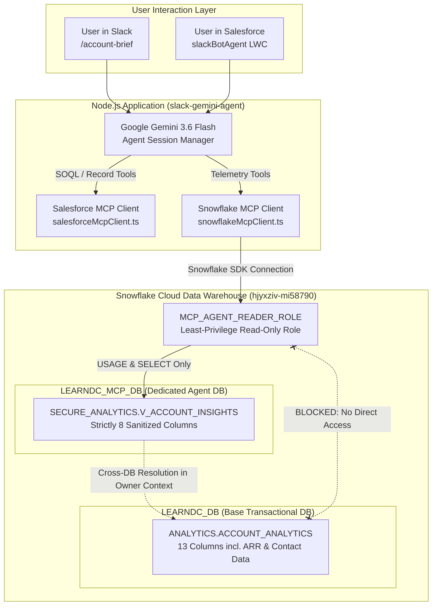

# Snowflake Model Context Protocol (MCP) Guide & Implementation Blueprint

A technical architecture specification, operational guide, and developer playbook for designing, implementing, securing, and orchestrating **Model Context Protocol (MCP)** tools with autonomous AI agents (Google Gemini 3.6 Flash) and Slack bots.

---

## 1. Executive Summary & What is Model Context Protocol (MCP)?

### What is Model Context Protocol (MCP)?
The **Model Context Protocol (MCP)** is an open, standardized protocol that standardizes how Large Language Model (LLM) agents securely connect to external enterprise data sources, business tools, and internal APIs. 

Historically, AI agents integrated with external services through custom, ad-hoc SDK wrappers and raw SQL strings directly embedded in application code. This legacy approach created significant challenges:
* **High Security Risk**: AI models often operated with high-privilege credentials capable of modifying or dropping production data.
* **Tight Coupling**: Any change to a database schema or API endpoint required updating the LLM prompt and core application logic.
* **Lack of Reusability**: Tool definitions could not be shared across different AI surfaces (e.g., Slack, Salesforce, terminal, web apps).

```
┌──────────────────────────────────────────────────────────────────────────────────┐
│                               MCP ARCHITECTURE                                   │
├──────────────────────────────────────────────────────────────────────────────────┤
│                                                                                  │
│   ┌────────────────────────┐                   ┌────────────────────────┐        │
│   │   AI Agent / Client    │                   │   MCP Tool Provider    │        │
│   │ (Gemini Session Mgr)   │                   │ (Snowflake MCP Client) │        │
│   └───────────┬────────────┘                   └───────────┬────────────┘        │
│               │                                            │                     │
│               │ 1. getTools()                              │                     │
│               │ ◄──────────────────────────────────────────┤                     │
│               │    (Returns JSON Schemas & Descriptions)   │                     │
│               │                                            │                     │
│               │ 2. Autonomous LLM Reasoning                │                     │
│               │    (LLM decides to call a tool)            │                     │
│               │                                            │                     │
│               │ 3. callTool(toolName, arguments)           │                     │
│               │ ──────────────────────────────────────────►│                     │
│               │                                            │ 4. Read-Only Query  │
│               │                                            │    via Least-Priv   │
│               │                                            │    Role             │
│               │                                            ▼                     │
│               │                                   [Snowflake Secure View]        │
│               │                                            │                     │
│               │ 5. Tool Result (Sanitized JSON DTO)        │                     │
│               │ ◄──────────────────────────────────────────┘                     │
│               ▼                                                                  │
│   Synthesizes Unified Dossier for User                                           │
└──────────────────────────────────────────────────────────────────────────────────┘
```

### Core MCP Concepts
1. **Host / Orchestrator**: The application runtime managing the AI agent session (in our architecture: [`slack-gemini-agent`](file:///C:/Users/Sumit%20Kr%20Gupta/OneDrive%20-%20Teqfocus%20Solutions%20Pvt.%20Ltd/Desktop/Learn%20DC/slack-gemini-agent)).
2. **MCP Client**: The service adapter maintaining isolated database/API credentials, declaring standardized tools, and dispatching execution calls.
3. **Tools**: Callable functions exposed to the LLM. Each tool has:
   - `name`: A unique identifier (e.g. `snowflake_get_account_telemetry`).
   - `description`: Plain-English explanation instructing the LLM when and why to invoke the tool.
   - `inputSchema`: JSON Schema specifying required and optional arguments.
4. **Tool Execution Result**: Strongly-typed JSON data objects (DTOs) returned back to the LLM context.

---

## 2. Snowflake MCP Architecture & Security Isolation

In enterprise environments, an AI agent should **never** query production transactional tables directly or connect using administrative accounts (`ACCOUNTADMIN` / `SYSADMIN`). 

Our Snowflake MCP implementation establishes an **isolated security boundary**:



### Key Security Principles Implemented:
1. **Database & Schema Segregation**:
   - Transactional staging and bi-directional synchronization live in `LEARNDC_DB.ANALYTICS`.
   - MCP Agent queries live exclusively in `LEARNDC_MCP_DB.SECURE_ANALYTICS`.
2. **Strict Column Sanitization (8 Fields Only)**:
   - Raw CRM fields like `ANNUAL_REVENUE` and internal email addresses are stripped.
   - Only 8 fields required for customer health analytics are exposed: `SF_ACCOUNT_ID`, `ACCOUNT_NAME`, `SLA_TIER`, `HEALTH_SCORE`, `HEALTH_STATUS`, `USAGE_HOURS`, `CHURN_RISK`, `SNOWFLAKE_LAST_UPDATED`.
3. **Snowflake Secure View Protection**:
   - `V_ACCOUNT_INSIGHTS` is defined as a **`SECURE VIEW`**.
   - Internal view definitions and query execution plans are masked from non-owner roles.
   - The view executes with the creator's permissions (`ACCOUNTADMIN`), allowing safe traversal into `LEARNDC_DB` without granting the consumer role any direct access to `LEARNDC_DB`.
4. **Least-Privilege Role (`MCP_AGENT_READER_ROLE`)**:
   - Granted `USAGE` on warehouse `COMPUTE_WH`.
   - Granted `USAGE` on database `LEARNDC_MCP_DB` and schema `SECURE_ANALYTICS`.
   - Granted `SELECT` on `V_ACCOUNT_INSIGHTS`.
   - **Zero write privileges**: All `INSERT`, `UPDATE`, `DELETE`, and `DROP` commands are rejected at the Snowflake compiler level.

---

## 3. Step-by-Step Creation of the Snowflake MCP

### Step 1: Snowflake Infrastructure Provisioning (DDL)

The following SQL statements provisioned the database, secure view, and read-only role:

```sql
-- 1. Create Dedicated MCP Database & Schema
CREATE DATABASE IF NOT EXISTS LEARNDC_MCP_DB 
COMMENT = 'Dedicated Snowflake Database for Model Context Protocol (MCP) Agent Access';

CREATE SCHEMA IF NOT EXISTS LEARNDC_MCP_DB.SECURE_ANALYTICS 
COMMENT = 'Sanitized Secure Views for AI Agent Consumption';

-- 2. Create Cross-Database Secure View with Strictly 8 Fields
CREATE OR REPLACE SECURE VIEW LEARNDC_MCP_DB.SECURE_ANALYTICS.V_ACCOUNT_INSIGHTS 
COMMENT = 'Sanitized Account Insights View for MCP Agent with strictly 8 fields and zero base table exposure'
AS
SELECT 
    SF_ACCOUNT_ID,
    ACCOUNT_NAME,
    SLA_TIER,
    HEALTH_SCORE,
    CASE 
        WHEN HEALTH_SCORE >= 80 THEN 'EXCELLENT'
        WHEN HEALTH_SCORE >= 60 THEN 'FAIR'
        ELSE 'AT RISK'
    END AS HEALTH_STATUS,
    USAGE_HOURS,
    CHURN_RISK,
    SNOWFLAKE_LAST_UPDATED
FROM LEARNDC_DB.ANALYTICS.ACCOUNT_ANALYTICS;

-- 3. Create Dedicated Read-Only MCP Role
CREATE ROLE IF NOT EXISTS MCP_AGENT_READER_ROLE 
COMMENT = 'Least-privileged read-only role for Slack Gemini MCP Agent';

-- 4. Grant Least-Privilege Permissions
GRANT USAGE ON WAREHOUSE COMPUTE_WH TO ROLE MCP_AGENT_READER_ROLE;
GRANT USAGE ON DATABASE LEARNDC_MCP_DB TO ROLE MCP_AGENT_READER_ROLE;
GRANT USAGE ON SCHEMA LEARNDC_MCP_DB.SECURE_ANALYTICS TO ROLE MCP_AGENT_READER_ROLE;
GRANT SELECT ON VIEW LEARNDC_MCP_DB.SECURE_ANALYTICS.V_ACCOUNT_INSIGHTS TO ROLE MCP_AGENT_READER_ROLE;

-- 5. Assign Role to Integration User
GRANT ROLE MCP_AGENT_READER_ROLE TO USER SUMITGUPTA05;
```

---

### Step 2: Implementing the TypeScript Snowflake MCP Client

The client is built as a standalone TypeScript class in [`slack-gemini-agent/src/mcp/snowflakeMcpClient.ts`](file:///C:/Users/Sumit%20Kr%20Gupta/OneDrive%20-%20Teqfocus%20Solutions%20Pvt.%20Ltd/Desktop/Learn%20DC/slack-gemini-agent/src/mcp/snowflakeMcpClient.ts).

#### A. Data Transfer Object (DTO) Definition
```typescript
export interface SecureAccountTelemetryDTO {
  isFound: boolean;
  sfAccountId?: string;
  accountName?: string;
  slaTier?: string;
  healthScore?: number;
  healthStatus?: string;
  usageHours?: number;
  churnRisk?: string;
  telemetryLastUpdated?: string;
  message?: string;
}
```

#### B. Singleton Pattern & Read-Only Connection Binding
The client connects exclusively through the least-privileged role:
```typescript
import snowflake from 'snowflake-sdk';
import { loadConfig } from '../config.js';

export class SnowflakeMcpClient {
  private static instance: SnowflakeMcpClient;
  private isInitialized = false;

  public static getInstance(): SnowflakeMcpClient {
    if (!SnowflakeMcpClient.instance) {
      SnowflakeMcpClient.instance = new SnowflakeMcpClient();
    }
    return SnowflakeMcpClient.instance;
  }

  private createReadOnlyConnection(): snowflake.Connection {
    const config = loadConfig(false);
    return snowflake.createConnection({
      account: config.snowflakeAccount!,
      username: config.snowflakeUsername!,
      password: config.snowflakePassword!,
      warehouse: 'COMPUTE_WH',
      database: 'LEARNDC_MCP_DB',          // Strictly bound to MCP DB
      schema: 'SECURE_ANALYTICS',          // Strictly bound to secure schema
      role: 'MCP_AGENT_READER_ROLE',       // Strictly bound to read-only role
    });
  }
}
```

#### C. Declaring Standardized MCP Tools
The `getTools()` method returns tool definitions following the MCP specification:
```typescript
public getTools(): McpToolDefinition[] {
  return [
    {
      name: 'snowflake_get_account_telemetry',
      description: 'Retrieves sanitized customer health, status (EXCELLENT/FAIR/AT RISK), usage hours, SLA tier, and churn risk from the Snowflake secure analytics view.',
      inputSchema: {
        type: 'OBJECT',
        properties: {
          accountIdentifier: {
            type: 'STRING',
            description: 'The Account Name or Salesforce 18-character Account ID (e.g. "Apex Global Innovations").',
          },
        },
        required: ['accountIdentifier'],
      },
    },
    {
      name: 'snowflake_list_at_risk_accounts',
      description: 'Lists accounts displaying elevated churn risk (HIGH) or low health scores (<60) from the Snowflake secure analytics view.',
      inputSchema: {
        type: 'OBJECT',
        properties: {
          maxResults: {
            type: 'INTEGER',
            description: 'Maximum number of records to return (default: 5).',
          },
        },
      },
    },
  ];
}
```

#### D. Tool Execution & Connection Teardown
When Gemini invokes a tool, `callTool()` runs a parameterized query and destroys the connection immediately after query completion to avoid socket leakage:
```typescript
public async callTool(toolName: string, args: Record<string, any>): Promise<any> {
  switch (toolName) {
    case 'snowflake_get_account_telemetry': {
      const identifier = (args.accountIdentifier || '').trim();
      const sql = `
        SELECT 
          SF_ACCOUNT_ID, ACCOUNT_NAME, SLA_TIER, HEALTH_SCORE,
          HEALTH_STATUS, USAGE_HOURS, CHURN_RISK, SNOWFLAKE_LAST_UPDATED
        FROM LEARNDC_MCP_DB.SECURE_ANALYTICS.V_ACCOUNT_INSIGHTS
        WHERE SF_ACCOUNT_ID = ? OR LOWER(ACCOUNT_NAME) = LOWER(?) OR LOWER(ACCOUNT_NAME) LIKE LOWER(?)
        ORDER BY SNOWFLAKE_LAST_UPDATED DESC NULLS LAST
        LIMIT 1
      `;
      const rows = await this.executeQuery<any>(sql, [identifier, identifier, `%${identifier}%`]);
      if (!rows || rows.length === 0) {
        return { isFound: false, message: `No telemetry insights found for "${identifier}".` };
      }
      return this.mapToDTO(rows[0]);
    }

    case 'snowflake_list_at_risk_accounts': {
      const limit = args.maxResults ? Number(args.maxResults) : 5;
      const sql = `
        SELECT SF_ACCOUNT_ID, ACCOUNT_NAME, SLA_TIER, HEALTH_SCORE, HEALTH_STATUS, USAGE_HOURS, CHURN_RISK
        FROM LEARNDC_MCP_DB.SECURE_ANALYTICS.V_ACCOUNT_INSIGHTS
        WHERE CHURN_RISK = 'HIGH' OR HEALTH_SCORE < 60
        ORDER BY HEALTH_SCORE ASC
        LIMIT ?
      `;
      const rows = await this.executeQuery<any>(sql, [limit]);
      return { count: rows.length, accounts: rows };
    }
  }
}
```

---

## 4. How the MCP is Orchestrated in Slack Bot & AI Agent

### 1. Application Startup (`src/index.ts`)
On application initialization, both MCP clients initialize their configurations:
```typescript
import { salesforceMcpClient } from './mcp/salesforceMcpClient.js';
import { snowflakeMcpClient } from './mcp/snowflakeMcpClient.js';

await salesforceMcpClient.initialize();
await snowflakeMcpClient.initialize();
```

### 2. Multi-MCP Tool Injection in Gemini Agent (`src/gemini/agent.ts`)
The session manager aggregates tools across all active MCP clients and passes them to the Gemini model declaration:
```typescript
export class GeminiAgentSessionManager {
  private getMergedTools(): Tool[] {
    const sfTools = salesforceMcpClient.getTools().map(this.mcpToGeminiDeclaration);
    const snowTools = snowflakeMcpClient.getTools().map(this.mcpToGeminiDeclaration);
    return [{ functionDeclarations: [...sfTools, ...snowTools] }];
  }

  // Autonomous Execution Router
  private async executeFunctionCall(call: FunctionCall): Promise<FunctionResponse> {
    const { name, args } = call;

    if (snowflakeMcpClient.hasTool(name)) {
      const result = await snowflakeMcpClient.callTool(name, args);
      return { name, response: { result } };
    }

    if (salesforceMcpClient.hasTool(name)) {
      const result = await salesforceMcpClient.callTool(name, args);
      return { name, response: { result } };
    }

    throw new Error(`Unregistered MCP tool: ${name}`);
  }
}
```

### 3. System Prompt Alignment: Zero Platform Brand Leakage (`src/gemini/prompt.ts`)
To prevent the agent from displaying confusing internal backend labels to business users, the system prompt instructs Gemini:
* **Never mention** backend technologies ("Salesforce", "Snowflake", "CRM", "Warehouse", "LEARNDC_DB").
* Present the synthesis as a single unified **Account Dossier** divided into business sections:
  * `Account Overview`
  * `Account Health & Platform Utilization`
  * `Recent Activity & Communication`

### 4. Slack Slash Command Integration (`src/slack/commands.ts`)
When a user types `/account-brief Apex Global Innovations` in Slack, the command handler invokes the MCP client directly to build a standardized Block Kit card:
```typescript
const telemetry = await snowflakeMcpClient.callTool('snowflake_get_account_telemetry', {
  accountIdentifier: accountName,
});
// Renders single unified Slack Block Kit Card
```

---

## 5. Verification & Security Testing Evidence

### Test Matrix

| Test Target | Execution Command / Query | Expected Behavior | Live Result |
| :--- | :--- | :--- | :--- |
| **Secure View Read** | `SELECT * FROM LEARNDC_MCP_DB.SECURE_ANALYTICS.V_ACCOUNT_INSIGHTS LIMIT 5;` | Returns 8 sanitized fields | ✅ Passed |
| **Write Protection** | `INSERT INTO V_ACCOUNT_INSIGHTS (SF_ACCOUNT_ID) VALUES ('001test');` | Compilation error (Not authorized) | ✅ Rejected (Safe) |
| **Base DB Protection** | `SELECT * FROM LEARNDC_DB.ANALYTICS.ACCOUNT_ANALYTICS;` (as MCP role) | Database not authorized error | ✅ Rejected (Safe) |
| **TypeScript MCP Client**| `await snowflakeMcpClient.callTool('snowflake_get_account_telemetry', { accountIdentifier: 'Apex Global Innovations' })` | Returns structured DTO | ✅ Returned Health=85, Hours=142.5 |
| **At-Risk Tool** | `await snowflakeMcpClient.callTool('snowflake_list_at_risk_accounts', { maxResults: 5 })` | Returns at-risk list | ✅ Returned records |

---

## 6. Master Developer Blueprint: How to Create a NEW MCP Server/Client

Use this standardized **5-phase framework** whenever you need to add a new external service or data source (e.g. **PostgreSQL**, **Stripe**, **Jira**, **Zendesk**) to the AI agent ecosystem.

```
┌──────────────────────────────────────────────────────────────────────────────────┐
│                          NEW MCP CREATION PLAYBOOK                               │
├──────────────────────────────────────────────────────────────────────────────────┤
│ Phase 1: Security & Boundary Definition (Least privilege, read-only token/role)   │
│ Phase 2: Tool Contract Design (JSON Schema input & output definitions)           │
│ Phase 3: Implement Client Class (Extending base MCP pattern)                    │
│ Phase 4: Host Registration & Agent Injection (Register in index.ts & agent.ts)   │
│ Phase 5: Verification & Zero-Brand-Leakage Formatting                           │
└──────────────────────────────────────────────────────────────────────────────────┘
```

### Phase 1: Security & Boundary Definition
1. **Never use Admin/Superuser credentials**: Always create a dedicated service account or scoped API token.
2. **Apply Read-Only Constraints**: Ensure the service role can only perform `SELECT` or `GET` operations.
3. **Data Sanitization**: Expose only the fields required for business decision-making. Expose no internal tokens, raw passwords, or confidential PII.

---

### Phase 2: Tool Contract Design
Follow the naming convention: `<service>_<action>_<entity>`:
* ✅ Good: `jira_get_customer_tickets`, `stripe_get_subscription_status`, `postgres_get_order_summary`
* ❌ Bad: `get_data`, `run_query`, `jiraTool`

Write descriptions from the perspective of the LLM explaining **when** to call the tool:
* *"Retrieves active support tickets and open escalations for a specific customer account name."*

---

### Phase 3: TypeScript MCP Boilerplate Template (`genericMcpClient.ts`)

Copy and adapt this template when creating any new MCP:

```typescript
// src/mcp/genericMcpClient.ts
import { McpToolDefinition } from './salesforceMcpClient.js';

export interface GenericEntityDTO {
  isFound: boolean;
  entityId?: string;
  name?: string;
  status?: string;
  metadata?: Record<string, any>;
  message?: string;
}

export class GenericMcpClient {
  private static instance: GenericMcpClient;
  private isInitialized = false;

  private constructor() {}

  public static getInstance(): GenericMcpClient {
    if (!GenericMcpClient.instance) {
      GenericMcpClient.instance = new GenericMcpClient();
    }
    return GenericMcpClient.instance;
  }

  public async initialize(): Promise<boolean> {
    // 1. Validate environment credentials
    // 2. Test connection to the service
    this.isInitialized = true;
    console.log('[GenericMCP] Initialized successfully.');
    return true;
  }

  public isReady(): boolean {
    return this.isInitialized;
  }

  /**
   * Declares tool schemas conforming to MCP standard
   */
  public getTools(): McpToolDefinition[] {
    return [
      {
        name: 'generic_get_entity_details',
        description: 'Retrieves current status, metrics, and details for a given identifier.',
        inputSchema: {
          type: 'OBJECT',
          properties: {
            identifier: {
              type: 'STRING',
              description: 'The entity name, external ID, or lookup key.',
            },
          },
          required: ['identifier'],
        },
      },
    ];
  }

  public hasTool(name: string): boolean {
    return this.getTools().some((t) => t.name === name);
  }

  /**
   * Executes the tool invocation
   */
  public async callTool(toolName: string, args: Record<string, any>): Promise<any> {
    console.log(`[GenericMCP] Invoking tool "${toolName}" with args:`, JSON.stringify(args));

    switch (toolName) {
      case 'generic_get_entity_details': {
        const id = (args.identifier || '').trim();
        if (!id) return { isFound: false, message: 'Identifier is required.' };

        // Execute API call or read-only database query
        return {
          isFound: true,
          entityId: id,
          status: 'ACTIVE',
        };
      }

      default:
        throw new Error(`Unknown tool: "${toolName}"`);
    }
  }
}

export const genericMcpClient = GenericMcpClient.getInstance();
```

---

### Phase 4: Host Registration & Agent Injection

#### Step A: Bootstrap in [`src/index.ts`](file:///C:/Users/Sumit%20Kr%20Gupta/OneDrive%20-%20Teqfocus%20Solutions%20Pvt.%20Ltd/Desktop/Learn%20DC/slack-gemini-agent/src/index.ts)
```typescript
import { genericMcpClient } from './mcp/genericMcpClient.js';

await genericMcpClient.initialize();
```

#### Step B: Register in [`src/gemini/agent.ts`](file:///C:/Users/Sumit%20Kr%20Gupta/OneDrive%20-%20Teqfocus%20Solutions%20Pvt.%20Ltd/Desktop/Learn%20DC/slack-gemini-agent/src/gemini/agent.ts)
```typescript
// 1. Add tools to Gemini tool list
const genericTools = genericMcpClient.getTools().map(this.mcpToGeminiDeclaration);
const mergedDeclarations = [...sfTools, ...snowTools, ...genericTools];

// 2. Add router dispatch
if (genericMcpClient.hasTool(name)) {
  const result = await genericMcpClient.callTool(name, args);
  return { name, response: { result } };
}
```

#### Step C: Update System Prompt in [`src/gemini/prompt.ts`](file:///C:/Users/Sumit%20Kr%20Gupta/OneDrive%20-%20Teqfocus%20Solutions%20Pvt.%20Ltd/Desktop/Learn%20DC/slack-gemini-agent/src/gemini/prompt.ts)
* Inform the model about the new tool's capabilities.
* Reinforce the Zero Brand Leakage rule: synthesize the output under standard business terminology without revealing the vendor name.

---

### Phase 5: Verification & End-to-End Testing
1. Compile the project with `npm run build`.
2. Run a test inquiry in Slack (e.g. `@bot check status for Apex Global Innovations`).
3. Verify the console logs:
   ```
   [Gemini] Model decided to invoke tool: "generic_get_entity_details"
   [GenericMCP] Invoking tool "generic_get_entity_details" with args: {"identifier":"Apex Global Innovations"}
   [Gemini] Synthesizing final response with tool results...
   ```

---

## 7. Production Operations, Troubleshooting & Maintenance Runbook

### Common Issues & Resolutions

| Issue / Symptom | Root Cause | Resolution |
| :--- | :--- | :--- |
| `SQL compilation error: Object does not exist or not authorized` | Querying without setting context or role does not have grant on view. | Always qualify with 3-part name: `LEARNDC_MCP_DB.SECURE_ANALYTICS.V_ACCOUNT_INSIGHTS` and verify `GRANT SELECT` was executed. |
| `Connection timed out` | Warehouse `COMPUTE_WH` was suspended or network firewall blocked port 443. | Verify warehouse has `AUTO_RESUME = TRUE` and inspect proxy settings. |
| `Agent displays raw table names` | Prompt instruction missing zero-branding guideline. | Verify [`prompt.ts`](file:///C:/Users/Sumit%20Kr%20Gupta/OneDrive%20-%20Teqfocus%20Solutions%20Pvt.%20Ltd/Desktop/Learn%20DC/slack-gemini-agent/src/gemini/prompt.ts) enforces the unified dossier schema. |
| `Too many connections open` | Connection not destroyed after query execution. | Ensure `conn.destroy()` is called in the `complete` callback of `conn.execute()`. |

### Warehouse Credit Optimization
To ensure the Snowflake warehouse consumes credits only when actively serving agent requests:
```sql
ALTER WAREHOUSE COMPUTE_WH SET 
    AUTO_SUSPEND = 60           -- Suspends warehouse after 1 minute of idle time
    AUTO_RESUME = TRUE          -- Resumes warehouse automatically upon query arrival
    STATEMENT_TIMEOUT_IN_SECONDS = 15; -- Prevents queries from hanging indefinitely
```
