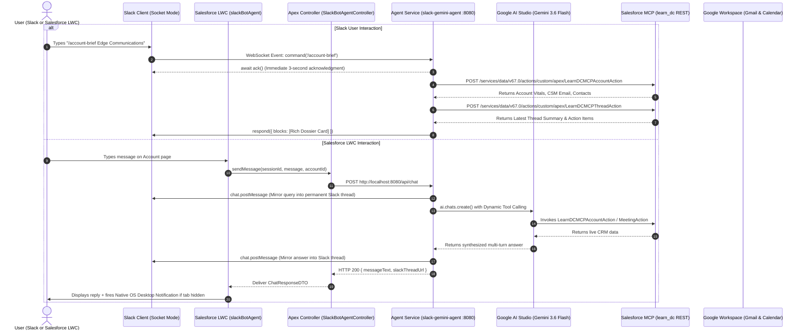
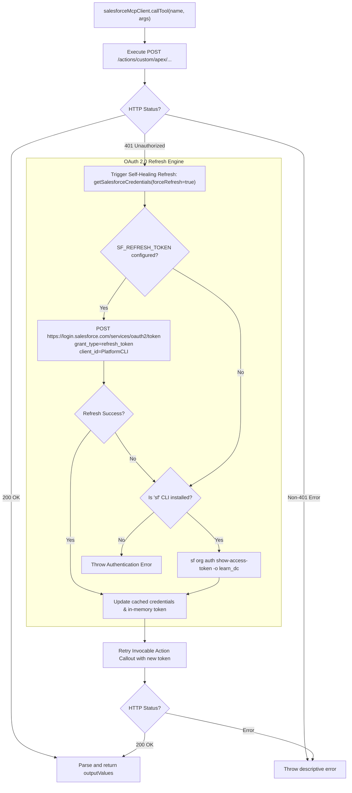

# Master Implementation, Architecture & Deployment Guide
## Omni-Channel AI Agent & Enterprise Collaboration Platform: Salesforce, Google Gemini, Slack, Gmail, Google Calendar & LWC

---

## Document Control & Overview

* **Document Title**: Master Technical Architecture, Implementation & Deployment Guide
* **Target Audience**: Software Engineers, Salesforce Developers/Architects, DevOps Engineers, and Technical Leads
* **Scope**: Complete end-to-end blueprint covering all 6 integrated subsystems, source code architecture, configuration recipes, deployment procedures, and troubleshooting runbooks.
* **Workspace Reference**: `Learn DC` (Salesforce Org: `learn_dc`)
* **Agent Service**: `slack-gemini-agent` (Node.js 22 Runtime / Docker Container `slack-gemini-agent-service`)

---

## Table of Contents

1. [Executive Summary & System Vision](#1-executive-summary--system-vision)
2. [End-to-End System Architecture](#2-end-to-end-system-architecture)
3. [Subsystem 1: Google AI Studio & Slack Bot Agent Service](#3-subsystem-1-google-ai-studio--slack-bot-agent-service)
4. [Subsystem 2: Salesforce MCP Client & Enterprise Self-Healing Auth](#4-subsystem-2-salesforce-mcp-client--enterprise-self-healing-auth)
5. [Subsystem 3: Slack Slash Commands (`/account-brief` & `/summarize-thread`)](#5-subsystem-3-slack-slash-commands-account-brief--summarize-thread)
6. [Subsystem 4: Salesforce & Gmail Bidirectional Integration & AI Thread Intelligence](#6-subsystem-4-salesforce--gmail-bidirectional-integration--ai-thread-intelligence)
7. [Subsystem 5: Salesforce & Google Calendar Real-Time Meeting Scheduling](#7-subsystem-5-salesforce--google-calendar-real-time-meeting-scheduling)
8. [Subsystem 6: Salesforce Lightning Web Components & Desktop Notifications](#8-subsystem-6-salesforce-lightning-web-components--desktop-notifications)
9. [Step-by-Step Implementation & Deployment Playbook](#9-step-by-step-implementation--deployment-playbook)
10. [Testing, Diagnostics & Operational Troubleshooting](#10-testing-diagnostics--operational-troubleshooting)

---

## 1. Executive Summary & System Vision

Modern customer success, sales, and support operations require seamless context across CRM data, client email communications, calendar meetings, and team collaboration channels. Switching between Salesforce, Gmail, Google Calendar, and Slack creates cognitive overhead, context switching, and delayed responses.

This platform solves this challenge by deploying a **unified, omni-channel autonomous AI agent** powered by **Google Gemini 3.6 Flash** and **Salesforce Model Context Protocol (MCP)**:

```
+---------------------------------------------------------------------------------------------------+
|                                  UNIFIED ENTERPRISE AI PLATFORM                                   |
+---------------------------------------------------------------------------------------------------+
|  1. Slack Workspace             | Interactive Slash Commands (/account-brief, /summarize-thread)   |
|                                 | Conversational mentions (@Gemini) and Direct Messages             |
+---------------------------------+-----------------------------------------------------------------+
|  2. Salesforce Lightning (LWC)  | Embedded Record-Page Copilot (slackBotAgent)                     |
|                                 | Background OS Desktop Notifications & Audio Alerts               |
|                                 | Split-pane Gmail Reader & Calendar Scheduler                      |
+---------------------------------+-----------------------------------------------------------------+
|  3. Google Workspace            | Bidirectional RFC 2822 Gmail Threading & AI Narrative Synthesis |
|                                 | Google Calendar API v3 with Automated Google Meet Links         |
+---------------------------------+-----------------------------------------------------------------+
|  4. Salesforce Core & Data Cloud| Hosted MCP Server Invocable Actions (LearnDC)                   |
|                                 | Dynamic OAuth 2.0 Self-Healing Session Engine                    |
+---------------------------------+-----------------------------------------------------------------+
```

### Core Business Capabilities
* **Instant 360° Account Briefings**: Slack users type `/account-brief [Account Name]` to receive an executive dossier combining live CRM vitals, assigned CSM, primary contacts, and the latest email discussion summary.
* **Autonomous Email Thread Summarization**: `/summarize-thread [Thread ID]` digests multi-message customer email exchanges into concise executive narratives, key discussion points, and recommended action items.
* **Omni-Channel Conversation Mirroring**: When a user chats with the AI agent inside Salesforce Lightning, the conversation is automatically mirrored into a dedicated Slack thread, guaranteeing permanent searchability and cross-team visibility.
* **Background Desktop Notifications**: Users interacting with the Salesforce LWC can switch tabs or minimize the browser; the browser fires native OS-level desktop notification banners and audio chimes the instant the AI completes its reasoning.
* **Self-Healing Connectivity**: Zero manual token maintenance. The agent automatically detects expired Salesforce sessions (HTTP 401 `INVALID_SESSION_ID`), performs native OAuth 2.0 token rotation via refresh tokens, and retries requests transparently.

---

## 2. End-to-End System Architecture

The following sequence diagram illustrates the end-to-end flow connecting Slack, Salesforce Lightning, the Node.js Agent Service, Google AI Studio, and Google Workspace:



### Communication & Protocol Matrix

| Source | Destination | Protocol / Transport | Auth / Credentials | Purpose |
| :--- | :--- | :--- | :--- | :--- |
| **Slack App** | **Agent Service** | WebSocket (`wss://`) | `SLACK_APP_TOKEN` (`xapp-`) | Socket Mode event listener (no public URLs) |
| **Agent Service** | **Slack API** | HTTPS REST | `SLACK_BOT_TOKEN` (`xoxb-`) | Posting messages, Block Kit cards, threads |
| **Salesforce LWC** | **Apex Controller** | Salesforce Wire / Apex | Salesforce User Session | Component controller invocation |
| **Apex Controller** | **Agent Gateway** | HTTP / REST Callout | Named Credential / Direct | Ingress to `/api/chat` on agent container |
| **Agent Service** | **Google Gemini** | HTTPS REST | `GEMINI_API_KEY` | LLM generation & Function Calling |
| **Agent Service** | **Salesforce** | HTTPS REST (Invocable) | OAuth 2.0 Bearer (`SF_REFRESH_TOKEN`) | Executing `LearnDCMCP*` Apex Actions |
| **Salesforce Core** | **Google APIs** | HTTPS REST | JWT Bearer RSA-SHA256 | Gmail & Google Calendar API v3 calls |

---

## 3. Subsystem 1: Google AI Studio & Slack Bot Agent Service

The core orchestration engine resides in the `slack-gemini-agent` directory. It is a containerized TypeScript Node.js service combining **Slack Bolt** and the **Google Gen AI SDK**.

### Key Architectural Characteristics:
1. **Slack Socket Mode (`@slack/bolt`)**:
   * Uses persistent outbound WebSockets (`wss://`).
   * Eliminates the need for public domains, ngrok tunnels, reverse proxies, and open firewall ports.
   * Completely immune to IP changes; runs identically on local developer machines or in cloud containers.
2. **Google Gen AI SDK (`@google/genai`)**:
   * Uses model `gemini-3.6-flash` for high-throughput, low-latency reasoning.
   * Leverages native **Function Calling** declarations to dynamically evaluate when CRM tools must be invoked.
   * Built-in exponential backoff and jitter retry engine to transparently survive transient Google API rate spikes (HTTP 429/503).
3. **Dual-Mode Headless Gateway (`src/index.ts` & `src/api/gateway.ts`)**:
   * In addition to listening on WebSockets, the service exposes an Express HTTP server on port `8080`.
   * **`GET /health`**: Returns service uptime, gateway health, and active LLM model. Satisfies Google Cloud Run and Kubernetes readiness probes.
   * **`POST /api/chat`**: Allows Salesforce LWC or external HTTP clients to submit prompts, receive responses, and mirror conversations to Slack.
4. **Session Management (`src/gemini/agent.ts`)**:
   * Multi-turn chat sessions with a 2-hour TTL.
   * Automatically re-initializes or cleans up stale memory contexts every 15 minutes.

### Directory Structure of `slack-gemini-agent`:
```
slack-gemini-agent/
├── Dockerfile                  # Multi-stage production build (node:22-alpine)
├── package.json                # Dependencies and scripts
├── tsconfig.json               # TypeScript compiler configuration
├── .env                        # Environment variables (tokens, keys, secrets)
├── src/
│   ├── index.ts                # Application entry point & server bootstrap
│   ├── config.ts               # Strongly typed configuration loader
│   ├── test-agent.ts           # Diagnostic CLI test for Gemini
│   ├── test-mcp.ts             # Diagnostic CLI test for Salesforce MCP tools
│   ├── api/
│   │   └── gateway.ts          # Express HTTP gateway (/api/chat, /health)
│   ├── gemini/
│   │   ├── client.ts           # Google AI Studio client factory
│   │   ├── prompt.ts           # System instructions & personality
│   │   ├── tools.ts            # Function declarations & dispatchers
│   │   └── agent.ts            # Multi-turn session manager & function calling loop
│   ├── mcp/
│   │   ├── salesforceAuth.ts   # Dynamic OAuth 2.0 refresh engine
│   │   └── salesforceMcpClient.ts # Direct Invocable Action bridge & retry
│   └── slack/
│       ├── handlers.ts         # Mention and DM event handlers
│       ├── commands.ts         # Slash command handlers (/account-brief, etc.)
│       └── formatters.ts       # Slack Block Kit card UI builders
```

---

## 4. Subsystem 2: Salesforce MCP Client & Enterprise Self-Healing Auth

The agent integrates with Salesforce via the Model Context Protocol (MCP) and direct Apex Invocable Action execution.

### The Direct Invocable Action Bridge (`salesforceMcpClient.ts`)
While standard MCP servers operate over Server-Sent Events (SSE), Salesforce Developer and Scratch orgs may not have External Client Apps (ECA) or Hosted MCP gateways publicly routable. 

The client implements a **Dual-Mode Execution Strategy**:
1. **Mode 1 (SSE Gateway)**: Attempts SSE connection to `SF_MCP_ENDPOINT_URL` if configured.
2. **Mode 2 (Direct Apex Bridge)**: Automatically registers and executes the deployed Apex Invocable Actions against the Salesforce REST endpoint:
   ```
   POST https://<instance>/services/data/v67.0/actions/custom/apex/<ActionName>
   ```

### Deployed Invocable Actions:
* **`LearnDCMCPAccountAction`**: Takes `accountIdentifier` (Name or ID); returns Account Name, Account ID, Industry, CSM Email, and primary contact list.
* **`LearnDCMCPThreadAction`**: Takes `accountIdentifier` or `threadId`; returns the AI executive summary, key points, and action items from `Gmail_Thread_Summary__c`.
* **`LearnDCMCPMeetingAction`**: Takes `accountIdentifier`, `subject`, `startDateTime`, `durationMinutes`, `attendeeEmail`; creates a Salesforce `Event` record and generates a Google Meet video link.

### Enterprise Self-Healing Authentication Architecture (`salesforceAuth.ts`)
To prevent `INVALID_SESSION_ID` (HTTP 401) errors when static access tokens expire, the authentication subsystem implements an autonomous OAuth 2.0 token rotation engine:



#### Why This Is Critical for Production:
* In a Docker container (or Cloud Run), the Salesforce CLI (`sf`) is not installed.
* Standard OAuth 2.0 `fetch` requests directly to `https://login.salesforce.com/services/oauth2/token` require zero external binaries.
* The application self-heals in memory without restarting the service or requiring human intervention.

---

## 5. Subsystem 3: Slack Slash Commands (`/account-brief` & `/summarize-thread`)

Slash commands allow users across any channel or private message to invoke intelligence instantly.

### Technical Implementation (`src/slack/commands.ts`):
1. **The 3-Second Rule (`ack()`)**:
   Slack requires an HTTP 200 or acknowledgment within 3,000 milliseconds, or it displays an `operation_timeout` error to the user. All command handlers execute `await ack()` immediately on line 1 before executing downstream tool callouts.
2. **Command 1: `/account-brief [Account Name]`**:
   * Invokes `LearnDCMCPAccountAction` with the supplied account name.
   * Invokes `LearnDCMCPThreadAction` to fetch the latest customer email intelligence.
   * Synthesizes and formats a multi-section Slack Block Kit card:
     * Header with Account Name.
     * Two-column metadata fields (Industry, CSM Assigned, Primary Contact, Contact Email).
     * Contact Summary badge list.
     * Recent Customer Intelligence section (Executive Summary & Action Items).
     * Context footer with live Salesforce Record ID and server timestamp.
3. **Command 2: `/summarize-thread [Thread ID]`**:
   * Takes a specific Gmail Thread ID (e.g., `18f52b618a8039d9`).
   * Fetches the parsed thread intelligence from Salesforce.
   * Renders a dedicated summary card highlighting key discussion takeaways and pending action items.

---

## 6. Subsystem 4: Salesforce & Gmail Bidirectional Integration & AI Thread Intelligence

This subsystem enables bidirectional synchronization between Salesforce and Gmail without requiring custom domain purchases or Google Workspace Admin privileges.

### Core Architectural Pillars:
1. **Domain-Free CSM & Client Threading**:
   * Uses `Account.CSM_Email__c` to route emails through native Salesforce email services.
   * Injects RFC 2822 threading headers (`Message-ID`, `In-Reply-To`, `References`) into outbound messages.
   * Gmail natively groups these messages into conversations in both the client's inbox and the CSM's personal Gmail inbox.
2. **Smart Inbound Reply Handler (`AccountGmailInboundHandler.cls`)**:
   * Inbound email service listening on an apex email address (e.g., `csm-reply@...`).
   * Parses incoming emails, extracts subject and thread IDs, associates them with the correct Account and Contact, and logs an inbound `Event` record.
   * Forwards replies to the CSM's personal Gmail inbox with quoted conversation history.
   * Fires a `Gmail_Sync_Notification__e` platform event to refresh UI components in real time via `empApi`.
3. **AI Whole-Thread Summarization Engine (`GmailAIService.cls`)**:
   * Gathers all messages associated with an email thread.
   * Formulates a structured prompt and dispatches it to Google Gemini.
   * Extracts an **Executive Narrative**, **Key Points**, and **Action Items**.
   * Caches the output in the custom object `Gmail_Thread_Summary__c` to prevent redundant LLM generation costs.
4. **Split-Pane Lightning Web Component (`accountGmail`)**:
   * Embedded on the Account record page.
   * Left pane: Interactive thread selector with unread message badges.
   * Right pane: Top section renders the Gemini AI thread summary; bottom section displays the chronological message stream with an inline composer.

---

## 7. Subsystem 5: Salesforce & Google Calendar Real-Time Meeting Scheduling

This subsystem allows Salesforce users to schedule, time-shift, and cancel meetings directly from Account record pages, automatically generating Google Meet video conference links.

### Core Architectural Pillars:
1. **Google Calendar API v3 Integration (`GoogleCalendarService.cls`)**:
   * Dispatches authenticated REST callouts to `https://www.googleapis.com/calendar/v3/calendars/primary/events`.
   * Automatically requests conference data generation (`conferenceDataVersion=1`) to attach a unique Google Meet link (`meet.google.com/xxx-xxxx-xxx`).
2. **Authentication via Signed JWT Bearer (`GoogleAuthService.cls`)**:
   * Uses RSA-SHA256 private key signing to request OAuth access tokens from `https://oauth2.googleapis.com/token`.
   * Supports Google Workspace Domain-Wide Delegation to impersonate specific CSM user accounts.
3. **Calendar vs. Email Isolation**:
   * Strict separation of concerns prevents routine customer emails from creating clutter on executive calendars.
   * Only formal meeting invitations dispatched via the meeting scheduler create entries in the user's primary Google Calendar.
4. **Bidirectional Webhook Synchronization**:
   * Inbound webhook endpoint (`GoogleCalendarWebhook.cls`) receives Google push notifications.
   * Enqueues `GoogleCalendarQueueable.cls` to perform delta synchronization using incremental `syncToken` values.
   * Synchronizes standard Salesforce `Event` records and fires `Calendar_Sync_Notification__e`.

---

## 8. Subsystem 6: Salesforce Lightning Web Components & Desktop Notifications

The frontend user interface in Salesforce consists of the **`slackBotAgent`** Lightning Web Component and a specialized desktop notification service.

### Component Architecture:
* **`slackBotAgent.html / .js / .css`**:
  * Chat modal interface embedded on Account record pages or the Salesforce Utility Bar.
  * Displays user and agent message bubbles with avatar badges, timestamps, and SLDS card styling.
  * Includes a header action bar with notification toggles and session reset buttons.
  * Automatically injects record context (Active Account Name and Account ID) into every prompt.
* **`desktopNotificationService.js` (Web Notifications API)**:
  * Implements the HTML5 **Web Notifications API** (`window.Notification`) and **Page Visibility API** (`document.hidden`).
  * **Intelligent Suppression**: If the user is actively viewing the tab (`document.hidden === false`), desktop popups are suppressed to avoid annoyance.
  * **Background OS Alerts**: If the user switches to another window, tab, or application while the LLM is thinking, the service triggers a native desktop banner:
    ```javascript
    new Notification('Slack Bot Agent: Edge Communications', {
      body: responseSummary,
      icon: '/resource/botAvatar',
      renotify: true,
      tag: 'agent-reply'
    });
    ```
  * **One-Click Window Focus**: Clicking the desktop banner automatically calls `window.focus()`, returning the user to the active Salesforce tab.
  * **Tab Title Pulsing**: Pulses the browser tab title (`🔔 (1) New Reply Ready | Salesforce`) until the user focuses on the tab.
  * **Audio Chime**: Plays a subtle audio alert upon response arrival.
* **`SlackBotAgentController.cls`**:
  * Apex controller providing `@AuraEnabled` methods for the LWC.
  * Handles HTTP callouts to the Node.js agent gateway (`/api/chat`).
  * Deserializes responses into `ChatResponseDTO` objects for the LWC.

---

## 9. Step-by-Step Implementation & Deployment Playbook

Follow this sequential checklist to deploy the complete platform from scratch.

### Step 1: Salesforce Org Prerequisites (`learn_dc`)
1. **Deploy Custom Fields**:
   * `Account.CSM_Email__c` (Email)
   * `Event.Google_Event_Id__c` (Text, 255)
   * `Event.Meeting_Link__c` (URL, 255)
2. **Deploy Custom Objects & Platform Events**:
   * `Gmail_Thread_Summary__c` (Fields: `Account__c`, `Thread_Id__c`, `Executive_Summary__c`, `Key_Points__c`, `Action_Items__c`, `Message_Count__c`).
   * `Gmail_Sync_Notification__e` (Platform Event).
   * `Calendar_Sync_Notification__e` (Platform Event).
3. **Deploy Apex Classes**:
   * Deploy `AccountGmailController`, `AccountGmailInboundHandler`, `GmailAIService`.
   * Deploy `AccountCalendarController`, `GoogleCalendarService`, `GoogleAuthService`.
   * Deploy `SlackBotAgentController`.
   * Deploy Invocable Actions: `LearnDCMCPAccountAction`, `LearnDCMCPThreadAction`, `LearnDCMCPMeetingAction`.
4. **Deploy Lightning Web Components**:
   * Deploy `accountGmail`, `accountGoogleCalendar`, `slackBotAgent`.
5. **Configure Remote Site Settings**:
   * `SlackAgentGateway`: `http://localhost:8080` (or your cloud URL).
   * `GoogleOAuth`: `https://oauth2.googleapis.com`.
   * `GoogleCalendarAPI`: `https://www.googleapis.com`.

### Step 2: Google Cloud & AI Studio Configuration
1. **Google AI Studio**:
   * Navigate to [aistudio.google.com](https://aistudio.google.com/) and create an API Key.
2. **Google Cloud Console**:
   * Enable **Google Calendar API** and **Gmail API**.
   * Create a Service Account with Domain-Wide Delegation (if using domain delegation) or OAuth 2.0 Web Client credentials.
   * Download the Service Account JSON key for RSA signing.

### Step 3: Slack App Configuration
1. Navigate to [api.slack.com/apps](https://api.slack.com/apps) and create an App **From an app manifest** or scratch.
2. **Enable Socket Mode**:
   * Settings ➔ Socket Mode ➔ Enable.
   * Generate an **App-Level Token** with scope `connections:write` (`xapp-...`).
3. **Configure Bot Token Scopes (`OAuth & Permissions`)**:
   * `app_mentions:read`
   * `chat:write`
   * `channels:history`, `groups:history`, `im:history`, `mpim:history`
   * `commands` (Required for slash commands)
4. **Create Slash Commands**:
   * `/account-brief`: Briefing for accounts (e.g. `/account-brief Edge Communications`).
   * `/summarize-thread`: Summarizes a customer thread ID.
5. **Install App to Workspace**:
   * Copy the **Bot User OAuth Token** (`xoxb-...`).
   * Copy the **Signing Secret** from Basic Information.

### Step 4: Configure & Run the Agent Service
1. Navigate to `slack-gemini-agent/` on your system.
2. Populate the `.env` file:
   ```env
   # Google AI Studio
   GEMINI_API_KEY=your_gemini_api_key
   GEMINI_MODEL=gemini-3.6-flash

   # Slack Configuration
   SLACK_BOT_TOKEN=xoxb-...
   SLACK_APP_TOKEN=xapp-...
   SLACK_SIGNING_SECRET=your_signing_secret

   # Salesforce Integration
   ENABLE_SALESFORCE_TOOLS=true
   SF_LOGIN_URL=https://login.salesforce.com
   SF_ORG_ALIAS=learn_dc
   SF_CLIENT_ID=PlatformCLI
   SF_REFRESH_TOKEN=your_permanent_refresh_token
   SF_INSTANCE_URL=https://your-domain.develop.my.salesforce.com
   SF_ACCESS_TOKEN=initial_access_token
   ```
3. Compile TypeScript:
   ```bash
   npm install
   npm run build
   ```
4. Run diagnostics:
   ```bash
   npm run test:mcp
   ```

### Step 5: Docker Containerization
1. Build the Docker container:
   ```bash
   docker build -t slack-gemini-agent:latest .
   ```
2. Launch the container:
   ```bash
   docker run -d \
     --name slack-gemini-agent-service \
     -p 8080:8080 \
     --env-file .env \
     --restart unless-stopped \
     slack-gemini-agent:latest
   ```
3. Verify container health:
   ```bash
   curl http://localhost:8080/health
   docker logs --tail 25 slack-gemini-agent-service
   ```

---

## 10. Testing, Diagnostics & Operational Troubleshooting

### Diagnostic Test Suite

| Test Target | Command | Expected Result |
| :--- | :--- | :--- |
| **Salesforce Auth & MCP Tools** | `npm run test:mcp` | Displays org connection, lists 3 tools, invokes `LearnDCMCPAccountAction` with test account `Edge`. |
| **Gemini AI Studio Direct** | `npm run test:agent` | Validates Gemini API key and prints sample LLM response. |
| **Container Health Probe** | `curl http://localhost:8080/health` | Returns HTTP 200 with `{"status":"healthy","gateway":"active"}`. |
| **Slack Socket Mode** | Check container logs | Displays `⚡️ Slack Gemini Agent is connected and running in Socket Mode!`. |

### Troubleshooting Runbook

#### Issue 1: HTTP 401 `INVALID_SESSION_ID` from Salesforce
* **Symptom**: Slack replies with `Salesforce action failed with HTTP 401: [{"message":"Session expired or invalid"}]`.
* **Root Cause**: The access token expired and no valid refresh token was configured.
* **Resolution**: Ensure `SF_REFRESH_TOKEN` and `SF_CLIENT_ID=PlatformCLI` are present in `.env`. With our updated `salesforceAuth.ts` and `salesforceMcpClient.ts`, the client will automatically intercept 401, refresh the token via OAuth 2.0, and retry the request without failing.

#### Issue 2: Slack Slash Command `operation_timeout`
* **Symptom**: Slack displays `Darn - that didn't work. The command took more than 3,000ms to respond.`
* **Root Cause**: The bot failed to execute `await ack()` immediately upon receiving the command.
* **Resolution**: Verify line 1 of any new command handler in `src/slack/commands.ts` calls `await ack()` before invoking long-running callouts.

#### Issue 3: Desktop Notifications Not Appearing in LWC
* **Symptom**: Background alerts do not pop up when the browser tab is hidden.
* **Root Cause**: Browser permissions are set to "Block" or "Default", or the tab is active.
* **Resolution**: Click the bell icon in the `slackBotAgent` header to trigger `Notification.requestPermission()`. Ensure the browser tab is actually in the background (`document.hidden === true`).

#### Issue 4: Docker Container Fails to Connect to Salesforce
* **Symptom**: Container logs show `Could not retrieve Salesforce credentials`.
* **Root Cause**: The container does not have access to the host's `sf` CLI session and `SF_REFRESH_TOKEN` is missing.
* **Resolution**: Set `SF_REFRESH_TOKEN` in `.env` and recreate the container using `--env-file .env`.

---

## 11. Maintenance & Future Extensions

* **Snowflake Analytics Integration**: Follow the blueprint in `SNOWFLAKE_SALESFORCE_SLACK_INTEGRATION_PLAN.md` to deploy `snowflakeClient.ts` and add telemetry tools to Gemini.
* **Google Cloud Run Hosting**: When ready to deploy to the cloud, use the one-command deployment script documented in `GCP_DEPLOYMENT_GUIDE.md` with `--min-instances 1` to keep the Socket Mode connection active 24/7.
