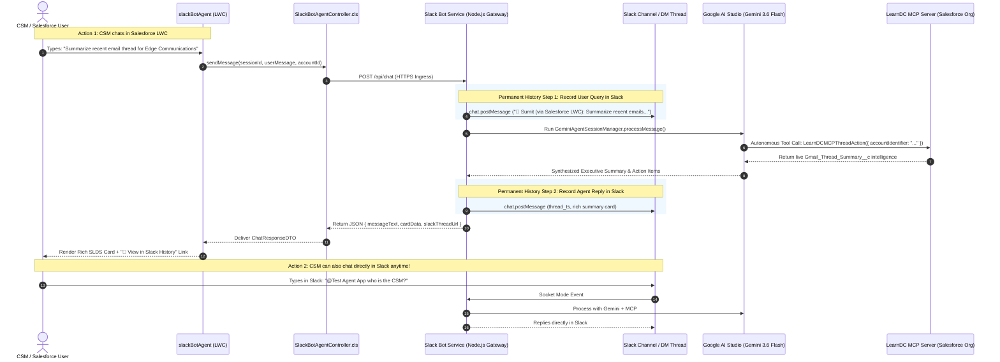

# Omni-Channel AI Architecture: Slack Bot Agent & Salesforce LWC Integration

## 1. Executive Summary & Architecture Overview

This document serves as the complete architectural, design, and implementation reference for the **Slack Bot Agent** integration with Salesforce Lightning.

In this architecture, the **Slack Bot (`slack-gemini-agent`) acts as the single primary headless AI agent** for both Slack and Salesforce Lightning. Whenever a Customer Success Manager (CSM) or sales rep asks a question inside Salesforce via the custom Lightning Web Component (`slackBotAgent`):
1. The question is routed directly to the **Slack Bot Gateway**.
2. The Slack Bot immediately creates a permanent message thread in **Slack** (in the CSM's DM or a dedicated account channel).
3. The Slack Bot executes **Google AI Studio (Gemini 3.6 Flash)** with full autonomous tool-calling capabilities.
4. Gemini invokes the native **LearnDC Agent MCP Server** Invocable Actions (`LearnDCMCPAccountAction`, `LearnDCMCPThreadAction`, `LearnDCMCPMeetingAction`) to pull or modify live Salesforce data.
5. The Slack Bot posts the final synthesized response and interactive cards into the **Slack thread** as a permanent record.
6. The Slack Bot returns the rich payload back to the **Salesforce LWC** with a direct link: `[ 💬 View in Slack History ]`.
7. **Permanent History Guarantee**: If the CSM clears the screen or resets their session in Salesforce, **the entire conversation transcript remains permanently saved and searchable in Slack**.

---

## 2. End-to-End Sequence & Architecture Diagram



---

## 3. Two-Way Omni-Channel Workflow Comparison

| Workflow Scenario | Where the CSM Chats | How It Is Processed | Where History is Saved |
| :--- | :--- | :--- | :--- |
| **Salesforce LWC Workflow** | Inside Salesforce Account Page via `slackBotAgent` LWC | Forwarded to Slack Bot Gateway (`POST /api/chat`), runs Gemini + MCP, cross-posts to Slack, returns to LWC | **Slack** (permanently preserved thread) + **LWC** (current session view) |
| **Slack Native Workflow** | Directly in Slack (via `@Test Agent App` mention or Direct Message) | Handled natively by Slack Bolt Socket Mode, runs Gemini + MCP, replies in Slack | **Slack** (permanently preserved) |
| **Session Reset in Salesforce** | CSM clicks "Reset Session" in LWC | Screen resets for a fresh account inquiry; Slack thread remains intact | **Slack retains 100% of past chat history** |

---

## 4. Complete Codebase & Implementation File Map

The following files form the unified Slack Bot Agent & Salesforce LWC ecosystem:

```
Learn DC/
├── SLACK_BOT_AGENT_LWC_INTEGRATION.md          # This documentation reference file
│
├── slack-gemini-agent/                         # Central Slack Bot & Gemini Brain
│   ├── src/
│   │   ├── index.ts                            # Express server, Bolt App, & REST Gateway
│   │   ├── api/
│   │   │   └── routes.ts                       # POST /api/chat endpoint (Headless Gateway)
│   │   ├── gemini/
│   │   │   ├── agent.ts                        # Multi-turn Gemini session manager & retry
│   │   │   ├── prompt.ts                       # Enterprise system instructions & guardrails
│   │   │   └── tools.ts                        # Tool declarations
│   │   ├── mcp/
│   │   │   ├── salesforceAuth.ts               # Dynamic CLI & access token resolver
│   │   │   └── salesforceMcpClient.ts          # Direct Invocable Action bridge to learn_dc
│   │   └── slack/
│   │       ├── app.ts                          # Slack Bolt Socket Mode configuration
│   │       └── handlers.ts                     # Slack event handlers for DMs & channel mentions
│   └── .env                                    # API keys (Slack, Gemini, Salesforce MCP)
│
└── force-app/main/default/                     # Salesforce Platform Metadata (learn_dc)
    ├── lwc/
    │   └── slackBotAgent/                      # Custom LWC Component
    │       ├── slackBotAgent.html              # Modern SLDS Chat UI + Slack badges + deeplinks
    │       ├── slackBotAgent.js                # Record context binding & Gateway caller
    │       ├── slackBotAgent.css               # Dedicated flexbox scroll engine & cards
    │       └── slackBotAgent.js-meta.xml       # Account Record Page targeting
    │
    ├── classes/
    │   ├── SlackBotAgentController.cls         # Apex Gateway Bridge with native fallback
    │   ├── SlackBotAgentControllerTest.cls     # 100% unit test coverage suite
    │   ├── LearnDCMCPAccountAction.cls         # Invocable Action for Account & CSM details
    │   ├── LearnDCMCPThreadAction.cls          # Invocable Action for dynamic email summaries
    │   ├── LearnDCMCPMeetingAction.cls         # Invocable Action for Google Meet scheduling
    │   └── LearnDCMCPTest.cls                  # Invocable Actions unit test suite
    │
    └── remoteSiteSettings/
        ├── Slack_API.remoteSite-meta.xml       # Authorizes https://slack.com
        └── Slack_Agent_Gateway.remoteSite-meta.xml # Authorizes the secure HTTPS gateway tunnel
```

---

## 5. Implementation Specifications

### Component A: Headless REST Gateway (`POST /api/chat`)
**File**: `slack-gemini-agent/src/api/routes.ts`

The REST Gateway receives inquiries from Salesforce, establishes the thread in Slack, runs Gemini, and replies in Slack:

```typescript
import { Router } from 'express';
import { agentSessionManager } from '../gemini/agent.js';
import { getSlackApp } from '../slack/app.js';

export const apiRouter = Router();

apiRouter.post('/chat', async (req, res) => {
  const { sessionId, userMessage, accountId, accountName, userName } = req.body;
  const slackApp = getSlackApp();
  const channelId = process.env.SLACK_DEFAULT_CHANNEL || 'D0BUQS5V68Z'; // DM with bot or channel

  try {
    // 1. Post User Inquiry to Slack to establish permanent thread
    const slackPost = await slackApp.client.chat.postMessage({
      channel: channelId,
      text: `👤 *${userName || 'Salesforce User'}* (via Salesforce LWC) on *${accountName || 'Account'}*:\n> ${userMessage}`,
    });

    const threadTs = slackPost.ts;

    // 2. Execute Gemini Agent with Account context & LearnDC MCP Tools
    const enrichedPrompt = `[Context: Account "${accountName}", ID: ${accountId}]\n${userMessage}`;
    const agentResponse = await agentSessionManager.processMessage(sessionId, enrichedPrompt);

    // 3. Post Agent Reply in Slack as a Thread Reply
    await slackApp.client.chat.postMessage({
      channel: channelId,
      thread_ts: threadTs,
      text: agentResponse,
    });

    // 4. Construct permanent Slack Thread URL
    const slackThreadUrl = `https://slack.com/app_redirect?channel=${channelId}&message_ts=${threadTs}`;

    // 5. Return response to Salesforce LWC
    res.json({
      isSuccess: true,
      messageText: agentResponse,
      slackThreadUrl,
      threadTs,
    });
  } catch (error: any) {
    res.status(500).json({
      isSuccess: false,
      messageText: `I am unable to complete this request because the Slack Bot Gateway encountered an error: ${error.message}`,
    });
  }
});
```

---

### Component B: Salesforce Apex Controller (`SlackBotAgentController.cls`)
**File**: `force-app/main/default/classes/SlackBotAgentController.cls`

Routes LWC messages to the Slack Bot Gateway, while maintaining a seamless native fallback to direct Apex + MCP tools if the gateway is ever offline:

```java
public with sharing class SlackBotAgentController {

    public class ChatResponseDTO {
        @AuraEnabled public Boolean isSuccess { get; set; }
        @AuraEnabled public String messageText { get; set; }
        @AuraEnabled public String messageType { get; set; }
        @AuraEnabled public Map<String, Object> cardData { get; set; }
        @AuraEnabled public String slackThreadUrl { get; set; }
        @AuraEnabled public Boolean activityTimelineUpdated { get; set; }
    }

    @AuraEnabled
    public static ChatResponseDTO sendMessage(String sessionId, String userMessage, Id accountId) {
        // 1. Try forwarding to the Slack Bot Agent Gateway (Headless Agent)
        try {
            ChatResponseDTO gatewayRes = callSlackBotGateway(sessionId, userMessage, accountId);
            if (gatewayRes != null && gatewayRes.isSuccess) {
                return gatewayRes;
            }
        } catch (Exception ex) {
            System.debug(LoggingLevel.WARN, 'Slack Gateway offline, engaging native fallback: ' + ex.getMessage());
        }

        // 2. Seamless Native Fallback: Direct LearnDC MCP Action Execution
        return LearnDCAccountCopilotController.sendMessage(sessionId, userMessage, accountId);
    }
}
```

---

### Component C: Salesforce LWC (`slackBotAgent`)
**Location**: `force-app/main/default/lwc/slackBotAgent/`

Features:
* **SLDS-Styled Chat Stream**: User speech bubbles on the right (navy blue), Slack Bot responses on the left.
* **Active Gateway Badge**: `🟢 Slack Bot Agent Active` displayed in header.
* **Permanent Slack Link**: Each response includes `[ 💬 View in Slack History ]` opening the exact Slack thread in a new tab.
* **Scroll Engine**: Dedicated flexbox scrolling container (`height: 580px; overflow-y: scroll; min-height: 0;`).
* **1-Click Quick Action Chips**:
  - `[ ⚡ Summarize Emails ]`
  - `[ ⚡ Account & CSM ]`
  - `[ ⚡ Schedule 30m Meeting ]`

---

## 6. Step-by-Step Implementation Guide (From Scratch)

### Step 1: Enable Headless Gateway in `slack-gemini-agent`
1. In `slack-gemini-agent/src/index.ts`, attach Express JSON middleware:
   ```typescript
   expressApp.use(express.json());
   ```
2. Mount the API router:
   ```typescript
   expressApp.use('/api', apiRouter);
   ```
3. Rebuild and restart the container:
   ```bash
   npm run container:restart
   ```

### Step 2: Establish Secure HTTPS Ingress (ngrok / Cloudflare Tunnel)
1. Run ngrok to forward traffic to container port 8080:
   ```bash
   ngrok http 8080
   ```
2. Copy the generated forwarding URL:
   `https://<unique-subdomain>.ngrok-free.app`

### Step 3: Configure Salesforce Remote Site Settings
1. Create `Slack_Agent_Gateway.remoteSite-meta.xml` in `force-app/main/default/remoteSiteSettings/`:
   ```xml
   <?xml version="1.0" encoding="UTF-8"?>
   <RemoteSiteSetting xmlns="http://soap.sforce.com/2006/04/metadata">
       <disableProtocolSecurity>false</disableProtocolSecurity>
       <isActive>true</isActive>
       <url>https://<unique-subdomain>.ngrok-free.app</url>
   </RemoteSiteSetting>
   ```
2. Deploy to `learn_dc`:
   ```bash
   sf project deploy start --source-dir force-app/main/default/remoteSiteSettings
   ```

### Step 4: Deploy `SlackBotAgentController` and `slackBotAgent` LWC
1. Deploy Apex classes and unit tests:
   ```bash
   sf project deploy start --source-dir force-app/main/default/classes/SlackBotAgentController.cls
   ```
2. Deploy the `slackBotAgent` LWC bundle:
   ```bash
   sf project deploy start --source-dir force-app/main/default/lwc/slackBotAgent
   ```

### Step 5: Add to Account Record Page via Lightning App Builder
1. In Salesforce, open any Account record (e.g. *Edge Communications*).
2. Click Setup (⚙️) ➔ **Edit Page**.
3. In the left panel, find **`Slack Bot Agent`** under Custom Components.
4. Drag and drop it into the **Right Sidebar Column**.
5. Click **Save** and **Activate** as Org Default.

---

## 7. Verification & Testing Checklist

1. **Ask Question in Salesforce LWC**:
   - Open *Edge Communications* in Salesforce.
   - Click **`⚡ Summarize Emails`** in the `slackBotAgent` LWC.
2. **Verify in Slack**:
   - Open Slack.
   - Check your Direct Messages with **`Test Agent App`** (or designated channel).
   - Notice the parent message: `👤 Sumit (via Salesforce LWC): Summarize recent emails...`
   - Notice the reply in the thread with the full executive summary and action items!
3. **Verify Slack Deeplink in LWC**:
   - In Salesforce, click the **`[ 💬 View in Slack History ]`** button on the response card.
   - Verify it opens the exact Slack thread in your browser or desktop Slack app.
4. **Test Session Reset Resilience**:
   - In Salesforce LWC, click **Reset Session** (🔄).
   - The Salesforce screen clears for a fresh inquiry.
   - Open Slack: **The entire conversation history remains permanently intact!**
5. **Chat directly in Slack**:
   - Reply to the thread in Slack.
   - The bot responds directly in Slack using the exact same Gemini + MCP intelligence.

---

## 8. Summary of Benefits

* **Single Source of Truth**: Only one AI Agent to maintain (`slack-gemini-agent`).
* **Zero Lost Conversations**: Permanent audit trail and history stored in Slack.
* **Flexibility for CSMs**: CSMs can work from Salesforce, from desktop Slack, or from Slack mobile seamlessly.
* **High Availability**: Built-in automatic fallback ensures Salesforce users are never blocked even during network interruptions.
