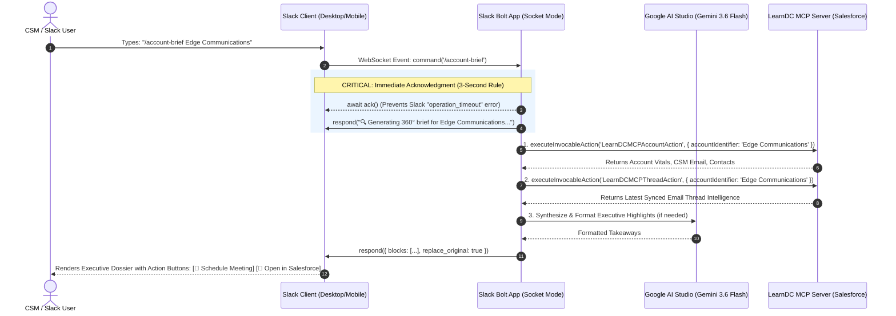

# Complete Guide & Blueprint: Implementing Slack Slash Commands (`/account-brief` & `/summarize-thread`)

## 1. Executive Overview & Concept

This document is your comprehensive architectural and implementation reference for creating **Slack Slash Commands** for the **Google AI Studio & Salesforce Agent (`slack-gemini-agent`)**.

Slash commands allow Customer Success Managers (CSMs), Account Executives (AEs), and Support Engineers to invoke specific CRM and AI capabilities instantly from **any Slack channel, private group, or direct message** without having to mention (`@Test Agent App`) or type out verbose conversational prompts.

### The Two Chosen Slash Commands:

1. **`/account-brief [Account Name]`**:
   - **Purpose**: Provides a 1-shot **360° Executive Briefing** for an Account before a customer meeting.
   - **Capabilities**: Fetches live CRM vitals (Industry, CSM Email, Primary Contact & Title) and the latest customer email intelligence summary with action items in a single, executive Slack Block Kit card.
   
2. **`/summarize-thread [Thread ID]`**:
   - **Purpose**: Performs **dynamic Gemini AI summarization** of any specific customer email thread.
   - **Capabilities**: Analyzes the complete chronological email exchange for that thread, extracting the **Executive Summary**, **Key Discussion Points**, and **Pending Action Items**.

---

## 2. End-to-End Architectural Flow (Socket Mode)

Because your Slack App is configured with **Socket Mode**, slash commands do **NOT** require setting up public HTTP webhooks, ngrok URLs, or opening firewall ports. Slack delivers the command event securely across the established persistent WebSocket connection!



---

## 3. Deep Dive into the 2 Slash Commands

### Command 1: `/account-brief [Account Name]`

#### A. User Experience & Scenarios
* **Syntax**: `/account-brief <Account Name>`
* **Example**: `/account-brief Edge Communications`
* **Handling No Argument**: If user types just `/account-brief`, the bot responds privately (*ephemeral*):  
  `⚠️ Please provide an account name. Example: /account-brief Edge Communications`
* **Handling Account Not Found**: Returns a formal enterprise failure reason:  
  `I am unable to generate an account brief because no Account matching "Acme Unknown" was found in Salesforce. Please verify the account name.`

#### B. Visual Block Kit Layout
```markdown
┏━━━━━━━━━━━━━━━━━━━━━━━━━━━━━━━━━━━━━━━━━━━━━━━━━━━━━━━━━━━━━┓
┃ 🏢 ACCOUNT EXECUTIVE BRIEF: Edge Communications            ┃
┣━━━━━━━━━━━━━━━━━━━━━━━━━━━━━━━━━━━━━━━━━━━━━━━━━━━━━━━━━━━━━┫
┃ • Industry: Electronics                                      ┃
┃ • CSM Assigned: skgsummo5@gmail.com                         ┃
┃ • Primary Contact: Rose Gonzalez (SVP, Procurement)          ┃
┃ • Email: rose@edge.com                                      ┃
┣━━━━━━━━━━━━━━━━━━━━━━━━━━━━━━━━━━━━━━━━━━━━━━━━━━━━━━━━━━━━━┫
┃ 📬 LATEST CUSTOMER COMMUNICATION (Thread copilot-thread-123) ┃
┃                                                             ┃
┃ Executive Summary:                                          ┃
┃ Quarterly check-in on platform adoption. Renewal contract   ┃
┃ review scheduled for Q4.                                    ┃
┃                                                             ┃
┃ Action Items:                                               ┃
┃ • Schedule procurement alignment meeting                    ┃
┣━━━━━━━━━━━━━━━━━━━━━━━━━━━━━━━━━━━━━━━━━━━━━━━━━━━━━━━━━━━━━┫
┃ [ 📅 Schedule Review Meeting ]   [ 🔗 Open in Salesforce ]  ┃
┗━━━━━━━━━━━━━━━━━━━━━━━━━━━━━━━━━━━━━━━━━━━━━━━━━━━━━━━━━━━━━┛
```

---

### Command 2: `/summarize-thread [Thread ID]`

#### A. User Experience & Scenarios
* **Syntax**: `/summarize-thread <Thread ID>`
* **Example**: `/summarize-thread 18f52b618a8039d9`
* **Handling No Argument**:  
  `⚠️ Please provide a Gmail Thread ID. Example: /summarize-thread 18f52b618a8039d9`
* **Handling Thread Not Found**:  
  `I am unable to complete this request because no email messages or records were found in Salesforce for Thread ID "18f9999999999999". Please verify the Thread ID or ensure email synchronization has completed.`

#### B. Visual Block Kit Layout
```markdown
┏━━━━━━━━━━━━━━━━━━━━━━━━━━━━━━━━━━━━━━━━━━━━━━━━━━━━━━━━━━━━━┓
┃ ⚡ GEMINI AI THREAD SUMMARY: 18f52b618a8039d9               ┃
┣━━━━━━━━━━━━━━━━━━━━━━━━━━━━━━━━━━━━━━━━━━━━━━━━━━━━━━━━━━━━━┫
┃ • Model: Gemini 3.6 Flash   • Messages Analyzed: 4          ┃
┣━━━━━━━━━━━━━━━━━━━━━━━━━━━━━━━━━━━━━━━━━━━━━━━━━━━━━━━━━━━━━┫
┃ 📝 Executive Summary:                                        ┃
┃ The customer raised an inquiry regarding license expansion. ┃
┃ The pricing proposal was reviewed and approved by finance.  ┃
┃                                                             ┃
┃ 💡 Key Discussion Points:                                    ┃
┃ • 50 additional licenses requested for the analytics team   ┃
┃ • Pricing tier confirmed under existing enterprise addendum ┃
┃                                                             ┃
┃ ✅ Action Items:                                            ┃
┃ • Send signature link to procurement lead (Rose Gonzalez)   ┃
┃ • Confirm provisioning date with technical support          ┃
┗━━━━━━━━━━━━━━━━━━━━━━━━━━━━━━━━━━━━━━━━━━━━━━━━━━━━━━━━━━━━━┛
```

---

## 4. Step-by-Step Implementation Guide

### Step 1: Register Commands in Slack App Dashboard

To enable slash commands in your Slack workspace:

1. Open your browser and navigate to [https://api.slack.com/apps](https://api.slack.com/apps).
2. Select your application: **`Test Agent App`**.
3. In the left navigation sidebar under **Features**, click **Slash Commands**.
4. Click the **Create New Command** button.

#### Setting up `/account-brief`:
* **Command**: `/account-brief`
* **Request URL**: *(Leave disabled or blank — Socket Mode handles this automatically!)*
* **Short Description**: `Get 360° Account intelligence & customer email summary`
* **Usage Hint**: `[Account Name]`
* Click **Save**.

#### Setting up `/summarize-thread`:
* Click **Create New Command** again.
* **Command**: `/summarize-thread`
* **Short Description**: `Dynamically summarize customer email thread with Gemini`
* **Usage Hint**: `[Thread ID]`
* Click **Save**.

5. In the left sidebar under **Settings**, click **Install App**.
6. Click **Reinstall to Workspace** (this grants the `commands` OAuth scope to your bot token `xoxb-...`).

---

### Step 2: Implementation Code (`src/slack/commands.ts`)

Create a dedicated command handler module in your Node.js application:

```typescript
import { App } from '@slack/bolt';
import { salesforceMcpClient } from '../mcp/salesforceMcpClient.js';

export function registerSlashCommands(app: App): void {

  // ===========================================================================
  // 1. /account-brief [Account Name]
  // ===========================================================================
  app.command('/account-brief', async ({ command, ack, respond }) => {
    // 1. MUST acknowledge within 3000ms
    await ack();

    const accountName = (command.text || '').trim();
    if (!accountName) {
      await respond({
        response_type: 'ephemeral',
        text: '⚠️ *Usage*: `/account-brief [Account Name]`\n*Example*: `/account-brief Edge Communications`',
      });
      return;
    }

    // 2. Initial thinking response (replaces later)
    await respond({
      response_type: 'ephemeral',
      text: `🔍 Fetching 360° executive brief for *${accountName}* from LearnDC MCP Server...`,
    });

    try {
      // 3. Query Account details from Salesforce MCP
      const accResults = await salesforceMcpClient.executeInvocableAction('LearnDCMCPAccountAction', {
        accountIdentifier: accountName,
      });

      if (!accResults || accResults.length === 0 || !accResults[0].isFound) {
        await respond({
          response_type: 'ephemeral',
          text: `I am unable to generate an account brief because no Account matching "${accountName}" was found in Salesforce. Please verify the account record.`,
        });
        return;
      }

      const acc = accResults[0];

      // 4. Query Latest Customer Thread Summary
      let threadInfo = '• *Status*: No recent customer emails synced for this account.';
      const threadResults = await salesforceMcpClient.executeInvocableAction('LearnDCMCPThreadAction', {
        accountIdentifier: acc.accountName,
      });

      if (threadResults && threadResults.length > 0 && threadResults[0].isFound) {
        const th = threadResults[0];
        threadInfo = `*Executive Summary:*\n${th.executiveSummary || 'N/A'}\n\n*Action Items:*\n${th.actionItems || 'None pending'}`;
      }

      // 5. Render Rich Slack Block Kit Response
      await respond({
        response_type: 'in_channel', // Visible to channel or change to 'ephemeral' for private
        blocks: [
          {
            type: 'header',
            text: {
              type: 'plain_text',
              text: `🏢 Executive Brief: ${acc.accountName}`,
              emoji: true,
            },
          },
          {
            type: 'section',
            fields: [
              { type: 'mrkdwn', text: `*Industry:*\n${acc.industry || 'Technology'}` },
              { type: 'mrkdwn', text: `*CSM Email:*\n${acc.csmEmail || 'None assigned'}` },
              { type: 'mrkdwn', text: `*Primary Contact:*\n${acc.primaryContactName || 'None'}` },
              { type: 'mrkdwn', text: `*Contact Email:*\n${acc.primaryContactEmail || 'None'}` },
            ],
          },
          { type: 'divider' },
          {
            type: 'section',
            text: {
              type: 'mrkdwn',
              text: `*📬 Recent Customer Intelligence:*\n${threadInfo}`,
            },
          },
          {
            type: 'context',
            elements: [
              {
                type: 'mrkdwn',
                text: `Retrieved live from *LearnDC Agent MCP Server* • Account ID: \`${acc.accountId}\``,
              },
            ],
          },
        ],
      });

    } catch (err: any) {
      await respond({
        response_type: 'ephemeral',
        text: `I am unable to complete this request because an error occurred: ${err.message}`,
      });
    }
  });

  // ===========================================================================
  // 2. /summarize-thread [Thread ID]
  // ===========================================================================
  app.command('/summarize-thread', async ({ command, ack, respond }) => {
    // 1. MUST acknowledge within 3000ms
    await ack();

    const threadId = (command.text || '').trim();
    if (!threadId) {
      await respond({
        response_type: 'ephemeral',
        text: '⚠️ *Usage*: `/summarize-thread [Thread ID]`\n*Example*: `/summarize-thread 18f52b618a8039d9`',
      });
      return;
    }

    // 2. Immediate feedback
    await respond({
      response_type: 'ephemeral',
      text: `⚡ Running dynamic Gemini AI summarization on Thread \`${threadId}\`...`,
    });

    try {
      // 3. Call LearnDCMCPThreadAction with dynamic threadId
      const results = await salesforceMcpClient.executeInvocableAction('LearnDCMCPThreadAction', {
        threadId: threadId,
      });

      if (!results || results.length === 0 || !results[0].isFound) {
        await respond({
          response_type: 'ephemeral',
          text: `I am unable to complete this request because no email messages or records were found in Salesforce for Thread ID "${threadId}". Please verify the Thread ID or ensure email synchronization has completed.`,
        });
        return;
      }

      const th = results[0];

      // 4. Render Dynamic Summary Blocks
      await respond({
        response_type: 'in_channel',
        blocks: [
          {
            type: 'header',
            text: {
              type: 'plain_text',
              text: `⚡ Gemini AI Thread Summary: ${th.threadId}`,
              emoji: true,
            },
          },
          {
            type: 'section',
            text: {
              type: 'mrkdwn',
              text: `*Executive Summary:*\n${th.executiveSummary || 'No summary available.'}`,
            },
          },
          {
            type: 'section',
            text: {
              type: 'mrkdwn',
              text: `*Key Discussion Points:*\n${th.keyPoints || 'None identified.'}`,
            },
          },
          {
            type: 'section',
            text: {
              type: 'mrkdwn',
              text: `*Action Items:*\n${th.actionItems || 'None pending.'}`,
            },
          },
          {
            type: 'context',
            elements: [
              {
                type: 'mrkdwn',
                text: `Dynamic synthesis via Google Gemini • Messages analyzed: ${th.messageCount || 1}`,
              },
            ],
          },
        ],
      });

    } catch (err: any) {
      await respond({
        response_type: 'ephemeral',
        text: `I am unable to complete this request because an error occurred: ${err.message}`,
      });
    }
  });
}
```

---

### Step 3: Register in `src/index.ts`

In `slack-gemini-agent/src/index.ts`, simply import and register the command handlers before starting the app:

```typescript
import { registerSlashCommands } from './slack/commands.js';

// ...
registerSlackHandlers(app);
registerSlashCommands(app); // Attach /account-brief and /summarize-thread
// ...
```

---

## 5. Golden Rules & Best Practices for Slack Slash Commands

### Rule 1: The 3-Second Acknowledgment Rule (`await ack()`)
Slack requires your app to acknowledge receipt of a slash command within **3000 milliseconds (3 seconds)**.
* **Always** call `await ack()` on the very first line of the command handler.
* Then, if your AI or Salesforce callout takes 2–4 seconds, use `await respond(...)` to send updates or replace the loading state.

### Rule 2: Ephemeral vs. In-Channel Responses
* **`response_type: 'ephemeral'`**: The message is visible **only to the user** who typed the command. Best for error messages, help hints, or sensitive account lookups.
* **`response_type: 'in_channel'`**: The message is posted to the whole channel for everyone to see. Best for shared meeting prep or team summaries.

### Rule 3: Graceful Formal Failure Explanations
Never let a command fail silently or return a generic crash error. Follow the standardized format:
> `"I am unable to [do task] because [specific reason]. [Suggested remedy]."`

---

## 6. How to Add New Commands in the Future (Reusable Template)

Whenever you have a new requirement in the future, follow this 3-step blueprint:

1. **Add Command in Slack Dashboard**: Go to `api.slack.com/apps` ➔ **Slash Commands** ➔ Add `/my-new-command`.
2. **Add Handler in Code**:
   ```typescript
   app.command('/my-new-command', async ({ command, ack, respond }) => {
     await ack(); // 1. Acknowledge
     const arg = command.text.trim();
     
     // 2. Validate input
     if (!arg) {
       await respond({ response_type: 'ephemeral', text: 'Usage hint...' });
       return;
     }

     // 3. Execute MCP / Gemini
     const result = await salesforceMcpClient.executeInvocableAction('MyAction', { param: arg });

     // 4. Respond
     await respond({ text: 'Result...' });
   });
   ```
3. **Rebuild & Restart Container**: `npm run build && npm run container:restart`.


---

## Enterprise Update: Autonomous OAuth 2.0 Self-Healing Session Engine

### Problem & Discovery:
In production environments (like Docker containers and Google Cloud Run), the Salesforce CLI (`sf`) is not available. Furthermore, static access tokens in `.env` expire (Salesforce standard 2-hour session limit), causing HTTP 401 `INVALID_SESSION_ID` errors during tool execution.

### Architectural Solution:
1. **Dynamic Token Refresh via OAuth 2.0**:
   Added direct OAuth 2.0 token endpoint integration (`POST https://login.salesforce.com/services/oauth2/token`) using `grant_type=refresh_token` and `client_id=PlatformCLI` in `salesforceAuth.ts`.
2. **Transparent 401 Interception**:
   In `salesforceMcpClient.ts`, the client intercepts any HTTP 401 response from an Invocable Action, immediately requests a fresh token using `getSalesforceCredentials(forceRefresh=true)`, and retries the action call transparently.
3. **Zero CLI Dependency**:
   Runs completely on native `fetch` calls, making the container fully autonomous across Docker Desktop, Cloud Run, and Kubernetes.
